# 摘要

针对当前高校数字服务入口分散、使用链路割裂以及多端体验不一致等问题，本文设计并实现了一套基于 Flutter 与 Supabase 的校园综合服务系统。系统面向学生与教师两类核心用户，围绕学习服务、生活服务、图书馆服务、校园互助以及教师教学办公扩展等场景展开。研究过程中，采用需求分析、分层设计、模块化实现与测试验证相结合的方法，在不单独建设业务后端的前提下，利用 Supabase 提供的身份认证与 PostgreSQL 数据存储能力，构建了“Flutter 客户端 + 云端数据服务”的轻量化实现方案。系统实现了登录注册、角色分流、课表与成绩查询、考试倒计时、图书与座位预约、校园资讯浏览、食堂菜单查询、失物招领、二手流转、互助任务发布以及教师端请假审批和成绩管理等功能。测试结果表明，在本文研究范围内，系统主要业务链路运行稳定，能够较好满足校园综合服务场景下的信息整合与功能协同需求。尽管教师端部分扩展功能、自动化测试深度与细粒度权限治理仍有提升空间，但本文的实现结果已经验证了该技术路线在毕业设计与中小规模校园应用中的现实可行性。

**关键词：** Flutter；Supabase；校园综合服务系统；跨平台开发；移动应用

# Abstract

To address the problems of fragmented service entrances, disconnected usage flows, and inconsistent multi-platform experience in current campus applications, this thesis designs and implements a campus integrated service system based on Flutter and Supabase. The system is oriented toward two major user groups, namely students and teachers, and covers learning services, daily life services, library services, campus mutual-aid functions, as well as extended teaching and office scenarios for teachers. In this study, requirement analysis, layered design, modular implementation, and testing were combined to build a lightweight architecture of "Flutter client plus cloud data services" without developing an independent business backend. With the support of Supabase Auth and PostgreSQL, the system implements user registration and login, role-based navigation, course schedule and grade inquiry, exam countdown management, book and seat reservation, campus news browsing, canteen menu inquiry, lost-and-found, second-hand exchange, help task publishing, leave approval, and teacher-side grade management. The test results indicate that, within the scope of this research, the major business flows operate stably and can basically satisfy the demand for service integration and functional coordination in campus scenarios. Although there is still room for improvement in teacher-side business depth, automated test coverage, and fine-grained permission governance, the study demonstrates the practical feasibility of this technical route for graduation projects and small-to-medium campus applications.

**Key Words:** Flutter; Supabase; campus integrated service system; cross-platform development; mobile application

# 目录

# 第1章 绪论

## 1.1 研究背景与现状

随着高校信息化建设不断深入，校园服务正在由传统线下办理逐步转向线上集成化处理。课程查询、成绩查看、校园资讯获取、图书馆预约、请假审批以及校园互助等需求，已经成为师生日常学习与生活中的高频场景。然而在许多实际校园环境中，这些功能往往分散在多个系统或多个小程序之中，存在入口分散、交互不统一、数据更新不及时和跨平台体验不一致等问题，给师生使用带来了较高成本。

与此同时，移动互联网和跨平台开发技术的快速发展，也为校园综合服务系统的建设提供了新的实现路径。Flutter 作为近年来发展迅速的跨平台框架，能够以单一代码库同时适配移动端、Web 端和桌面端，在开发效率、界面一致性和维护成本方面具有明显优势。Supabase 等后端即服务平台的出现，则进一步降低了中小型信息系统的开发门槛，使开发者可以在不自建完整后端服务的前提下，完成用户认证、数据存储和权限控制等关键能力的集成。

从现有研究和应用现状来看，校园类应用大多集中在某一个子场景，例如仅提供教务查询、仅提供图书馆服务或仅提供生活资讯，真正面向学生与教师双角色、覆盖学习、生活、互助和办公多个业务场景的综合型系统相对较少。尤其是在毕业设计或中小型项目实践中，如何在有限开发周期内利用现代跨平台技术快速构建具备较完整业务闭环的校园服务系统，仍具有较强的研究和实践价值。

## 1.2 研究目的与意义

本课题旨在设计并实现一套基于 Flutter 与 Supabase 的校园综合服务系统，以解决校园服务功能入口分散、使用体验割裂以及开发维护成本较高等问题。系统围绕学生和教师在校园中的真实使用场景，集成学习服务、生活服务、校园互助、图书馆服务和教师办公扩展等功能，尝试构建一个具有统一界面风格、统一认证方式和统一数据访问机制的跨平台应用。

从实践意义上看，本系统能够为师生提供更集中、更便捷的校园服务入口，提升课程、成绩、资讯、预约和审批等高频业务的使用效率，并通过校园互助等功能增强校内社区协作能力。对于学校信息化建设而言，这种“轻量客户端 + 云端服务平台”的实现模式也具有一定参考价值，能够为中小规模校园应用的开发提供较低成本的实现思路。

从技术研究意义上看，本课题验证了 Flutter 在校园综合服务场景中的跨平台适用性，探索了 Riverpod 状态管理、GoRouter 路由组织、Supabase 身份认证与数据访问、Hive 本地存储与数据迁移等技术的协同应用方式。通过本系统的设计与实现，可以进一步总结在“无自建后端”条件下构建完整业务应用的工程方法，对后续类似项目开发具有借鉴意义。

进一步而言，本课题的研究目的不仅在于“做出一个能够运行的校园应用”，更在于尝试回答一个具有现实意义的工程问题，即在开发周期有限、人员规模有限且不单独建设后端服务的前提下，如何仍然完成一个具备较完整业务闭环的校园服务系统。围绕这一目标，系统需要在角色分流、数据组织、权限控制、交互一致性和跨平台适配等多个方面形成可行方案，而不是仅停留在单一页面或单一模块的功能演示层面。

从校园应用建设角度看，本课题还具有一定的服务整合意义。传统校园信息系统往往以部门为边界独立建设，学生需要在教务、图书馆、资讯、请假、后勤等多个入口之间反复切换，教师也需要在不同平台之间来回处理教学与办公事务。这种分散式模式虽然在早期能够快速满足局部业务需求，但随着使用场景增加，系统之间割裂的问题会越来越明显。本课题通过统一客户端入口整合学习、生活、互助和教师办公扩展功能，尝试从用户体验层面对校园数字服务进行重新组织，这对于提升服务聚合度和降低用户使用成本具有现实价值。

从工程实现角度看，本课题的意义还体现在对“轻量化数字校园应用实现模式”的验证上。与传统需要分别建设前端、后端和数据库的方案相比，基于 Flutter 与 Supabase 的实现路径能够显著降低系统搭建门槛，使开发者将更多精力投入到业务流程梳理、交互设计和数据结构组织之中。对于毕业设计项目而言，这种方案有助于在有限时间内完成更完整的成果展示；对于中小规模实际项目而言，该模式同样具有一定推广价值，特别适合预算有限、需要快速迭代且强调统一入口体验的场景。

从论文研究与教学训练角度看，本课题还具有较强的综合实践意义。系统开发过程中涉及需求分析、功能抽象、数据表设计、权限控制、客户端分层、状态管理、异常处理、跨平台适配以及测试验证等多个环节，能够较全面地体现软件工程项目从设计到实现再到评估的完整过程。因此，本课题不仅是一次具体系统开发实践，也是一次围绕现代移动应用架构与软件工程方法的综合训练，对提升开发者系统分析能力、工程组织能力和问题解决能力具有积极作用。

## 1.3 研究内容与技术路线

本文的研究内容主要包括以下几个方面。首先，对校园综合服务系统的目标用户、业务场景和功能需求进行分析，明确系统需要覆盖的核心服务范围；其次，根据项目实际情况设计系统总体架构、分层结构、数据库模型、权限策略和界面交互方案；再次，基于 Flutter 与 Supabase 完成系统的功能实现，包括登录注册、课表、成绩、考试倒计时、图书馆预约、校园资讯、互助社区以及教师端部分教学办公功能；最后，通过测试与分析对系统可用性、稳定性和后续改进方向进行总结。

在技术路线方面，系统以前端统一开发为核心，采用 Flutter 作为客户端开发框架，以 Riverpod 实现状态管理，以 GoRouter 统一管理页面导航，以 Supabase 提供身份认证和 PostgreSQL 数据存储能力，以 Hive 承担本地轻量存储与历史数据迁移任务。整体技术路线可以概括为：需求分析 → 架构设计 → 数据模型设计 → 核心模块实现 → 系统测试与总结。该路线既符合毕业设计项目的实施节奏，也较好契合本系统“快速集成、轻量实现、持续扩展”的建设目标。

在研究内容的展开顺序上，本文并非简单按照功能罗列进行描述，而是围绕“需求提出问题、设计给出方案、实现验证方案、测试评价结果”的逻辑展开。首先，通过对学生与教师两类用户的校园使用场景进行归纳，明确系统需要重点解决的高频服务聚合问题；其次，结合项目实际代码结构和数据表结构，分析在无自建后端条件下如何组织客户端分层、权限边界和业务模块；再次，选取登录认证、学习服务、图书馆服务、互助服务和教师端扩展功能作为重点实现对象，说明系统核心链路的落地方式；最后，通过功能验证、自动化测试和静态分析总结系统的当前完成度与后续提升空间。

在具体技术实施路径上，本系统遵循“先确定数据基础，再组织业务能力，最后优化界面与测试”的思路推进。由于系统并未采用自建后端，因此云端数据结构与客户端模型之间的一致性显得尤为关键。项目首先依据 Supabase 中已有的数据表完成业务对象抽象，再通过 Service 与 Repository 封装形成稳定的数据访问入口，随后借助 Riverpod 将异步数据请求、业务状态和页面渲染建立连接，最终通过 GoRouter 完成页面路由和角色分流组织。该路线强调先搭建稳定的数据与状态骨架，再逐步丰富业务页面和用户交互，从而避免系统在功能增长过程中出现结构失控的问题。

此外，本文的技术路线还体现出明显的渐进式实现特征。项目早期保留了 Hive 本地数据方案，后续随着 Supabase 认证和数据库能力逐步完善，又完成了向云端统一数据体系的迁移。这意味着系统并非一次性构建完成，而是在已有实现基础上不断重构与整合。将这一过程纳入论文论述，有助于更真实地反映实际开发中的技术演进路径，也能够说明系统最终形成的架构并非理论假设，而是经过多轮实现取舍后逐步沉淀的结果。

## 1.4 论文组织结构

本文共分为七章。

第1章为绪论，主要介绍课题研究背景、研究目的与意义、研究内容以及论文整体结构。

第2章为相关技术综述，主要分析系统开发中涉及的 Flutter、Dart、Supabase、Riverpod、GoRouter 和 Hive 等关键技术。

第3章为系统需求分析，围绕校园综合服务场景，从业务需求、功能需求、非功能需求和可行性等方面展开论述。

第4章为系统设计，主要对系统总体架构、客户端分层结构、功能模块划分、数据模型与权限控制以及界面视觉交互方案进行设计说明。

第5章为系统实现，重点介绍开发环境、项目结构、核心功能模块实现过程以及关键技术问题的解决方式。

第6章为系统测试与分析，对系统的测试环境、测试方法、核心功能验证情况以及系统存在的问题进行总结。

第7章为总结与展望，对全文工作进行归纳，并提出系统当前不足及后续改进方向。

# 第2章 相关技术综述

## 2.1 Flutter 跨平台开发框架

Flutter 是 Google 推出的开源跨平台 UI 开发框架，支持使用单一代码库构建 Android、iOS、Web、Windows、macOS 和 Linux 等多个平台的应用。与传统的多端分别开发方式相比，Flutter 在界面一致性、开发效率和后期维护成本方面具有明显优势，因此非常适合需要快速迭代且界面统一要求较高的中小型应用项目。

本系统选择 Flutter 作为客户端实现框架，主要基于以下考虑。第一，校园综合服务系统涉及的页面数量较多，且学生端和教师端存在较大范围的界面复用需求，Flutter 能够较好地支撑组件化开发；第二，系统需要同时兼顾移动端与桌面端展示效果，Flutter 在跨平台 UI 一致性方面具备天然优势；第三，Flutter 社区生态较为完善，能够较方便地引入状态管理、网络访问、图像加载、本地存储等依赖，为项目实现提供充分支撑。

从工程实践角度看，Flutter 的优势并不只在于“多端共用一套代码”，更在于它提供了一种以组件为中心、以声明式界面为核心的开发方式。开发者可以围绕页面拆分可复用组件，再通过统一主题、统一布局规范和统一交互模式构建完整应用。这一点对于校园综合服务系统尤为重要，因为此类系统通常包含大量相似的信息卡片、表单页面、列表页面和详情页面，如果缺少良好的组件化机制，后期维护和风格统一都会变得较为困难。

此外，Flutter 的热重载和较快的界面迭代能力也非常适合毕业设计项目的开发节奏。在论文撰写和项目实现并行推进的过程中，界面结构和交互细节往往需要多次调整。Flutter 允许开发者在较短反馈周期内完成页面验证、样式微调和功能联调，从而降低试错成本。对于需要频繁对首页布局、图书馆预约页、教师端入口和互助发布页进行调整的本项目而言，这种快速迭代能力具有明显实际价值。

从系统适配性上看，校园应用具有明显的“多场景、多终端”特征。学生可能在手机端快速查看课表、预约座位和浏览资讯，教师则可能在桌面端更关注成绩管理和审批信息。Flutter 支持在统一代码基础上通过布局控制和局部差异处理适配不同终端，使项目能够在保持整体风格一致的前提下兼顾不同使用环境。这也是本系统最终选择 Flutter 作为核心客户端技术的重要原因。

### 2.1.1 Dart 语言特性分析

Dart 是 Flutter 的核心开发语言，具有语法简洁、类型系统完善、面向对象能力较强以及异步编程支持良好等特点。Dart 支持空安全机制，可以在编译阶段减少空引用引发的错误，提高代码健壮性。其面向对象模型适合构建页面组件、业务模型和服务类等结构化代码，对中大型 Flutter 项目尤其友好。

在本系统中，Dart 的异步编程能力发挥了重要作用。系统中大量涉及云端数据读取、用户登录认证、列表刷新和预约提交等异步操作，这些场景均通过 `Future`、`async` 和 `await` 实现较清晰的调用链路。同时，Dart 对 JSON 映射、枚举类型和集合操作的支持也有助于实现数据库字段转换、状态筛选和列表展示逻辑。可以说，Dart 为本系统提供了较稳定的语言基础和良好的工程表达能力。

进一步来看，Dart 的空安全机制对于本系统这种以云端数据驱动为主的应用尤为重要。Supabase 返回的数据中经常包含可空字段，例如图片地址、备注信息、审批意见、发布时间和部分教师扩展资料等，若在客户端缺少清晰的空值约束，极易在页面渲染时产生空引用异常。Dart 通过可空类型、非空断言和编译期检查等机制，使开发者能够在编码阶段更明确地区分“必须存在的数据”和“可能缺失的数据”，从而提高系统在复杂数据场景下的稳定性。

在语言表达能力方面，Dart 对类、构造函数、命名参数、扩展方法和泛型集合的支持，也有助于本系统构建较清晰的工程结构。领域模型可以通过类进行统一抽象，业务服务可以通过面向对象方式组织，状态对象又可以借助不可变数据结构和复制更新方式保持可读性。这种写法既契合 Flutter 项目的常见工程习惯，也使论文中所描述的分层结构更容易在代码中得到对应体现。

此外，Dart 对集合处理和函数式写法的支持也在本系统中发挥了明显作用。例如，成绩列表需要按学期聚合、考试倒计时需要按日期排序、菜单信息需要按星期与餐次组织、图书预约记录需要按状态筛选，这些操作都高度依赖列表映射、过滤、排序与分组能力。得益于 Dart 在集合操作上的较好表达力，开发者能够以相对简洁的方式完成这类业务转换逻辑，从而提高系统代码的可维护性。

### 2.1.2 Flutter 的 Widget 机制与渲染原理

Flutter 的核心思想是“一切皆 Widget”。在 Flutter 中，界面中的文本、按钮、容器、滚动视图乃至整个页面都可以看作 Widget。开发者通过组合不同 Widget 形成层次化的界面结构，再借助状态变化驱动界面重新构建，从而实现动态交互效果。这种声明式 UI 开发方式能够显著降低复杂页面的维护难度。

在渲染机制上，Flutter 不依赖平台原生控件，而是通过自身的渲染引擎直接绘制界面。这使得 Flutter 在不同平台上可以保持较高一致性的视觉表现，同时减少了因平台控件差异造成的适配负担。本系统中的首页卡片布局、底部导航、列表分组、自定义进度图形和多端适配布局，均建立在 Flutter 的 Widget 组合和统一渲染能力基础上。正因如此，系统能够较稳定地在不同终端环境中保持一致的界面风格和交互体验。

从更细的实现原理上看，Flutter 在界面构建过程中会围绕 Widget 树、Element 树和渲染对象树形成完整的界面组织机制。Widget 负责描述界面应该呈现的样子，Element 负责维护 Widget 与真实渲染结构之间的对应关系，而渲染对象则承担布局和绘制职责。当状态变化时，Flutter 并不会简单销毁整个页面重新绘制，而是根据新的 Widget 配置与已有结构进行对比，再对需要更新的部分进行重建和重绘。这样的机制使系统既能保持声明式开发的清晰性，又能在多数场景下维持较好的运行效率。

这种渲染模式对本系统的意义在于，许多页面都包含局部频繁变化但整体结构相对稳定的内容。例如，成绩页中的统计信息、考试倒计时列表中的剩余天数、图书馆座位页中的预约状态标记、教师审批页中的待办数量等，都可能随着数据刷新发生局部变化。Flutter 的组件重建机制能够较自然地支持这种“局部状态变化驱动局部界面更新”的模式，使系统无需采用过于复杂的手工刷新方案。

另外，Flutter 的自绘能力也使本系统更容易实现统一且可控的视觉风格。传统跨平台方案中，不同平台原生控件的视觉差异可能导致界面在颜色、边距、阴影和交互反馈上出现不一致，而 Flutter 通过统一渲染链路减少了这类差异。本系统中的首页卡片、按钮、状态标签、自定义进度展示和图书馆信息块均能保持相近的视觉规范，这正是 Flutter 渲染体系在工程层面的直接体现。

## 2.2 Supabase 后端即服务平台

Supabase 是一种面向现代 Web 与移动应用的后端即服务平台，主要提供身份认证、关系型数据库、对象存储、实时订阅和权限控制等能力。对于中小型项目而言，Supabase 能够显著减少自建后端接口与数据库基础设施的工作量，使开发者更聚焦于业务实现本身。

本系统未单独实现业务后端，而是直接使用 Supabase 作为云端服务平台。这一技术选择使项目在毕业设计周期内能够以较低成本完成认证、数据存储和权限控制等关键需求，也使系统整体架构更加轻量。

从系统建设方式看，Supabase 代表的是一种“云端基础能力集成”思路，而不是传统意义上的完整业务后端开发方案。开发者无需先搭建独立服务器、设计完整 RESTful API、部署认证中心和数据库连接层，而是可以直接在统一平台上获得认证、数据表、访问策略和存储等基础能力。对于本课题这种以客户端功能实现为主、开发周期相对有限的校园应用项目而言，Supabase 能够显著压缩基础设施建设成本，使更多精力投入到业务流程设计和界面实现上。

当然，采用 Supabase 并不意味着系统不再需要架构设计。恰恰相反，当客户端可以直接访问云端数据时，开发者更需要认真处理数据表结构、客户端模型映射、权限边界和异常反馈问题。也就是说，Supabase 减少的是“自建后端基础设施”工作量，但并没有减少“系统整体设计”本身的复杂度。本系统正是在这一前提下，将数据访问封装、角色识别和权限控制放在更重要的位置，以保证在轻量架构下仍能维持较稳定的业务逻辑。

从项目适配性角度看，Supabase 与 Flutter 的组合也具有较强互补性。Flutter 负责统一多端界面与交互，Supabase 负责提供统一的云端认证与数据支撑，两者都强调快速集成和较低初始开发门槛。对于校园综合服务系统这类既需要一定业务深度、又不适合在毕业设计阶段投入大量后端开发资源的项目而言，这种组合具有较高现实可行性。

### 2.2.1 Supabase Auth 身份认证机制

Supabase Auth 提供了用户注册、登录、会话管理、密码重置和用户资料扩展等能力。本系统基于该机制实现邮箱密码登录和注册，并结合 `users` 业务表扩展出手机号、学号、用户角色、院系等校园业务所需信息。客户端通过 Supabase Auth 获取当前会话，再进一步加载业务资料，从而构建完整的用户对象。

这一机制的优点在于认证链路稳定，且便于与业务数据进行解耦。认证负责“用户是否合法”，业务表负责“用户在系统中扮演何种角色、拥有何种资料”，两者协同完成校园应用的身份体系建设。

在校园应用场景下，单纯的认证成功并不足以支撑完整业务流程，因为系统不仅需要知道“当前是谁登录了”，还需要知道“该用户属于学生还是教师”“该用户对应哪个学号或工号”“该用户可以访问哪些模块”。因此，本系统采用 Supabase Auth 与公共业务用户表相结合的方式，将登录凭据管理和校园业务身份管理进行分层处理。前者保证用户会话的合法性与稳定性，后者负责补充角色、院系、学号、手机号等业务属性。这样的设计既保持了认证体系的简洁，也满足了校园场景下细粒度角色识别的需要。

从客户端使用流程看，认证机制还承担了全局状态切换入口的作用。用户登录后，系统不仅获得访问云端数据的会话令牌，还会同步刷新当前用户 Provider、首页结构、角色分流逻辑和与用户绑定的数据查询条件；当用户退出登录或会话失效时，系统又需要及时回收这些状态并返回认证页面。由此可见，Supabase Auth 在本系统中并非单独存在的“登录模块”，而是贯穿整个应用生命周期的身份基础设施。

此外，Supabase Auth 还适合本系统这种以客户端为中心的实现模式。开发者无需自行维护密码加密、登录会话续期和账户基础安全策略，而是可以在平台已有机制上构建业务逻辑。对于毕业设计而言，这种方案既提高了开发效率，也降低了在认证安全细节上出现重大错误的风险。

### 2.2.2 Supabase PostgreSQL 数据存储机制

Supabase 以 PostgreSQL 作为底层数据库引擎，能够支持结构化数据存储、关系建模、约束控制和复杂查询。本系统中的课程、成绩、请假、图书、座位预约、校园资讯、食堂菜单以及互助信息等业务数据，均存储于 Supabase 提供的 PostgreSQL 数据库中。

由于 PostgreSQL 本身具备较强的关系建模能力，因此本系统可以通过主键、外键、状态字段和时间字段较好地组织业务数据。例如，请假审批可以通过状态字段体现流程流转；图书预约可以通过队列位置表示等待顺序；座位预约可以通过用户标识和日期约束控制冲突。这种基于关系型数据库的数据设计，较适合校园系统中结构明确、状态可控的业务场景。

从数据组织特点上看，校园综合服务系统中的多数业务天然适合关系型数据库建模。课程与学生、成绩与课程、请假申请与审批人、图书与预约记录、座位与预约时间段之间都存在清晰的结构化关系，且很多数据还带有强约束属性，如唯一性、时间有效性、状态流转和用户归属等。PostgreSQL 在主键、外键、索引、默认值、约束和条件查询方面具有成熟能力，因此能够较好支撑这类业务数据的长期维护与扩展。

本系统的数据设计也体现出明显的按业务域划分思路。学习服务、生活服务、校园互助、图书馆服务和教师端扩展业务并未被混杂地存放在少数几张表中，而是按照功能边界划分为多张独立数据表，再通过用户标识、业务主键和状态字段建立关联。这种设计方式既便于客户端按模块访问数据，也便于后续根据业务演进继续新增字段或扩展表结构，而不会对全局造成过大影响。

此外，PostgreSQL 的查询能力也为本系统的列表展示与统计分析提供了良好基础。成绩需要按学期汇总，资讯需要按时间倒序，菜单需要按星期分类，图书预约需要按队列顺序排列，教师审批需要按待处理状态筛选，这些需求都依赖清晰的数据查询条件和稳定的排序逻辑。关系型数据库在这方面的天然优势，使系统可以在不额外构建复杂数据处理服务的情况下完成大部分基础业务支撑。

### 2.2.3 Row Level Security 权限控制机制

Row Level Security，简称 RLS，是 PostgreSQL 提供的行级权限控制机制。Supabase 对这一能力进行了较好集成，开发者可以基于当前登录用户身份，为不同数据表定义细粒度访问策略。对于直接由客户端访问数据库的系统而言，RLS 是保障数据安全的关键技术之一。

在本系统设计中，成绩、考试倒计时、请假记录、图书预约和座位预约等与用户高度绑定的数据，均适合通过 RLS 限制“用户只能访问自己的记录”；教师审批或录入类功能，则适合结合教师身份开放特定权限；校园资讯和公开互助信息则可根据业务需要配置为可公开读取。通过这种方式，可以在无需自建后端校验层的前提下，实现较为可靠的数据访问控制。

RLS 的重要性在本系统中尤为突出，因为项目采用的是客户端直连云端数据库的架构模式。如果缺少数据库层面的细粒度权限约束，仅依赖客户端页面隐藏或前端逻辑判断来限制访问，将很难从根本上防止越权读取和修改行为。RLS 的优势就在于它将安全边界下沉到数据层，即使客户端逻辑存在疏漏，只要底层策略定义正确，用户仍然无法轻易访问不属于自己的记录。对于毕业设计项目而言，这是一种兼顾实现效率与安全性的务实方案。

从原则上看，RLS 所体现的是“最小权限”思想。学生应只能读取自己的成绩、自己的考试倒计时、自己的预约记录和自己的请假申请；教师可以在特定场景下读取或处理与其职责相关的数据；公开资讯和公开互助信息则可以适当放宽读取范围。通过按业务表逐一设计读取、插入、更新和删除策略，系统能够把“谁能看、谁能改、谁能提交、谁能审批”这些业务规则转化为底层可执行的访问限制。

同时需要指出，RLS 不是孤立存在的，它需要与认证机制、角色字段和客户端业务逻辑共同配合。只有当 Supabase Auth 能准确提供当前用户身份、业务表能清晰标识记录归属、客户端又能根据角色合理组织入口时，RLS 才能真正发挥作用。因此，在本系统中，RLS 不只是一个数据库配置项，而是整个“云端权限控制体系”的核心组成部分。

## 2.3 Riverpod 状态管理与 GoRouter 路由管理

Riverpod 是 Flutter 生态中较为现代的状态管理方案，具备依赖注入清晰、测试友好、状态边界明确等优点。本系统通过 Riverpod 统一管理认证状态、成绩状态、课程状态、考试倒计时状态、资讯状态、请假审批状态以及校园互助状态，使页面能够围绕状态变化进行自动更新，减少页面层与数据层的直接耦合。

GoRouter 则是系统用于处理页面导航的核心路由工具。通过统一配置路由路径、嵌套路由和参数传递规则，系统能够较清晰地组织登录、首页、图书馆、请假、成绩和教师端页面之间的跳转关系。对于学生端和教师端共用入口但目标页面不同的场景，GoRouter 还能够与角色分流逻辑配合，实现动态页面切换。Riverpod 与 GoRouter 的结合，使本系统在状态流与页面流两个维度都具备较好的组织性。

在本系统中，Riverpod 的价值并不仅体现在“可以管理状态”，更体现在它为复杂业务提供了稳定的组织边界。校园综合服务系统涉及认证状态、当前用户资料、角色分流、列表数据加载、错误反馈、局部刷新和异步写入结果等多种状态类型，如果全部交由页面内部以 `setState` 处理，很容易导致页面逻辑过重、状态来源混乱和复用困难等问题。采用 Riverpod 后，系统可以将“页面展示什么”与“数据如何获取、何时更新、失败后如何处理”明确拆分开来，使页面层只关注状态渲染，而由 Provider 和 StateNotifier 负责业务状态流转。

从工程组织角度看，Riverpod 还帮助系统建立了较清晰的依赖注入关系。例如，成绩模块、考试倒计时模块和部分预约模块都需要依赖当前登录用户信息进行数据过滤，系统通过认证状态 Provider 向下游业务 Provider 传递当前用户标识，从而使“登录用户变化”能够自动驱动“业务数据重载”。这种由上游认证状态联动下游业务状态的机制，不仅提高了逻辑一致性，也使项目更容易围绕关键链路编写自动化测试。已有测试中针对认证绑定行为的验证，正是建立在这种 Provider 透传关系之上。

GoRouter 在本系统中的作用同样不仅是简单页面跳转。由于系统同时服务学生和教师两类角色，而两类角色在首页结构、成绩入口和办公功能访问范围上存在明显差异，因此路由系统必须具备足够清晰的组织能力。GoRouter 支持集中配置路由、嵌套路由和动态参数传递，使系统能够把认证页、主导航页、二级业务页和详情页组织在统一的导航结构中。同时，配合角色识别逻辑，路由层还承担了“入口分流”的职责，例如统一成绩入口可根据当前用户角色跳转到学生成绩页或教师成绩管理页，从而减少页面层内部重复判断的负担。

进一步来看，Riverpod 与 GoRouter 的结合形成了“状态驱动页面、页面反映状态”的一致性机制。当用户登录成功后，认证状态更新会触发首页结构变化；当用户退出登录后，路由可快速回到认证页；当业务状态发生变化时，页面在保持当前路由位置不变的前提下自动完成刷新。这种组织方式使系统在角色切换、异步加载和业务操作后的界面反馈上都表现出较好的连贯性，也说明现代 Flutter 项目中“状态管理 + 路由管理”协同设计的重要性。

从本质上看，Riverpod 解决的是“系统当前处于什么状态”，而 GoRouter 解决的是“用户当前位于什么页面”。在一个包含多角色、多模块、多层级页面的校园综合服务系统中，这两个问题如果分别由零散逻辑处理，往往会造成认证状态与页面位置不一致、页面跳转后数据未同步更新、返回上级页面后状态丢失等问题。将两者结合使用，实质上是在为应用建立统一的“状态流”和“页面流”，从而提高整体交互行为的可预测性。

## 2.4 Hive 本地存储与历史数据迁移

Hive 是 Flutter 常用的轻量级本地键值数据库，具备使用简单、性能较好和离线支持方便等优点。虽然本系统当前核心业务数据主要存储于 Supabase 中，但 Hive 仍在两个方面发挥了作用：其一，用于应用启动时的本地初始化能力；其二，用于支持项目早期本地用户数据向 Supabase 云端体系的迁移。

在项目演进过程中，系统曾存在本地用户数据维护场景。随着云端认证与业务数据逐渐完善，需要将原有 Hive 数据平滑迁移至 Supabase，以保证数据连续性和后续统一维护。为此，系统设计了专门的数据迁移服务，用于读取本地用户盒子、生成临时密码并在云端创建对应用户。这说明 Hive 虽然不再作为当前系统的主数据源，但仍在项目过渡与扩展中具有重要辅助价值。

将 Hive 保留在项目中而不是完全移除，体现了系统设计中的渐进式兼容思想。对于已经进入云端统一数据阶段的系统而言，Hive 不再适合作为核心业务数据源，因为课程、成绩、预约、审批等数据都需要多端一致、身份隔离和云端集中维护，这些要求更适合由 Supabase 提供支持。但在项目实际迭代过程中，本地数据往往承载着早期原型阶段积累下来的用户资料和使用痕迹，如果在架构切换时直接废弃，既会造成已有数据丢失，也会增加旧版本过渡成本。因此，引入 Hive 迁移层实际上是在为系统演进过程提供缓冲机制。

从实现逻辑上看，历史数据迁移大致经历“读取本地数据、转换字段结构、生成可用认证信息、写入云端用户体系、保留后续统一访问入口”等步骤。虽然该流程本身并不属于高频用户功能，但它直接关系到系统从“本地原型”过渡到“云端驱动应用”的平滑程度。通过迁移机制，系统能够尽量避免因架构升级而要求旧用户重新建立全部基础资料，从而降低版本切换成本，也提高了工程实现的连续性。

此外，Hive 的保留也为后续进一步扩展本地缓存能力提供了技术基础。当前系统虽然主要依赖 Supabase 实时读取云端数据，但在资讯列表、菜单数据、用户偏好和部分只读内容场景中，未来仍可利用 Hive 构建轻量缓存，以减少重复请求、提升弱网体验。换言之，Hive 在本系统中的定位已经由“主数据方案”转变为“迁移与缓存辅助方案”，这一变化也反映出系统架构逐渐成熟后的职责重分配过程。

从技术特点上看，Hive 适合作为 Flutter 项目中的轻量本地持久化方案，原因在于其读写方式相对直接、集成成本较低，并且能够较方便地保存结构化程度不高但需要快速本地访问的数据。虽然本系统当前并未将 Hive 用作核心业务数据库，但它在启动初始化、临时持久化和历史兼容上的存在，使整体系统具备更强的演进弹性。尤其是在毕业设计这类需求边界会逐步清晰的项目中，保留这样的本地辅助能力有助于降低早期方案调整带来的重构压力。

因此，从本系统的角度看，Hive 的价值不在于承担主要业务，而在于作为云端架构之外的一层补充能力。它让系统在向 Supabase 统一数据体系迁移时具备平滑过渡基础，也为后续探索本地缓存、离线浏览和用户偏好存储保留了实现空间。这种“主数据上云、本地能力辅助”的思路，也较符合当前移动应用中常见的数据组织趋势。

## 2.5 本章小结

本章围绕系统实现过程中涉及的关键技术进行了综述，包括 Flutter 跨平台开发框架、Dart 语言、Supabase 云端服务平台、Riverpod 状态管理、GoRouter 路由管理以及 Hive 本地存储等内容。上述技术共同构成了本系统的实现基础，也决定了系统在跨平台适配、数据组织、权限控制和工程可维护性等方面的整体特征。通过相关技术分析，可以为后续需求分析、系统设计与实现过程提供充分的理论支撑。

综合来看，第2章所述各项技术并不是孤立使用的。Flutter 提供统一的跨平台界面承载能力，Dart 提供结构化的语言基础与异步表达能力，Supabase 提供认证、数据库与权限控制支撑，Riverpod 和 GoRouter 分别负责状态流与页面流组织，Hive 则承担历史迁移与本地辅助存储任务。正是这些技术在职责上的相互衔接，才使本系统能够在不自建完整后端的条件下，仍然形成较完整的业务链路和较清晰的工程结构。

同时，这些技术的组合也体现出本项目的一个核心特征，即以轻量化、快速集成和可持续扩展为导向进行系统建设。相比传统的重后端模式，本系统更强调客户端架构清晰、云端数据组织合理和权限边界明确。这样的技术路线既符合毕业设计的时间与资源约束，也为后续章节中的需求分析、系统设计和具体实现奠定了理论与工程基础。

# 第3章 系统需求分析

## 3.1 系统业务场景概述

本系统面向高校校园中的学生与教师两类主要用户。学生用户在日常使用中更关注课程安排、成绩查询、考试提醒、图书馆服务、校园资讯、食堂菜单和校园互助等内容；教师用户则除需要获取校园生活信息外，还更加关注授课安排、成绩管理、请假审批和办公事务入口等功能。因此，系统必须同时覆盖学习、生活、社区互助与教学办公多个业务场景。

从实际使用流程来看，学生通常在登录后进入学习、生活和互助三个一级模块，通过首页快速进入课表、成绩、考试倒计时、图书馆和请假等高频功能；教师则在登录后进入教学、办公和社区三个模块，优先处理授课信息、审批事项和教学工具。由此可见，系统的业务场景具有明显的角色差异和高频服务聚合需求。

进一步分析可以发现，校园综合服务系统的业务场景具有明显的碎片化使用特征。学生往往会在上课前快速查看当天课程与教室信息，在考试周关注倒计时和成绩变化，在用餐时段查询食堂菜单，在进入图书馆前预约图书或座位，在日常生活中浏览校园资讯或发布互助信息。教师的使用节奏则更多围绕授课前查看课程安排、课后处理成绩与作业、日常审批学生请假申请以及浏览通知与办公入口展开。这说明系统不仅要覆盖多种功能，还要适应“高频、短时、快速进入快速退出”的使用特点。

从业务联系角度看，系统中的各类场景并不是彼此割裂的。学习服务中的课程、成绩和考试倒计时直接影响学生的日常学习安排；图书馆服务既属于学习支持场景，又与个人预约记录和时间管理密切相关；校园资讯、菜单和地图等生活服务会对日常行动路径产生影响；请假审批则连接了学生端申请与教师端办公两个角色。因此，本系统的需求分析不能简单理解为若干孤立模块的堆叠，而应将其视为一个围绕校园日常活动组织起来的综合服务集合。

从用户期望角度看，校园场景中的信息系统通常需要具备两个明显特征。第一，入口要统一，用户不希望为了查课表、看成绩、预约图书和浏览资讯而频繁切换不同系统；第二，反馈要明确，用户希望在预约、审批、发布等操作完成后立即知道结果，避免不确定状态带来重复操作或误判。正因如此，本系统在业务场景上不仅强调功能覆盖范围，还强调在一个统一客户端中形成较顺畅的任务流转体验。

为更直观地归纳系统主要用户及其高频使用场景，本文将其总结为表 3-1。

| 用户角色 | 典型使用时段 | 高频业务场景 | 主要目标 |
| --- | --- | --- | --- |
| 学生 | 课前、考试周、午餐时段、图书馆使用前后 | 课表查询、成绩查看、考试倒计时、图书与座位预约、请假申请、资讯浏览、互助发布 | 快速获取学习与生活信息，完成个人服务操作 |
| 教师 | 上课前后、办公时段、审批处理时段 | 授课安排查看、成绩管理、请假审批、通知浏览、办公入口访问 | 快速处理教学与办公事务，完成角色化管理操作 |

由表 3-1 可以看出，本系统面对的并不是单一查询型场景，而是一个同时包含“信息查看、数据录入、状态处理和角色协作”的复合型校园服务环境。这一特征决定了系统后续在功能设计时必须兼顾查询效率、流程完整性和角色边界控制。

## 3.2 系统功能需求分析

系统功能需求分析的核心目标，是在明确目标用户与业务场景的基础上，将系统需要提供的功能进行结构化归纳，为后续模块设计和实现提供依据。

结合前文业务场景可以看出，本系统的功能需求并非平均分布，而是呈现出明显的主次关系。其中，用户认证、角色分流、学生端学习服务和图书馆服务属于系统主链路需求，直接决定应用是否具备基本使用价值；校园生活服务、校园互助服务和教师端扩展功能则在主链路之外进一步完善系统的综合服务能力。因此，在需求分析阶段有必要不仅说明“系统要做什么”，还要说明“哪些功能必须优先保证、哪些功能属于扩展提升”。

从功能性质上看，本系统的需求大致可以划分为三类。第一类是基础支撑型需求，例如登录、注册、角色识别和状态恢复，这些功能是其他业务模块运行的前提；第二类是核心业务型需求，例如课程、成绩、考试倒计时、图书馆预约和请假流程，这些直接构成系统的主要使用价值；第三类是综合扩展型需求，例如资讯、菜单、地图、互助社区和教师办公扩展等，它们共同提升系统的校园场景覆盖度和完整性。这样的层次划分有助于后续系统设计时明确优先级，也有助于论文中客观评价项目当前完成度。

为更直观地说明学生与教师两类角色在系统中的主要功能范围，本文绘制系统用例关系如图3-1所示。

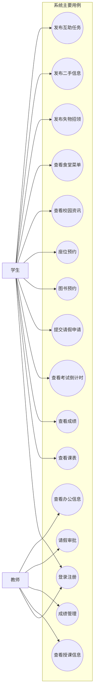

图3-1 系统用例图

### 3.2.1 用户认证与角色分流需求

系统首先需要具备完整的用户认证能力，包括注册、登录、退出登录、用户资料读取和登录状态恢复等基础功能。考虑到校园用户的使用习惯，系统不仅应支持邮箱密码登录，还应兼顾学号或手机号作为辅助登录标识的实际需求。

此外，系统还必须支持角色分流能力。由于学生和教师在首页结构、功能入口和业务权限上存在明显差异，系统需要在认证成功后能够根据用户角色动态切换页面结构，并限制部分功能仅对教师开放。例如，教师成绩管理和请假审批不应暴露给学生用户，而学生成绩查询和学生请假申请则应在学生端重点呈现。

从业务依赖关系看，用户认证并不是孤立的起始页面，而是整个系统功能联动的根节点。课程、成绩、考试倒计时、预约记录和请假记录等大量业务数据都与当前登录用户直接关联，如果系统无法稳定识别当前用户身份，就无法保证后续查询结果和操作权限的正确性。因此，认证需求除了要求用户能够成功登录之外，还要求系统能够在应用重新启动后恢复会话状态，在会话失效时及时跳回登录界面，并在登录状态切换时同步更新依赖当前用户的业务模块。

角色分流需求则体现了本系统双角色服务特征。学生与教师虽然共享同一应用入口，但在可见模块、可执行操作和数据访问范围上存在本质区别。学生更偏重个人信息查询和个人服务提交，而教师更偏重审批、管理和教学事务处理。因此，系统需要在用户认证成功后尽快完成角色判断，并据此切换首页结构、导航入口和二级功能页面。只有做到“登录后即按角色进入正确工作流”，才能避免用户在应用内部再次手动切换角色所带来的混乱。

此外，认证与角色分流需求还隐含着一致性要求。也就是说，系统不仅要在界面上隐藏无权限入口，还要保证业务请求、本地状态和路由跳转同时遵循同一角色判断逻辑。例如，教师成绩管理页面不应仅仅在首页按钮上对学生隐藏，更应在路由层和数据访问层同时限制其被错误访问。这种一致性要求决定了用户认证需求在本系统中具有基础设施性质，而不是单纯的功能页面需求。

### 3.2.2 学生端学习服务需求

学习服务是学生端的核心需求，系统应至少满足以下几个方面。第一，学生能够查看个人课程安排，并在首页快速获得当天或当前时段的重要课程信息；第二，学生能够查询个人成绩，并查看绩点、学分与学期汇总等统计结果；第三，学生能够维护个人考试倒计时信息，以便掌握备考节奏；第四，学生能够使用图书馆服务，包括图书查询、图书预约、借阅记录查看和座位预约等；第五，学生能够提交请假申请并查看审批结果。

除上述功能外，学生还需要一定的学习辅助工具，如教室查找、完整课表浏览等。这些功能虽然不一定构成独立业务系统，但在校园实际使用中具有较高频率，因此应在综合服务应用中得到体现。

从需求强度上看，学习服务模块是学生端最具刚性特征的部分。与资讯浏览或互助发布相比，课程查询、成绩查看和考试提醒直接关系到学生的学习安排与学业管理，属于使用频率高、时效要求强、个性化程度高的功能类型。因此，该模块需要优先保证数据与当前用户强绑定、查询结果清晰可读、首页入口足够直接，并尽量减少进入高频功能所需的点击层级。

从功能组织关系看，学习服务内部也并非若干独立页面的简单并列。课程安排决定了学生每日的上课节奏，成绩数据反映了阶段性学习结果，考试倒计时则帮助学生形成时间规划，图书馆预约与学习资源获取直接相关，请假流程则与上课出勤和教学管理产生联系。换言之，这些功能共同构成了学生学习过程中的“计划、执行、反馈和补充支持”闭环。系统在需求层面应支持这种闭环关系，而不仅仅是提供若干可点击入口。

另外，学生端学习服务还具有明显的个体化特征。同一功能在不同用户之间的展示结果通常完全不同，例如课程表、成绩记录、考试计划、请假申请和图书馆预约都依赖个人身份进行筛选。因此，该模块的需求分析必须强调“个性化数据读取”和“隐私隔离”两项基础要求。只有在确保数据归属明确的前提下，学习服务模块才能真正满足校园场景中的实际使用需要。

### 3.2.3 校园生活服务需求

校园生活服务需求主要体现在资讯获取、餐饮查询、地图浏览与出行辅助等方面。系统需要支持校园资讯的统一展示，帮助用户及时获取校内通知和新闻内容；需要支持食堂菜单按周和按受众类型展示，帮助学生和教师快速了解餐饮安排；需要提供校园地图入口，用于课程地点查找、生活设施定位和空间认知；同时还可整合校车或通勤信息，以增强系统在日常生活场景中的服务能力。

这类需求的共同特点是高频、轻量和即时查询，因此界面设计上应突出快速访问与清晰展示，而不宜采用过度复杂的交互流程。

与学习服务相比，生活服务模块的业务复杂度相对较低，但其使用频率和入口价值同样较高。学生和教师几乎每天都会接触校园通知、食堂菜单、地图和通勤信息，因此系统应保证这些功能具备“打开即可读、信息层级清楚、无须复杂操作”的特点。也就是说，生活服务的核心并不在于复杂业务处理，而在于是否能够以较低认知成本完成信息触达。

从数据特征上看，生活服务更强调时效性和展示性。资讯内容通常按发布时间不断更新，菜单信息按周和按餐次变化，地图内容强调空间位置理解，通勤信息则更关注班次和时间安排。这意味着系统在功能需求上不仅要支持读取数据，还要支持较合理的排序、分组和摘要展示方式，使用户能够在较短浏览时间内获取最重要的信息。尤其在移动端场景下，若信息堆叠过多或层级不清晰，用户很容易放弃继续使用。

此外，生活服务需求还反映出系统在“统一校园入口”中的门户属性。许多传统校园信息系统只关注教务或办公，而忽略了师生日常生活中的高频便利服务。本系统将生活服务纳入核心需求分析，说明其目标不仅是构建一个学习管理工具，更是构建一个覆盖校园日常行为场景的综合服务平台。

### 3.2.4 校园互助服务需求

校园互助服务需求体现了系统的社区属性。学生在校生活中经常需要处理失物招领、二手物品交易和代办求助等问题，因此系统应支持用户发布和浏览相关信息，并允许对信息状态进行必要的维护。

从功能角度看，系统至少需要支持三类互助场景：其一，用户能够发布失物或招领信息，并在找回或认领后更新状态；其二，用户能够发布和浏览闲置物品信息，形成简易的校内二手流转平台；其三，用户能够发布互助任务并对完成状态进行标记。此类需求不仅提高了校园服务的生活化程度，也有助于增强用户参与感和系统活跃度。

校园互助需求与前述学习服务、生活服务相比，具有更明显的用户生产内容特征。也就是说，这一模块中的大量信息并非由学校官方统一维护，而是由学生或教师主动发布。这意味着系统除了要支持信息读取之外，还必须支持较低门槛的内容发布流程，以及发布后对状态进行修改、关闭和维护的能力。若发布流程过于繁琐，用户参与积极性将明显下降；若状态管理能力不足，系统中的互助信息则容易过期失效，降低整体可信度。

从业务组织角度看，失物招领、二手流转和互助任务虽然具体内容不同，但它们在交互结构上具有高度相似性，即都需要经历“发布内容、展示列表、查看详情、更新状态”的基本流程。因此，在需求分析中可以将三者视为同一类“社区型信息流需求”的不同表现形式。这种归纳有助于后续系统设计阶段采用统一发布入口、统一卡片样式和统一状态字段思路进行实现。

此外，校园互助服务需求还隐含着一定的信息有效性要求。用户希望看到的是“近期、真实、仍然有效”的失物信息、闲置物品和任务请求，而不是长期无人维护的历史记录。因此，系统在需求层面应支持发布时间展示、状态标签标识和发布者自主管理机制，以帮助用户快速判断一条信息是否仍值得关注。这种需求虽然不一定表现为复杂业务规则，但对模块的实际可用性影响很大。

### 3.2.5 教师端教学与办公扩展需求

教师端需求主要包括教学服务和办公服务两个方向。在教学服务方面，教师需要查看授课安排、班级信息、成绩管理入口和教学辅助工具；在办公服务方面，教师需要查看待审批事项，尤其是与学生请假相关的审批流程，并保留调课、场地借用、奖助学金审核和通知查看等扩展入口。

与学生端相比，教师端功能更强调角色特定性和业务闭环性，因此系统应保证教师用户在登录后能够快速进入教学和办公主页面，并将真实可用功能与演示性功能合理组织，形成清晰的教师工作流界面。

从使用逻辑上看，教师端需求与学生端需求的差别不只是模块名称不同，更在于操作性质发生了变化。学生端更多是“查看个人信息、提交个人申请”，而教师端则更多涉及“查看整体情况、处理他人申请、执行管理操作”。这意味着教师端功能需要比学生端更强调列表筛选、待办聚合、状态处理和角色责任边界。例如，请假审批不仅要求教师能看到申请记录，还要求其能够区分待处理与已处理状态，并在审批后让结果及时反馈到学生端。

在需求优先级上，教师端功能又可进一步区分为“真实闭环需求”和“扩展展示需求”两类。前者如请假审批和成绩管理，与当前系统中的真实业务数据联系更紧密，是教师端的核心功能；后者如调课申请、通知分类查看、奖助学金审核和科研相关页面，则更多体现教师办公场景的扩展方向。将这两类需求进行区分，有助于后续论文在描述系统完成度时更加客观，也更符合实际开发中的分阶段实现策略。

从系统整体定位看，教师端的引入使本项目不再是单纯面向学生的信息查询工具，而是开始具备双端协同属性。学生提交请假，教师完成审批；教师维护成绩，学生查看结果；教师查看授课安排和班级信息，学生查看课程与成绩。正是这种跨角色数据流转关系，使教师端需求在系统需求分析中具有不可替代的重要性。

为便于归纳各功能模块的优先级与角色对应关系，本文将主要功能需求总结为表 3-2。

| 功能类别 | 主要使用角色 | 业务性质 | 优先级 |
| --- | --- | --- | --- |
| 用户认证与角色分流 | 学生、教师 | 基础支撑 | 高 |
| 学习服务 | 学生 | 核心业务 | 高 |
| 图书馆服务 | 学生 | 核心业务 | 高 |
| 校园生活服务 | 学生、教师 | 高频辅助 | 中高 |
| 校园互助服务 | 学生、教师 | 社区扩展 | 中 |
| 教师端教学与办公 | 教师 | 角色扩展 | 中高 |

## 3.3 系统非功能需求分析

### 3.3.1 性能与响应性需求

校园综合服务系统作为高频使用应用，需要具备较好的响应速度和界面流畅性。用户在进行登录、数据查询、页面跳转和预约提交等操作时，应能够在较短时间内获得反馈，避免因长时间等待影响使用体验。对于首页、成绩、图书馆和互助列表等高频页面，系统应通过合理的数据加载与状态管理机制减少重复渲染和不必要的等待过程。

此外，系统在处理列表展示、图像加载和异步请求时，也应尽量保持界面稳定，避免出现明显卡顿或操作阻塞。对于毕业设计场景而言，虽然系统不追求超大规模并发能力，但仍需满足日常使用条件下的基本性能要求。

从具体表现形式上看，性能需求不仅仅意味着“程序能够打开”，还意味着常用操作需要具有足够可接受的反馈速度。例如，用户登录后首页应尽快显示关键模块入口，成绩、课表和资讯等页面应避免因重复请求而长时间停留在空白状态；对于图书预约、座位预约和请假提交等写操作，系统也应及时给出加载状态和结果反馈，以降低用户对操作是否成功的疑虑。特别是在校园环境中，用户常常利用课间、排队或移动过程中进行碎片化使用，因此系统的响应性直接影响实际可用性。

考虑到本系统以客户端直连云端数据为主要模式，性能优化还需要兼顾请求次数控制和状态更新策略。若每一次页面切换都重新发起完整查询，不仅会增加网络负担，也容易造成界面反复闪烁。因而系统在非功能目标上需要强调状态复用、局部刷新和结构化数据缓存思路，使应用在常规校园网络环境下依然能够保持较流畅的使用体验。

对于本系统而言，性能与响应性需求还应体现为不同操作类型的差异化要求。只读型操作如课程查看、资讯浏览和菜单查询，更强调首屏信息尽快呈现和滚动过程稳定；写入型操作如预约提交、请假申请和审批处理，则更强调结果反馈及时明确，防止用户因等待不确定而重复提交。也就是说，性能需求不应被抽象为单一指标，而应结合具体业务动作理解为“在用户最在意的环节上提供足够快且足够清晰的响应”。

### 3.3.2 跨平台兼容性需求

由于系统采用 Flutter 开发，因此应具备较好的跨平台兼容能力，至少要在移动端和桌面端环境下保持核心功能可用、布局稳定和视觉风格一致。不同平台屏幕尺寸和交互方式存在差异，因此页面布局需要具备弹性，避免在大屏设备上过度拉伸，或在小屏设备上内容拥挤难读。

对于存在平台差异的页面，如地图展示功能，系统还需要提供针对性处理策略，以保证不同运行环境下的可用性和稳定性。兼容性需求不仅体现在“能运行”，还体现在“运行体验尽量一致”。

进一步分析，跨平台兼容性还要求系统在不同设备类型下保持相对统一的信息表达逻辑。移动端用户更倾向于通过底部导航和纵向滚动完成操作，而桌面端用户则更容易关注页面整体布局、留白比例和多模块并列展示效果。因此，在系统设计中不仅要保证同一功能在不同设备上可以正常访问，还要保证文本层级、卡片结构、操作入口和反馈方式在不同平台上不会发生过大割裂。对于毕业设计论文而言，这种兼顾“功能一致性”和“体验一致性”的要求，也是评价跨平台应用质量的重要维度。

此外，兼容性需求还涉及平台差异页面的降级处理能力。考虑到地图等功能在不同平台上可能存在依赖差异，系统应允许在不影响主流程功能的前提下对特定页面进行分平台实现或占位处理。换言之，兼容性不仅要求“最好所有页面都完全一致”，还要求“即使个别平台能力存在差异，系统整体仍然稳定可用”。这种思路对于采用跨平台框架开发的校园应用尤为重要。

### 3.3.3 数据安全与权限控制需求

系统涉及用户认证、成绩、请假、预约和个人资料等敏感信息，因此必须满足基本的数据安全要求。首先，系统不应在客户端暴露高权限数据库密钥；其次，必须确保用户只能访问与自身相关的私有数据，教师端的审批与管理功能也应受到角色限制；最后，系统还需要避免因角色分流不清晰导致普通用户误入高权限页面的情况。

在本系统中，这类需求主要通过 Supabase Auth、角色字段识别和数据库权限策略共同实现。数据安全与权限控制既是功能正确性的保障，也是系统能否长期扩展的重要基础。

除了访问范围控制之外，系统的安全性还体现在异常场景下的边界保护能力。例如，当用户会话失效、网络请求被中断或数据库返回权限不足错误时，客户端应能够及时阻止后续非法操作，并通过统一方式提示用户重新登录或稍后重试；当教师端与学生端共用某些页面入口时，也应通过路由分流与界面隐藏双重方式减少误触发风险。换言之，数据安全并不只依赖底层策略本身，还依赖客户端在身份识别、错误响应和操作提示层面的协同处理。

对于校园综合服务系统而言，非功能层面的权限控制还有一个重要目标，即在不显著增加用户操作负担的前提下完成安全隔离。系统既不能因为权限设计不足导致数据越权，也不能因为权限流程过于复杂而破坏使用体验。因此，如何在“安全性”和“易用性”之间取得平衡，也是本系统非功能需求分析中的重点内容。

### 3.3.4 可维护性与可扩展性需求

除了面向最终用户的性能、兼容性和安全性需求外，系统还应具备良好的可维护性与可扩展性。毕业设计项目虽然在交付时以“当前功能可用”为主要目标，但如果系统结构本身缺乏清晰边界，后续无论是修复问题、补充教师端真实业务，还是增加新的校园服务场景，都会面临较高修改成本。因此，从需求分析阶段就应明确系统需要采用模块化组织方式，使页面层、状态层和数据层尽量分离，并保证公共主题、公共组件和公共数据访问能力能够被重复复用。

从扩展角度看，校园服务场景并不是固定不变的。学生端后续可能增加更多学习工具或个性化功能，教师端可能继续接入通知、调课、作业和审核等真实业务，生活服务和互助服务也可能扩展消息提醒、收藏、筛选等能力。这要求系统在需求层面具备良好的扩展承载能力，即新增模块时不应对现有结构造成大面积破坏，新功能应尽量能够在既有认证机制、路由体系和数据访问机制基础上平滑接入。

为了更直观地概括主要非功能需求，本文将其总结为表 3-3。

| 非功能类别 | 重点关注内容 | 需求目标 |
| --- | --- | --- |
| 性能与响应性 | 页面加载、数据刷新、操作反馈 | 高频场景下保持流畅与及时反馈 |
| 跨平台兼容性 | 多端布局、交互一致性、平台差异处理 | 保证主要功能在移动端和桌面端稳定可用 |
| 数据安全与权限控制 | 身份认证、角色隔离、私有数据访问边界 | 防止越权读取与误操作 |
| 可维护性与可扩展性 | 分层结构、模块化组织、后续功能接入能力 | 支持系统持续迭代和功能扩展 |

## 3.4 系统可行性分析

从技术可行性来看，本系统所采用的 Flutter、Supabase、Riverpod、GoRouter 和 Hive 等技术均较为成熟，具有良好的社区支持和文档资源，能够支撑项目在毕业设计周期内完成开发。尤其是 Supabase 的使用，使系统在不自建完整后端服务的前提下，仍能获得认证、数据库和权限控制能力，显著降低了开发难度。

从经济可行性来看，本系统主要依托开源框架和云端平台的基础能力进行实现，开发成本相对较低，不需要额外投入复杂服务器开发与维护资源。对于毕业设计项目而言，这种轻量架构能够在有限时间和资源条件下实现更完整的功能闭环。

从应用可行性来看，校园综合服务是高校场景中的真实需求，学生和教师均存在较高频的使用动机。系统所覆盖的课程、成绩、资讯、图书馆、请假和互助等功能具有明确的场景基础，因此在业务上具备较强可行性。总体而言，无论从技术、成本还是应用场景角度分析，本系统都具备较好的实现可行性。

进一步从开发组织可行性来看，本系统的任务边界相对清晰，功能划分具有较强的模块化特征，适合在毕业设计周期内按阶段推进。认证、学习服务、生活服务、互助服务和教师端扩展功能之间既存在统一的数据与路由基础，也可以按优先级逐步完成，从而使项目能够先实现主链路，再逐步补齐扩展模块。这样的任务拆分方式降低了系统一次性开发的压力，也提高了项目在有限周期内交付完整成果的可能性。

从数据基础可行性来看，本项目并非在完全空白的业务模型上构建，而是已经具备较为明确的数据表结构和功能边界。Supabase 中现有的课程、成绩、资讯、图书馆、请假、互助和教师扩展相关数据表，为系统实现提供了直接的数据支撑，使论文中的设计与实现能够建立在真实数据模型之上，而不是停留在抽象设想阶段。这一点对于毕业设计尤其重要，因为它意味着系统具备较强的可验证性，能够通过真实数据读写与业务流程演示来证明方案的可行性。

从风险控制角度分析，项目所选择的轻量化技术路线也具有较好的可控性。若采用自建后端方案，开发者还需要额外处理服务部署、接口设计、认证联动和权限校验等大量基础工作，容易在有限周期内分散精力。相较之下，当前方案将更多精力集中在客户端业务实现和云端数据组织上，风险点更加聚焦，问题定位也更直接。虽然这并不意味着系统不存在限制，但就毕业设计目标而言，该路线在可实现性、可演示性和可维护性之间取得了较合理的平衡。

从运行维护可行性来看，本系统后期维护压力相对可控。由于没有单独建设复杂后端服务，系统部署和日常维护的重点主要集中在客户端版本迭代、Supabase 数据表管理和权限策略调整三个方面。这种维护方式比传统“前端、后端、数据库多处联动”的模式更轻量，也更适合教学项目或中小规模应用进行持续改进。对于毕业设计而言，这意味着系统不仅能在开发阶段完成实现，也具备在答辩后继续迭代完善的现实基础。

从进度可行性来看，当前项目采用分阶段推进方式是合理的。先完成认证、学生端核心学习服务和图书馆服务，再逐步补充生活服务、互助服务和教师端扩展内容，既符合需求优先级，也能够降低一次性开发全部功能带来的风险。尤其是在部分教师端功能仍以静态演示为主的情况下，这种渐进式推进策略使系统能够在有限周期内优先保证主链路完成，而不是在过多扩展功能上分散资源。

综合上述分析，系统可行性并不只是“技术上能否做出来”的单一判断，而是技术条件、数据基础、开发资源、时间安排和后续维护可能性共同作用的结果。就本项目而言，这几个方面总体上都呈现出较为积极的条件，因此系统具备较强的实施可行性。为便于概括，本文将可行性分析结果归纳为表 3-4。

| 可行性维度 | 主要依据 | 结论 |
| --- | --- | --- |
| 技术可行性 | Flutter、Supabase、Riverpod 等技术成熟 | 可行 |
| 经济可行性 | 主要依托开源框架和云服务基础能力 | 可行 |
| 应用可行性 | 校园场景真实、师生需求明确 | 可行 |
| 开发组织可行性 | 模块边界清晰，可按优先级分阶段推进 | 可行 |
| 运行维护可行性 | 架构较轻量，后续维护重点明确 | 可行 |

## 3.5 本章小结

本章从业务场景、功能需求、非功能需求和系统可行性等方面，对校园综合服务系统进行了分析。通过需求分析可以看出，本系统不仅需要满足学生在学习和生活中的高频需求，还需要兼顾教师在教学和办公中的部分扩展需求；同时，还必须在跨平台适配、性能响应和数据安全等方面达到基本可用标准。这些分析结果为后续系统设计与实现提供了明确方向。

进一步总结可以看出，本系统的需求具有三个显著特点。第一，需求覆盖范围较广，既包含课程、成绩、图书馆和请假等刚性学习服务，也包含资讯、菜单、地图和互助等生活与社区服务；第二，需求具有明显角色差异，学生端以个人服务和信息查询为主，教师端则更强调审批与管理；第三，需求之间存在较强关联性，认证状态、角色分流和权限边界会直接影响多个业务模块的正确运行。正因如此，后续系统设计不能只关注单个页面实现，而需要从整体架构、分层组织和数据访问控制等层面统筹考虑。

因此，第3章的需求分析不仅为后续功能模块设计提供了依据，也为第4章的总体架构设计、分层结构设计和权限控制设计奠定了问题背景。只有在明确“用户真正需要什么、系统必须优先保证什么、哪些约束会影响系统质量”的基础上，后续设计与实现过程才具有充分的合理性与针对性。

# 第4章 系统设计

## 4.1 系统总体架构设计

本系统面向校园场景中的学习服务、生活服务、校园互助以及教师教学办公等业务需求，采用“Flutter 客户端 + Supabase 云端数据服务 + 本地轻量存储”的总体架构进行设计。与传统的“前端 + 自建后端 + 数据库”模式不同，本系统未单独开发业务后端服务，而是通过 Supabase 提供的身份认证、数据库访问和权限控制能力，直接支撑客户端的数据读写与用户管理，从而降低了系统开发复杂度，提高了开发效率与部署便利性。

从整体结构上看，系统可以划分为表现层、状态管理与业务协调层、数据访问层以及云端数据层四个部分。表现层主要由 Flutter 页面、通用组件和主题样式构成，负责完成界面展示、用户交互和多端适配；状态管理与业务协调层基于 Riverpod 实现，对用户状态、成绩数据、课表数据、互助信息、请假审批等业务状态进行统一管理；数据访问层主要由各类 Service 与 Repository 组成，负责封装对 Supabase 数据表的查询、插入、更新和删除操作；云端数据层则依赖 Supabase 提供的 Auth 与 PostgreSQL 数据存储能力，实现用户认证、业务数据持久化以及基于角色的数据隔离控制。

如图4-1所示，本系统采用“Flutter 客户端 + Supabase 云端服务 + Hive 本地辅助存储”的轻量化总体架构。

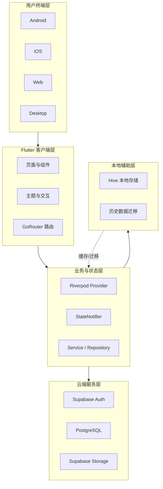

图4-1 系统总体架构图

在客户端架构设计方面，系统以 Flutter 作为统一开发框架，通过单一代码库适配移动端与桌面端运行环境。系统入口在应用启动时完成 Hive 初始化和 Supabase 初始化，随后加载全局主题与路由配置。界面导航采用 GoRouter 实现，通过路由集中管理各功能页面之间的跳转关系，并结合当前登录用户身份实现学生端与教师端的页面分流。例如，当用户进入首页或成绩模块时，系统会根据用户角色动态切换到对应的学生端页面或教师端页面，以提升功能组织的合理性和使用体验。

在业务组织方面，系统采用较为清晰的分层结构。表现层负责页面渲染与交互逻辑；业务层通过 Riverpod 的 Provider 与 StateNotifier 维护页面状态和异步加载结果；数据层通过 Service 与 Repository 对接 Supabase 数据表。该设计方式使界面逻辑、状态逻辑与数据逻辑彼此解耦，既有利于后续功能扩展，也有利于测试与维护。对于图书馆预约、座位预约、请假审批、成绩查询、考试倒计时等典型业务，系统均通过对应的数据服务类完成业务封装，再由状态管理层向页面提供统一的数据访问入口。

在数据架构方面，系统核心数据统一存储于 Supabase 的 PostgreSQL 数据库中，主要包括用户信息、课程信息、成绩信息、校园资讯、请假申请、互助任务、失物招领、二手流转、图书与图书预约、座位与座位预约等数据表。系统通过 Supabase SDK 在客户端直接访问这些数据表，并结合用户身份信息完成按用户筛选、按角色区分和按状态流转等业务处理。与此同时，系统保留了 Hive 本地存储能力，一方面用于早期本地数据方案的迁移支持，另一方面也为后续的本地缓存和离线扩展预留了实现基础。

在安全设计方面，由于系统直接通过客户端访问云端数据，因此权限控制成为总体架构中的关键环节。本系统以 Supabase Auth 作为用户身份认证基础，通过用户表中的角色字段区分学生和教师身份，并结合数据库访问策略约束不同用户对不同业务数据的可见范围和操作范围。相比传统自建后端统一校验的方式，此种架构将部分数据安全责任前移到云端平台规则层，既减少了自建接口的维护成本，也提高了权限控制的一致性。

此外，考虑到本项目的实际开发周期和毕业设计场景，系统采用“真实业务数据 + 局部静态演示数据”相结合的实现方式。其中，登录注册、成绩、课表、请假、校园资讯、图书馆预约、座位预约、互助信息等核心功能已基于 Supabase 完成真实数据驱动；部分教师办公展示类内容则以静态结构化数据进行界面与流程演示。该架构既保证了主要业务链路的可运行性，也兼顾了项目完整性与实现成本之间的平衡。

综上所述，本系统总体架构具有跨平台统一开发、云端服务集成度高、前后职责划分清晰、扩展维护成本较低等特点。该架构能够较好满足校园综合服务应用在功能实现、开发效率、运行维护和后续扩展等方面的需求，为后续各功能模块的详细设计与实现提供了稳定的技术基础。

## 4.2 客户端分层结构设计

为更清晰地展示客户端内部的职责划分关系，本文将其分层结构概括如图4-2所示。该结构反映了页面展示、状态组织、数据访问和数据源之间的连接方式。

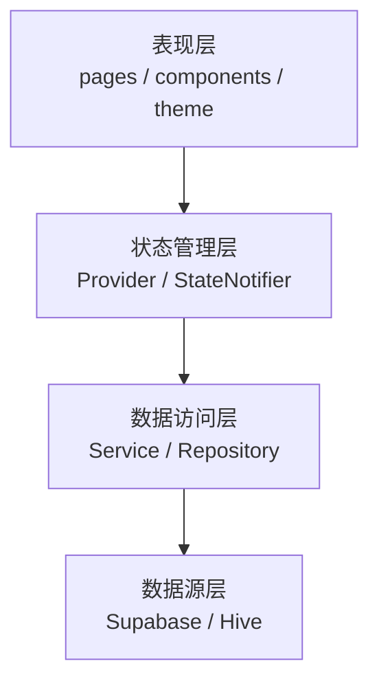

图4-2 客户端分层结构图

### 4.2.1 表现层设计

表现层是系统与用户直接交互的部分，主要负责界面展示、页面跳转、输入响应以及多端适配等功能。本系统采用 Flutter 构建统一的客户端界面，在工程组织上将表现层划分为页面层、通用组件层、路由层和主题样式层。页面层负责承载具体业务场景，如登录注册、首页、学习服务、校园生活、校园互助、图书馆服务以及教师教学办公等页面；通用组件层负责封装应用栏、按钮、卡片、表单、加载状态、空状态等高复用界面元素；主题样式层统一管理颜色、字体、间距和整体视觉风格，从而保证系统界面的一致性与可维护性。

在页面组织方式上，系统按照实际业务功能进行划分。学生端主要包括学习、生活和互助三个一级功能入口，教师端则包括教学、办公和社区三个主要入口。首页采用底部导航栏切换不同业务页面，并根据当前登录用户身份动态显示对应的功能结构。这样的设计既满足了不同角色的使用习惯，也避免了学生和教师功能混杂造成的界面复杂化问题。与此同时，系统将认证页面、个人中心页面以及图书馆、成绩、请假、预约等二级页面纳入统一页面体系中，使页面层次更加清晰。

在界面复用设计方面，系统通过封装通用组件减少了重复开发。例如，应用栏组件统一处理标题和操作按钮展示，卡片组件统一承载模块化信息块，加载组件和空状态组件统一处理异步请求过程中常见的界面反馈问题。通过这种方式，系统不仅提升了界面开发效率，也使整体视觉风格更加统一，便于后续对界面细节进行集中调整和优化。

在导航机制方面，系统采用 GoRouter 实现路由集中管理。各页面的跳转路径、参数传递和嵌套路由关系均在统一位置进行配置，从而提升了页面导航逻辑的可读性和可维护性。对于需要依据用户身份进行动态跳转的功能，如成绩模块入口和首页模块切换，系统在路由层和页面层之间增加了角色分流逻辑，使不同角色能够进入各自对应的功能页面，体现了表现层与业务规则的有效协同。

在跨平台适配方面，系统充分考虑了移动端与桌面端的显示差异。页面整体采用 SafeArea、SingleChildScrollView、ConstrainedBox 等布局方式控制内容区域，并通过限制最大宽度和居中展示的方式优化桌面端显示效果。对于地图页面等存在平台差异的功能，系统采用分平台页面实现策略，以保证不同运行环境下的可用性和稳定性。总体来看，表现层设计在保证界面美观性的同时，也兼顾了交互流畅性、组件复用性与跨平台适应能力。

### 4.2.2 业务逻辑层设计

业务逻辑层位于表现层与数据访问层之间，主要负责状态管理、业务流程协调、异步数据处理以及页面行为控制。本系统采用 Riverpod 作为核心状态管理工具，通过 Provider、StateNotifier 和 StateNotifierProvider 等机制构建统一的状态管理体系，实现各模块状态的独立维护与集中调度。该设计避免了将复杂业务逻辑直接写入界面层，从而有效提升了系统的可维护性和可测试性。

在具体实现上，系统为用户认证、成绩查询、课程表、考试倒计时、校园资讯、请假审批、失物招领、二手流转、互助任务等功能分别建立独立的状态对象和业务控制器。状态对象通常包含业务数据、加载状态和错误信息三个基本部分，用于描述当前模块的运行状态；业务控制器则负责封装加载、添加、修改、删除、刷新等操作逻辑，并在操作完成后更新状态。这样的设计方式使页面层可以直接根据状态变化自动刷新界面，而无需自行处理复杂的数据同步逻辑。

用户认证相关业务是系统逻辑层中的核心部分。系统通过认证状态管理模块维护当前登录用户信息，并在应用启动后自动尝试恢复登录状态。当用户完成登录、注册或退出操作后，相关状态会立即更新，并驱动首页、个人中心及其他依赖身份信息的页面重新渲染。此外，系统还利用业务逻辑层对用户角色进行识别，并据此控制学生端与教师端的功能分流。例如，首页根据用户角色切换不同模块集合，成绩入口根据教师或学生身份跳转到不同的页面，这体现了业务逻辑层在角色控制中的关键作用。

在典型业务流程处理方面，系统通过业务逻辑层对数据加载和状态流转进行统一封装。例如，请假审批业务需要经历“待审批、已通过、已驳回”等状态变化；座位预约业务需要经历“预约、签到、使用中、结束、取消”等多个阶段；图书预约业务需要处理排队、可借阅、取消等状态。上述流程均由业务逻辑层进行集中管理，从而避免页面层直接承担复杂状态判断任务。这种设计有助于保证业务规则的一致性，减少因页面分散处理而产生的逻辑冲突。

此外，业务逻辑层还承担了异常处理与界面反馈协同的职责。当数据请求失败、权限不足或业务规则不满足时，系统会将错误信息写入状态对象，页面再根据状态统一展示错误提示、重试按钮或空数据界面。对于新增、删除、审批等操作，系统则采用刷新列表或局部更新的方式保持界面与数据的一致性。总体而言，业务逻辑层在本系统中发挥了承上启下的重要作用，是连接界面交互与数据操作的核心中枢。

### 4.2.3 数据访问层设计

数据访问层负责完成客户端与云端数据源之间的交互，是系统实现业务数据持久化的关键部分。由于本系统未单独开发业务后端，而是采用 Supabase 作为后端即服务平台，因此数据访问层直接建立在 Supabase Flutter SDK 之上。其主要职责包括用户认证访问、数据库表查询、数据插入与更新、业务状态校验、结果映射以及异常处理等。通过对数据访问逻辑进行统一封装，系统避免了界面层直接操作数据表，提高了代码结构的清晰度。

从工程实现来看，数据访问层主要由两类对象构成：一类是面向通用业务模块的 Service，另一类是面向复杂子模块的 Repository。前者主要服务于认证、课表、成绩、考试倒计时、校园资讯、食堂菜单、请假申请、失物招领、二手流转和互助任务等功能；后者主要用于图书馆相关场景，如图书查询、图书预约、借阅记录、公告读取和座位预约等。Service 与 Repository 的划分使得不同复杂度的数据访问需求能够采用更加合适的封装方式，既保持了通用模块的简洁性，也满足了复杂模块的业务扩展需求。

在数据映射方面，由于 Supabase 数据表采用以下划线命名为主，而 Flutter 领域模型通常采用驼峰命名，因此系统在数据访问层中统一完成字段映射与模型转换。例如，数据库中的 published_at、image_url、available_copies、student_id 等字段，会在数据访问层转换为客户端模型所使用的 publishedAt、imageUrl、availableCopies、studentId 等属性。通过引入统一的领域模型，系统保证了上层业务逻辑与页面层不必直接关心底层数据表的字段细节，从而降低了耦合程度。

在认证与权限控制方面，数据访问层直接结合 Supabase Auth 实现用户身份管理。系统登录成功后，会进一步从公共用户表中读取用户姓名、角色、学号、院系等扩展信息，以构建完整的客户端用户对象。对于与用户相关的数据查询，系统普遍基于当前登录用户标识进行筛选，例如成绩查询按用户编号过滤、请假记录按学生编号读取、座位预约按当前用户获取、图书预约按当前登录用户读取个人队列信息。这种设计方式既符合业务需求，也与 Supabase 的权限控制机制相配合，保证了数据访问的安全性。

在复杂业务的数据控制方面，数据访问层不仅负责简单的增删改查，还承担了部分前置业务校验职责。例如，座位预约前需要检查当前用户当天是否已有有效预约，同时还要验证目标座位在指定时段是否已被占用；图书预约前需要检查当前用户是否已存在未完成预约，并计算新的排队位置；请假审批则需要根据操作结果更新审批状态和教师意见。上述逻辑均在数据访问层中进行了封装，使上层业务逻辑能够以更稳定、更统一的方式调用数据服务。

此外，系统保留了 Hive 本地存储能力，用于支持早期本地用户数据向 Supabase 的迁移，并为后续扩展本地缓存和离线能力提供基础。需要指出的是，在当前版本中，系统的核心业务数据仍以 Supabase PostgreSQL 为主数据源，本地存储主要承担辅助作用。总体而言，数据访问层通过对 Supabase 能力的合理封装，实现了“无自建后端”架构下的数据统一访问，为系统整体运行提供了可靠的数据支撑。

## 4.3 系统功能模块设计

系统功能模块设计是在需求分析基础上，对各业务功能进行结构化划分和模块化组织的过程。本系统围绕校园综合服务场景，将整体功能划分为学习服务模块、生活服务模块、校园互助模块和教师端扩展模块四个部分。各模块既相互独立，又通过统一的用户认证体系、状态管理机制和数据访问方式进行协同，共同构成完整的校园服务应用功能体系。

图4-3从整体层面展示了系统功能模块的结构划分，其中学生端以个人服务与信息查询为主，教师端则以教学和审批处理为主。

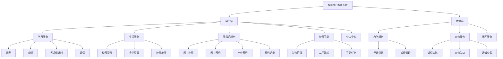

图4-3 系统功能模块结构图

### 4.3.1 学习服务模块设计

学习服务模块是学生端最核心的功能模块，主要面向学生在校学习过程中的信息查询、进度跟踪与资源获取需求。结合本系统实际实现情况，该模块主要包括课程表查询、成绩查询与可视化、考试倒计时、图书馆服务、请假申请以及教室查找等子功能。

在课程表功能设计方面，系统从 Supabase 数据表中读取课程信息，并按照星期、上课时间、起止周次等字段进行组织展示。首页学习模块优先显示当天或当前时间段最相关的课程信息，用于提升信息获取效率；完整课表页面则提供更全面的课程浏览能力，方便学生查看周内课程安排。为了增强课程信息的可读性，系统在界面设计中结合课程名称、授课教师、上课地点和时间段等内容进行模块化展示。

在成绩管理功能设计方面，系统支持学生查询个人课程成绩，并基于已有成绩数据完成绩点计算、学分统计和学期维度的数据汇总。系统将原始成绩数据组织为课程记录集合，并进一步生成学期级汇总结果，用于支持首页的学习进度展示和成绩页的详细分析。为了提高信息表达能力，系统采用可视化方式展示绩点变化趋势，使学生能够更直观地了解自身学业表现。

在考试倒计时功能设计方面，系统允许学生添加、修改和删除个人考试计划，并按考试日期自动计算剩余时间。该功能不仅可展示全部考试记录，还能够根据考试时间判断即将到来的考试和已过期考试，从而帮助学生形成较清晰的备考节奏。考试倒计时数据按用户标识存储于 Supabase 中，使不同用户能够维护各自独立的考试任务列表。

在图书馆服务设计方面，本系统将图书馆相关功能作为学习服务的重要延伸，主要包括图书查询、图书预约、借阅记录查看、自习座位预约和预约记录管理等内容。图书查询功能支持读取图书基础信息，包括书名、作者、馆藏位置、库存数量和封面信息；图书预约功能根据当前用户和目标图书生成预约记录，并维护排队状态；自习座位预约功能则围绕楼层、区域、座位号和预约时段展开，支持预约、签到、签退和取消等操作。通过这些设计，系统能够较完整地覆盖学生在校学习中常见的图书馆业务场景。

此外，为增强学习服务模块的实用性，系统还设计了请假申请和教室查找等辅助功能。请假申请功能支持学生提交请假记录并查看个人申请结果；教室查找功能则为学生在日常上课、考试和活动过程中提供教学空间信息支持。总体来看，学习服务模块从课程、成绩、考试、图书馆和辅助教学服务等多个方面构建了较为完整的学习场景支持体系。

### 4.3.2 生活服务模块设计

生活服务模块主要面向学生和教师在校园日常生活中的信息获取与基础服务需求，目标是提升校园信息传递效率和日常生活便利性。结合本系统的当前实现，该模块主要包括校园资讯、食堂菜单、校园地图以及通勤信息展示等内容。

在校园资讯功能设计方面，系统通过 Supabase 数据表统一管理校园新闻与通知数据，页面按照发布时间倒序展示资讯内容，并支持标题、摘要、来源、分类、封面图片等信息的呈现。首页生活模块以轮播卡片的形式展示近期重点资讯，使用户能够在较短时间内获取校园内的重要信息。此设计兼顾了信息展示效率与界面视觉效果，符合移动端浏览场景下的使用习惯。

在食堂菜单功能设计方面，系统通过食堂基础信息表和周菜单表实现菜单数据的结构化管理。系统根据用户角色或目标受众区分不同食堂菜单内容，并以周维度组织每日早餐、午餐和晚餐数据。页面展示时重点突出每日推荐、菜品列表和食堂开放状态，使用户能够快速了解当日餐饮信息。该模块的数据组织方式也为后续扩展菜品分类、口味偏好推荐等功能提供了基础。

在校园地图功能设计方面，系统提供地图详情页与首页入口，用于帮助用户完成校园位置认知与基础空间导航。当前版本中，地图模块重点强调校园空间可视化展示和页面交互整合，其主要作用是为课程地点查找、生活设施定位和校园路线了解提供辅助支持。为兼顾不同平台的运行适配，系统采用了分平台页面处理方式，以保证地图相关功能在不同运行环境下具有较好的稳定性。

在通勤与校园出行信息设计方面，系统对校车或通勤班车信息进行了整合展示。当前版本中，相关数据主要用于界面流程演示和生活服务场景补充，重点体现系统在校园出行服务方面的扩展能力。整体而言，生活服务模块强调“轻量、高频、即查即用”的设计思路，围绕资讯、餐饮、地图和出行等日常生活场景，为用户提供较为便捷的校园生活支持。

### 4.3.3 校园互助模块设计

校园互助模块是本系统区别于传统校园信息查询应用的重要组成部分，其核心目标是为校内用户提供基于真实场景的社区化互助服务。根据项目当前实现情况，该模块主要包括失物招领、二手流转和互助任务三类功能，并通过统一的发布入口和列表展示机制进行组织。

在失物招领功能设计方面，系统允许用户发布遗失信息或拾取信息，主要字段包括标题、描述、地点、联系方式、发布时间和处理状态等。页面展示时，系统根据数据记录的类型区分“寻物”和“招领”两类内容，并对已解决与未解决状态进行标记。对于已被认领或已完成处理的物品，系统支持状态更新，从而形成较完整的失物招领信息流转机制。该功能能够有效回应校园中高频出现的失物管理需求。

在二手流转功能设计方面，系统为用户提供闲置物品发布与浏览功能。发布内容主要包括物品名称、描述、价格、原价、成色、卖家标识和发布时间等字段，首页与列表页可分别展示部分精选内容和完整数据集合。为了增强商品展示效果，系统支持封面图片字段扩展，在界面层通过卡片式布局强化物品信息的浏览体验。该功能的设计目标是促进校内闲置资源流动，降低学生之间的交易门槛。

在互助任务功能设计方面，系统支持用户发起代办、求助、协作等类型的互助请求。任务内容包括标题、描述、任务类型、奖励信息、需求人数、当前完成人数以及完成状态等。系统不仅支持任务的发布和列表展示，还能够对任务完成状态进行更新，从而体现互助请求从发布到完成的业务闭环。该模块在设计上强调低门槛发布和快速信息触达，以增强校园社区内部的协作效率。

为了提升校园互助模块的整体一致性，系统在交互设计上提供了统一的发布入口。用户可以在同一功能页中选择发布失物招领、二手流转或互助任务等不同类型的信息，系统再根据内容类型调用对应的数据处理逻辑并写入不同的数据表。此设计降低了用户的学习成本，也使互助模块内部的功能组织更加紧凑。

总体而言，校园互助模块不仅扩展了校园应用的服务边界，也增强了系统的社区属性与参与性。相比单纯的信息查询型应用，该模块更强调用户之间的信息发布、互动流转与场景协作，能够体现校园综合服务系统的实际应用价值。

### 4.3.4 教师端扩展模块设计

教师端扩展模块是在学生端基础功能之外，面向教师用户增设的角色化服务模块。该模块的设计目标是结合教师在教学管理和日常办公中的典型需求，形成具有角色区分特征的校园服务能力。结合本系统实际实现情况，教师端主要包括教学服务、办公审批和信息展示三类内容。

在教学服务设计方面，系统为教师提供教学首页入口，并围绕授课安排、班级名册、作业管理、成绩管理和教学周历等功能展开组织。其中，授课信息用于展示教师当前课程安排；班级名册功能用于查看教学班级信息；成绩管理用于支持教师视角下的学生成绩录入、查询和修改；作业与提交管理用于展示教学任务和学生提交记录。此类功能体现了教师在教学活动中的日常信息处理需求。

在办公审批设计方面，系统已实现与真实业务数据较为贴近的请假审批功能。教师可以查看待审批请假申请列表，并对申请执行通过或驳回操作，同时记录审批意见和审批状态。该功能与学生端请假申请模块形成前后呼应，构成较完整的业务闭环。除请假审批外，系统还预留了奖助学金审核、场地借用、调课申请等办公事务入口，用于构建教师日常办公服务的整体框架。

在教师信息展示与扩展服务设计方面，系统提供了通知查看、科研概况、通勤信息、生活服务等功能入口。其中部分功能当前采用静态演示数据实现，主要用于完成教师端页面结构展示和交互流程设计。例如，科研信息、报销记录、通知分类查看等功能在现阶段更多体现为可扩展的业务界面框架，而非完整的在线业务闭环。这种设计方式既符合毕业设计阶段的实现条件，也为后续真正接入更多云端数据提供了清晰的扩展路径。

教师端模块与学生端模块在系统架构中共享统一的认证机制、状态管理方式和数据访问方式，但在首页结构、路由分发和功能呈现上根据角色进行差异化组织。系统通过用户角色字段识别当前用户身份，并动态切换教师端首页页面和相关功能入口，从而保证不同角色能够获得更符合其实际需求的功能界面。总体来看，教师端扩展模块的设计增强了系统的角色适应能力，使本系统从单一学生服务应用扩展为兼顾学生与教师双主体的校园综合服务平台。

## 4.4 Supabase 数据模型与权限设计

### 4.4.1 主要数据表结构设计

为满足校园综合服务系统的业务需要，本项目在 Supabase PostgreSQL 中建立了面向用户管理、学习服务、生活服务、图书馆服务、校园互助和教师扩展功能的多组数据表。整体数据结构遵循“按业务域划分、按角色关系组织、按状态流转设计”的原则，使各类数据既能独立维护，又能通过用户标识和业务主键建立关联。

为直观展示系统核心实体之间的关联关系，本文将主要数据模型概括为图4-4所示的 E-R 关系图。

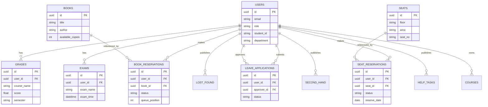

图4-4 系统数据库 E-R 图

在用户与身份基础数据方面，系统以 `auth.users` 作为认证主体，并在公共业务表 `users` 中维护用户名、姓名、手机号、用户类型、学号、院系等扩展信息。该设计将认证信息与业务信息适度分离，既便于依托 Supabase Auth 完成登录注册，又便于客户端以统一的用户模型读取角色和资料信息。对于教师用户，数据库中还预留了 `teacher_profiles` 表用于扩展工号、职称、办公室等属性；对于学生相关业务，系统进一步设置了 `students`、`classes` 等结构，为教师端教学管理与班级信息展示提供支撑。

在学习服务相关数据方面，系统主要使用 `courses`、`grades`、`exam_countdowns` 和 `leave_applications` 等表。其中，`courses` 表用于记录课程名称、任课教师、上课地点、星期和起止时间等信息，支撑学生端课表与首页课程卡片展示；`grades` 表用于保存课程成绩、绩点、学分和学期信息，支撑成绩查询和绩点分析；`exam_countdowns` 表用于维护用户自定义考试计划；`leave_applications` 表则承担学生请假申请与教师审批流转功能，记录请假类型、起止时间、审批状态、审批教师及审批意见等关键字段。上述表结构共同构成了学习服务模块的核心数据基础。

在生活服务相关数据方面，系统使用 `campus_news` 表管理校园资讯内容，字段包括标题、摘要、图片、来源、分类和发布时间等；使用 `canteens` 与 `canteen_weekly_menus` 两张表实现食堂与周菜单信息的分表管理，其中前者保存食堂基础属性，后者按星期组织早中晚餐条目和推荐说明。通过这种结构化设计，客户端能够较方便地按受众类型和日期维度组织生活服务内容。

在校园互助相关数据方面，系统主要使用 `lost_and_found`、`second_hand_items` 和 `help_tasks` 三张数据表。`lost_and_found` 表用于记录失物招领信息，包括标题、地点、联系方式和处理状态等字段；`second_hand_items` 表用于存储二手物品发布信息，包括价格、原价、成色和卖家标识；`help_tasks` 表则用于描述互助任务内容、奖励信息、需求人数和完成状态。三张表在结构上保持了相似的数据组织方式，便于客户端采用统一的列表展示和发布流程进行处理。

在图书馆服务相关数据方面，系统的数据模型相对更为丰富。`books` 表用于存储图书基础信息；`borrowed_books` 与 `borrow_request` 表用于支撑借阅状态和借阅流程展示；`book_reservations` 表用于维护图书预约队列、预约状态和可借期限；`seat` 与 `seat_reservation` 表用于支持自习座位预约、签到、签退和冲突校验；此外，`library_announcements` 表还可用于展示图书馆通知信息。通过这些表结构的配合，系统能够较完整地承载图书馆服务模块的主要业务需求。

对于教师端扩展业务，数据库中还配置了 `teacher_schedules`、`reschedule_applications`、`assignment_submissions`、`scholarship_reviews` 等结构。这些表用于支持教师课表、调课申请、作业提交管理和奖助学金审核等场景。需要指出的是，当前项目中部分教师端功能仍以静态演示为主，但数据库层已预留了相应结构，为系统后续进一步扩展提供了良好的基础。

总体来看，本系统的数据表设计既覆盖了当前已经实现的核心业务，也兼顾了教师端与图书馆等扩展场景的可演进能力，体现出较好的模块化和可扩展性。

### 4.4.2 客户端数据交互流程设计

由于本系统未采用独立业务后端，因此客户端与云端数据之间的交互流程直接建立在 Supabase SDK 之上。为了保证访问过程清晰可控，系统采用“页面触发、状态层调度、数据层访问、模型映射、界面回写”的数据交互链路。

在应用启动阶段，客户端首先完成 Hive 和 Supabase 的初始化操作，随后加载全局路由和认证状态。当用户进入登录、注册或首页页面时，认证模块会优先读取当前会话信息，并进一步从 `users` 业务表中补充用户资料和角色信息。若存在有效会话，则系统直接进入主界面；若不存在有效会话，则跳转至登录页面等待用户输入认证信息。

在常规查询流程中，页面层通过 Riverpod 订阅某一业务 Provider，当页面首次渲染或用户主动刷新时，StateNotifier 会调用对应 Service 或 Repository 发起数据请求。数据访问层从 Supabase 指定数据表读取原始记录后，先在本地完成字段映射和模型转换，再将结果封装为统一状态对象返回给页面层。页面层根据状态中的 `isLoading`、`error` 和业务数据集合更新界面，从而形成标准化的异步交互过程。

在数据写入与状态流转流程中，客户端通常遵循“前置校验、提交请求、刷新状态”的模式。例如，在图书预约功能中，系统会先检查当前用户是否已有相同图书的未完成预约，再根据现有队列长度计算新的排队顺序，最后将预约记录写入 `book_reservations` 表；在座位预约功能中，系统会先检查当前用户当天是否已有有效预约，再检查目标座位是否已被占用，校验通过后才执行插入操作；在请假审批功能中，教师执行审批动作后，客户端将审批状态与审批意见写回 `leave_applications` 表，并同步更新本地状态列表。通过这些前置校验与状态刷新机制，客户端在缺少自建业务后端的条件下，仍能维持较稳定的业务一致性。

对于列表页和详情页之间的交互，系统采用“列表读取 + 详情拉取或参数传递”的混合方式。图书馆模块中的图书列表页、预约记录页和座位预约页均使用 Repository 层统一读取数据；对于需要根据标识查询单条记录的页面，系统则通过路由参数或页面参数传递主键，再由页面内部发起补充查询。这样既减少了页面之间的耦合，也保持了界面间导航逻辑的简洁性。

在异常处理方面，系统将数据库异常、网络异常和业务规则异常统一封装为错误状态，通过状态管理层向页面回传，再由页面层使用统一的加载组件、空状态组件或消息提示组件进行反馈。这种交互设计保证了即使在直接访问云端数据的架构下，客户端仍然具备较好的用户可感知性和错误恢复能力。

### 4.4.3 用户权限与数据访问控制设计

在本系统中，由于客户端直接访问 Supabase 数据库，因此权限控制不再依赖传统自建后端的集中校验，而是主要通过 Supabase Auth、业务表中的角色字段以及数据库访问策略共同实现。权限设计目标是在保证开发效率的同时，确保不同角色只能访问与其职责相匹配的数据。

首先，在身份认证层面，系统使用 Supabase Auth 管理用户登录注册、会话维护和退出登录等基础能力。客户端仅使用匿名公开密钥进行访问，未在客户端存放高权限 `service_role` 密钥，从根本上避免了客户端越权访问数据库的风险。用户成功认证后，系统再从 `users` 表中读取扩展资料，并依据 `type` 字段识别当前用户是学生还是教师。

其次，在业务访问层面，系统按照“与当前用户强相关的数据按用户隔离、公共数据按模块开放、审批数据按角色控制”的思路设计数据权限。成绩、考试倒计时、座位预约、图书预约、个人请假记录等数据均以用户标识作为主要过滤条件，客户端查询时必须绑定当前登录用户；校园资讯、菜单、图书基础信息等公共数据则允许在业务范围内公开读取；请假审批、教师成绩录入和部分教师办公数据则要求当前用户具备教师角色，并通过页面分流与业务逻辑限制入口访问范围。

再次，在数据库策略层面，系统设计上依赖 Supabase 的 Row Level Security 机制约束用户对业务表的访问边界。对于用户私有数据，应保证用户只能读取和修改自己的记录；对于教师审批类数据，应结合教师身份或业务关系开放相应写入权限；对于校园互助这类社区公开信息，则可在允许公开读取的基础上，仅允许发布者修改或管理本人发布内容。即使当前项目重点放在客户端实现上，这种以 RLS 为核心的数据访问控制思路仍然是系统安全设计的重要组成部分。

此外，系统还通过客户端侧的角色识别进一步强化权限表现。例如，首页会根据用户角色切换学生端或教师端功能入口，成绩模块会根据角色决定进入学生成绩页还是教师成绩管理页，教师办公页面也只有在教师身份下才会显示。这种“数据库限制 + 客户端角色分流”的双重控制方式，既提高了用户体验，也减少了误操作概率。

综上所述，本系统通过 Supabase Auth、角色字段识别、业务查询过滤和 RLS 权限控制构成了较为完整的数据安全体系，能够较好满足校园综合服务场景下对数据隔离性和操作安全性的要求。

## 4.5 界面视觉与交互设计

本系统的界面视觉与交互设计遵循“简洁统一、信息清晰、操作低负担、兼顾多端”的原则。在整体视觉风格上，系统采用较为轻量的现代卡片式布局，通过统一的配色、圆角、阴影、留白和字体层级建立清晰的信息组织关系，使不同业务模块在风格上保持一致。

在主题设计方面，系统将颜色、间距、文字样式和全局主题集中定义在 `AppColors`、`AppSpacing`、`AppTextStyles` 和 `AppTheme` 等文件中，实现了界面样式的统一管理。此种设计不仅能够避免页面中大量出现硬编码样式，也便于后续对全局视觉风格进行集中优化。系统中的主要界面组件，如导航栏、按钮、卡片、表单输入框、加载状态和提示消息等，也均通过通用组件进行封装，从而增强界面的一致性与复用性。

在交互组织方面，学生端采用底部导航的主框架，将学习、生活和互助三个高频模块置于一级入口；教师端则根据使用需求切换为教学、办公和社区三大入口。这样既符合移动端操作习惯，也便于不同角色用户快速定位常用功能。对于图书馆、请假、成绩、预约等二级业务场景，系统进一步通过路由跳转和页面分层展示更详细内容，使主界面保持简洁，复杂功能则在子页面中展开。

在信息展示方式上，系统大量采用模块化卡片布局。首页中的课程、资讯、菜单、互助信息等内容都被拆分为独立卡片或信息区块，以减少一次性信息堆叠带来的阅读压力。对于成绩趋势、学习进度等内容，系统采用自定义绘制方式实现轻量图形展示，从而在不引入过多复杂图表依赖的前提下增强了信息可视化效果。对于预约、审批、发布等需要用户做出决策的功能，系统则通过按钮、状态标签和列表分组等方式增强交互引导。

在反馈设计方面，系统统一处理加载、空数据、错误和操作结果提示。当页面发起异步请求时，加载组件用于提示用户当前状态；当列表无数据时，空状态组件能够减少界面空白带来的困惑；当操作失败或数据异常时，系统通过统一的消息提示组件反馈错误原因；当用户完成预约、审批或发布操作后，系统则通过局部刷新或页面回跳强化操作结果感知。这样的反馈设计有助于提升系统的交互连贯性和可用性。

在多端适配方面，系统针对桌面端与移动端显示特点进行了差异化处理。内容区域通过 `ConstrainedBox` 控制最大宽度，使桌面端界面不会出现过度拉伸；通过 `SafeArea`、滚动容器和弹性布局保证小屏设备上的可用性；针对地图等存在平台差异的页面，则采用分平台实现方式以提升兼容性。整体而言，系统的视觉与交互设计较好地平衡了界面美观性、业务清晰度与跨平台可用性。

从信息层级设计角度看，系统特别强调“高频信息前置、复杂流程后置”的组织原则。首页优先展示课程、成绩摘要、考试提醒、热点资讯和互助入口等最常用内容，使用户在进入应用后的第一时间获得与当前校园生活最相关的信息；而图书预约详情、请假审批处理、教师成绩管理等流程性较强的功能，则通过二级页面承载更细致的操作内容。这样的组织方式有助于降低首页信息密度，避免用户在初次进入应用时面对过多复杂选项而产生认知负担。

在视觉一致性控制方面，系统通过统一卡片容器、统一标题层级和统一状态标签样式来强化整体识别度。无论是课程卡片、图书信息卡片、资讯摘要卡片还是互助信息卡片，其核心布局思路都保持相对一致，即使用清晰的标题区域、内容区域和操作区域组织信息。这种设计能够减少用户在不同模块之间切换时的学习成本，让用户把注意力更多集中在业务内容本身，而不是界面结构差异上。

对于表单与操作型页面，系统在交互设计上强调输入流程的清晰性和反馈的及时性。例如，请假申请、互助信息发布、预约提交等页面通常会将输入字段按业务含义进行分组，并通过占位文本、按钮文案和错误提示帮助用户理解当前应完成的操作。对于提交成功、提交失败、重复预约、权限不足等结果，系统均尽量采用统一反馈方式进行表达。这样既能减少用户误操作，也能在缺少人工指导的场景下提升系统的自解释能力。

此外，系统在界面设计中还兼顾了后续扩展性。由于教师端部分功能当前仍处于演示性实现阶段，因此页面设计时采用了较强的模块化布局方式，使未来接入真实业务数据时无需彻底重构整体结构。对于生活服务和互助服务等内容更新频繁的页面，系统也通过列表、卡片和状态标签的通用组合方式保留了较好的延展空间。由此可见，本系统的界面视觉与交互设计不仅服务于当前功能实现，也为后续功能深化提供了较稳定的承载框架。

## 4.6 本章小结

本章围绕系统设计展开论述，从总体架构、客户端分层结构、功能模块划分、Supabase 数据模型与权限控制以及界面视觉交互设计等方面，对校园综合服务系统的设计方案进行了系统分析。通过本章设计可以看出，本系统采用的“Flutter 客户端 + Supabase 云端数据服务”架构能够较好地适配当前项目规模与实现需求。清晰的分层结构、模块化的功能组织以及统一的数据访问与权限控制机制，为后续系统实现和测试验证提供了稳定基础。

# 第5章 系统实现

## 5.1 开发环境与项目结构

本系统采用 Flutter 进行跨平台客户端开发，当前项目环境基于 Flutter 3.38.5 和 Dart 3.10.4 构建。数据库与认证服务依托 Supabase 提供，客户端通过 `supabase_flutter` 包接入云端能力。在依赖选型方面，系统主要使用 `flutter_riverpod` 与 `riverpod` 实现状态管理，使用 `go_router` 实现路由管理，使用 `hive` 与 `hive_flutter` 支持本地存储与历史数据迁移，使用 `cached_network_image`、`flutter_svg`、`shimmer` 等组件完善界面展示效果。

从工程目录结构上看，项目整体采用较清晰的分层组织方式。`core/services` 目录用于存放认证、课程、成绩、考试倒计时、互助、资讯和请假等通用数据服务；`domain/models` 用于定义系统基础领域模型；`features/library`、`features/life`、`features/office` 和 `features/study` 等目录则负责承载相对独立的业务子模块；`presentation/pages`、`presentation/components` 和 `presentation/theme` 主要用于组织页面、可复用界面组件与全局主题配置；`ui/components` 用于补充基础交互组件；`test` 目录用于存放自动化测试用例；`docs` 目录则用于保存开题报告、论文文档和开发记录等资料。

这种项目结构一方面避免了不同业务逻辑混杂在同一目录中，另一方面也使得后续对某一模块进行单独扩展和维护变得更加方便。例如，图书馆模块单独使用 `Repository + Provider + Page` 的组织形式，便于处理较复杂的预约和借阅逻辑；而通用业务则通过 Service 和 StateNotifier 即可实现相对简洁的调用链路。总体而言，该项目结构较符合中小型 Flutter 应用的工程实践要求。

为便于说明系统实现所依赖的基础环境，本文将当前主要开发环境归纳为表 5-1。

| 项目要素 | 采用方案 |
| --- | --- |
| 客户端框架 | Flutter 3.38.5 |
| 开发语言 | Dart 3.10.4 |
| 状态管理 | Riverpod / flutter_riverpod |
| 路由管理 | GoRouter |
| 云端服务 | Supabase |
| 数据库 | PostgreSQL（由 Supabase 托管） |
| 本地存储 | Hive / hive_flutter |
| 图像与界面增强 | cached_network_image、flutter_svg、shimmer |

从应用启动流程来看，系统首先在 `main.dart` 中调用 `WidgetsFlutterBinding.ensureInitialized()`，随后依次完成 Hive 初始化和 Supabase 初始化，再通过 `ProviderScope` 注入全局状态容器，最终以 `MaterialApp.router` 的形式挂载主题与路由配置。这一启动顺序具有明确的工程原因：只有先保证本地存储与云端 SDK 可用，后续认证状态读取、数据迁移服务和页面跳转逻辑才能稳定运行；只有先建立全局 Provider 容器，业务状态才能在页面之间共享和透传。

在工程组织上，项目并未采用完全按技术层或完全按业务域的单一划分方式，而是采取“通用能力下沉到 core，复杂业务按 feature 拆分，页面与主题集中在 presentation”这一混合结构。这样做的原因在于，认证、成绩、课表和请假等通用服务具有较强复用性，适合放在统一的 `core/services` 中；而图书馆模块由于预约、借阅、统计和公告等业务较为复杂，更适合在 `features/library` 中独立组织 Repository、Provider 和页面；页面和路由则需要被集中管理，因而放在 `presentation` 层更利于整体导航与主题风格控制。

从后续维护角度看，这种目录结构还具有较明显的扩展优势。若要继续补充教师端真实业务功能，可以在 `features/office` 或 `presentation/pages/teacher` 下局部扩展，而不必大范围改动已有学习服务链路；若要继续优化图书馆预约或社区发布流程，也可以围绕对应 feature 目录开展调整。由此可见，第5章的实现并非简单堆砌页面，而是建立在相对清晰的工程结构基础之上。

## 5.2 核心功能模块实现

### 5.2.1 基于 Supabase Auth 的登录注册功能实现

系统在应用启动阶段首先调用 `Supabase.initialize()` 完成云端服务初始化，并通过 `Supabase.instance.client` 获取全局客户端对象。登录注册功能由 `AuthService` 统一封装，核心能力包括邮箱密码登录、注册、退出登录、当前用户获取以及用户资料更新等。

与仅支持邮箱密码的基础认证不同，本系统还实现了手机号或学号辅助登录的业务能力。具体做法是先在 `users` 业务表中通过手机号或学号反查对应邮箱，再调用 Supabase Auth 的 `signInWithPassword` 完成真正的身份认证。这种设计兼顾了校园使用场景下学号登录的习惯，也保持了 Supabase 原有认证链路的稳定性。

在注册流程中，系统通过 `signUp` 将邮箱、密码及用户扩展资料一并写入认证系统，并在后续读取时将 `auth.users` 中的认证信息与 `users` 公共业务表中的资料信息合并为统一的 `User` 模型。登录成功后，`authStateProvider` 会自动更新当前用户状态，并驱动首页、个人中心及其他依赖认证信息的页面重新渲染。整个登录注册模块不仅完成了用户会话管理，也为后续的角色分流和权限控制打下了基础。

从具体实现流程看，`AuthService` 将登录能力拆分为邮箱直接登录和手机号/学号间接登录两条路径。若用户输入的是手机号或学号，系统会先调用 `findEmailByPhoneOrStudentId()` 在 `users` 表中查找对应邮箱，再统一进入 `loginWithEmail()` 的认证流程；若用户输入内容本身包含邮箱格式，则可直接进入邮箱登录。这样的实现方式避免了在 Supabase Auth 层重复维护多种登录入口，也使认证逻辑始终围绕官方支持的邮箱密码登录机制展开，从而降低了适配复杂度。

在用户资料读取方面，系统并未简单依赖认证系统中的基础字段，而是通过 `_getUserFromPublicTable()` 将 `auth.users` 中的认证信息与公共 `users` 业务表中的扩展信息进行合并。最终生成的客户端 `User` 模型不仅包含 `id`、`email` 等认证基础属性，还包含 `username`、`name`、`phone`、`type`、`studentId`、`department` 和 `avatar` 等校园业务字段。这样做的直接好处在于，页面层与业务层只需面向统一用户模型编程，无需分别从认证信息和公共表信息中手工拼接数据。

在状态组织上，系统通过 `AuthNotifier` 和 `authStateProvider` 将“当前用户、加载状态和错误信息”统一纳入认证状态流中。应用启动时，`AuthNotifier` 会自动尝试调用 `getCurrentUser()` 恢复会话；登录成功后会立即写入新的用户对象；退出登录时则清空当前用户状态。依赖用户身份的模块，如成绩、考试倒计时和部分预约功能，则通过认证绑定 Provider 读取当前用户标识，使登录状态变化能够自动向下游业务状态传播。

图5-1展示了系统登录完成后从身份认证到角色分流的主链路。

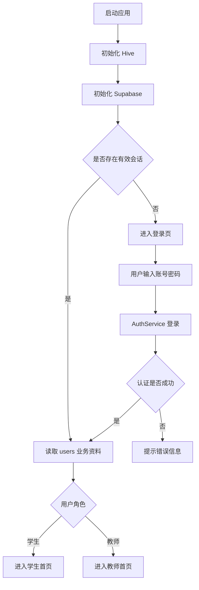

图5-1 登录与角色分流流程图

这一登录注册实现方案体现了本系统在工程上的两个重要特点。第一，尽可能遵循 Supabase 现有认证能力，不额外自建复杂认证逻辑；第二，在此基础上通过业务表补足校园角色体系所需信息。正是通过这种“平台能力 + 业务扩展”的组合方式，系统才得以在较低实现成本下完成校园应用所需的身份体系建设。

### 5.2.2 基于 Riverpod 的全局状态管理实现

系统以 Riverpod 为核心实现全局状态管理。针对成绩、考试倒计时、课程表、请假审批、校园资讯、失物招领、二手流转、互助任务等业务，项目分别定义了状态对象和对应的 StateNotifier，用于统一管理业务数据、加载状态和错误信息。

这种实现方式的优点在于页面层无需直接处理数据请求和状态同步，而只需订阅相应 Provider 并根据状态字段渲染界面。例如，成绩模块通过 `gradeStateProvider` 对成绩列表、绩点统计和错误状态进行统一管理；考试倒计时模块通过 `examCountdownStateProvider` 管理考试记录与筛选逻辑；请假模块通过 `leaveStateProvider` 同时承载学生提交与教师审批场景。对于需要读取当前用户标识的业务，系统还专门通过认证绑定 Provider 进行透传，以保证业务状态能够随着登录用户变化而自动切换。

通过 Riverpod 进行状态管理，项目实现了页面层、业务层和数据层之间的低耦合协作。异步加载、错误回传和局部刷新逻辑均被收敛到统一的状态流中，使得系统在功能增多后仍能保持较好的可维护性。

在具体实现模式上，项目中的大多数业务状态都遵循“State 类 + Notifier 类 + Provider 暴露”的统一结构。State 类负责描述当前模块的数据结果、加载状态和错误信息，例如 `GradesState` 中包含成绩列表、加载标识和错误信息，并进一步提供总绩点、总学分、按学期分组以及学期汇总等派生计算能力；Notifier 类则负责调用 Service 或 Repository 执行异步操作，并在操作完成后更新状态；最终通过 `StateNotifierProvider` 向页面公开订阅入口。这样的实现方式使业务状态流相对固定，有利于不同模块保持一致的开发风格。

以成绩模块为例，系统在 `grade_service.dart` 中同时实现了数据访问能力和状态组织能力。Service 层负责读取、增加、修改和删除成绩记录，而 `GradesNotifier` 则负责在加载成功后更新本地成绩集合，并根据成绩列表动态计算 GPA、总学分和学期级统计结果。相比把这些计算逻辑散落在页面中，当前实现方式更适合在多个页面之间共享同一套计算结果，也更便于后续编写测试验证聚合逻辑是否正确。

在请假模块中，Riverpod 的作用同样十分明显。`LeaveNotifier` 同时承担待审批列表加载、全部记录加载、审批通过、审批驳回和学生撤销等多种动作，并在审批或撤销成功后直接更新本地列表状态。部分操作还采用了带有本地同步效果的更新方式，即在云端操作完成后立刻刷新当前状态集合，尽量减少用户需要手动重新进入页面或再次刷新才能看到结果的情况。这样的状态控制方式能够显著提升交互连贯性。

如图5-2所示，系统通过 Riverpod 将页面、业务服务和数据源之间的异步交互收敛到统一状态流中。

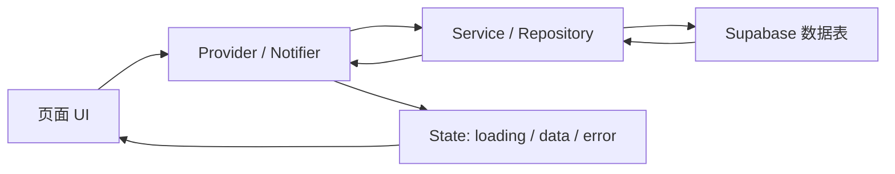

图5-2 Riverpod 状态流转图

总体来看，Riverpod 在本系统中的作用已经超出“状态存储容器”的范畴，而是成为连接认证、页面、服务和业务流程的重要中间层。它使系统能够在角色切换、数据刷新和复杂业务操作并存的情况下，依然保持相对清晰和统一的状态流结构。

### 5.2.3 学习服务模块实现

学习服务模块的实现围绕课表、成绩、考试倒计时、请假申请和学习工具等功能展开。课表功能通过 `CourseService` 从 `courses` 表中读取课程记录，并在首页学习模块展示当天最近课程，在完整课表页面展示更全面的课程安排。成绩功能通过 `GradeService` 从 `grades` 表读取当前用户成绩，再由状态层对绩点、学分和学期汇总进行二次计算。首页中的学习进度卡片则基于成绩汇总结果和自定义绘制组件展示绩点趋势。

考试倒计时功能由 `ExamCountdownService` 支撑，支持考试计划的新增、修改、删除和按时间排序展示。系统不仅对即将到来的考试进行突出显示，还可将过期考试与未过期考试分组处理，以帮助学生进行备考管理。请假申请功能则通过 `LeaveService` 与 `leave_applications` 表完成数据交互，学生能够提交请假申请、查看个人记录，并在必要时撤销未处理申请。

在学习服务首页设计上，系统将课程、图书馆入口、学习进度和工具入口进行模块化组合，使高频功能集中呈现。成绩查询、考试倒计时、完整课表、教室查找和请假申请等功能通过按钮或卡片快速进入，形成了较完整的学生学习服务闭环。

从实现重点看，学习服务模块并不是单纯把多个页面拼接在一起，而是围绕“学习进度信息集中展示”这一目标进行组织。首页学习区域承担的是高频摘要展示职责，因此更强调“今天最相关的课程是什么”“当前 GPA 和学习表现如何”“最近有哪些考试”以及“图书馆和请假入口是否便于快速进入”。而二级页面则负责承载完整数据，例如完整课表、全部成绩列表、全部考试计划和全部请假记录。通过这种“首页摘要 + 二级详细页”的结构，系统既保证了高频信息的可达性，也避免了首页内容过度拥挤。

在成绩实现方面，项目不仅完成了成绩列表读取，还将成绩汇总逻辑下沉至状态层。`GradesState` 可以基于原始成绩记录计算总绩点、总学分、按学期分组结果和学期级摘要对象，这使成绩页与首页进度展示能够共享同一套统计结果，避免多个页面各自重复编写聚合逻辑。此外，教师端成绩管理也复用了同一套基础成绩数据结构，只是在页面入口和操作权限上依据角色做了区分，这体现了学习服务能力在不同角色间的复用价值。

在请假功能实现中，系统将学生端申请和教师端审批建立在同一张 `leave_applications` 表之上。学生在 `LeaveApplyPage` 中提交请假后，可通过个人记录列表查看当前状态；若记录仍处于可撤销状态，学生还可以执行撤销操作。这样一来，请假模块既满足了学生端个人服务需求，也为教师端审批功能提供了数据来源，形成了完整的跨角色业务链路。

总体而言，学习服务模块的实现重点在于把学生高频使用的学习信息聚合到统一体验中，并通过状态层和数据层的协同，保证各类学习数据既能在首页简洁展示，也能在二级页面中展开为完整功能。

### 5.2.4 图书馆服务模块实现

图书馆服务模块是本系统实现较完整、业务结构较复杂的模块之一。该模块采用 `Repository + Provider + Page` 的实现模式，将图书查询、图书预约、借阅记录、座位预约、预约记录和公告读取等功能进行细分。

在图书数据处理方面，`BookRepository` 负责从 `books` 表读取图书基础信息，并将数据库中的下划线命名字段映射为客户端模型中的驼峰命名属性。图书列表页、图书详情页和推荐图书展示均建立在这一数据层封装之上。`ReservationRepository` 则负责处理图书预约队列逻辑，在创建预约前检查用户是否已有未完成预约，再根据当前排队记录计算 `queue_position`，从而支持图书预约队列的形成与取消。

在自习座位预约方面，`SeatRepository` 完成了座位查询、冲突检测、预约创建、签到、签退和取消等关键逻辑。系统先根据楼层和区域读取启用座位，再结合 `seat_reservation` 表中的预约记录计算座位当前状态；在创建预约时，会检查同一用户当天是否已有有效预约，并检查目标座位在指定日期是否已被占用。通过这些校验，系统在客户端层面实现了较为完整的预约约束控制。

图书馆模块的页面层进一步将复杂业务拆分为图书搜索页、图书详情页、预约记录页、我的借阅页、座位预约页和统计页等，使用户能够围绕图书和座位两条核心服务线完成常见操作。该模块的实现表明，本系统已经具备支撑较复杂业务状态流转的能力。

图书馆模块之所以单独采用 `Repository + Provider + Page` 模式，而不是像其他模块一样主要依赖通用 Service，在于其业务链路更长、状态更多、页面间关联更紧密。图书查询、预约记录、借阅信息、统计页和座位预约之间不仅共享同一批业务对象，还存在明显的先后操作关系。如果继续沿用简单的单一 Service 直接面向页面供数，后续在处理预约状态刷新、统计汇总和多页面同步时会变得较难维护。因此，项目将图书馆模块提升为一个相对独立的 feature，围绕数据仓库和 Provider 组织实现。

从图书预约流程实现看，`ReservationRepository` 不仅负责简单插入记录，还承担了重复预约检测、队列顺位计算和取消逻辑。当前实现会先校验用户是否已存在 `queuing` 或 `available` 状态的未完成预约，再根据已有排队数据计算新的 `queue_position`。同时，系统还通过统计接口返回当前用户的排队中数量和可借数量，用于在图书馆首页或统计页中展示更直观的个人预约概况。这样一来，图书馆模块不仅能“做预约”，还能“解释当前预约处于什么状态”。

座位预约实现则更加体现业务约束特征。`SeatRepository` 在读取座位列表时，会先加载指定楼层和区域的启用座位，再根据当日预约记录动态计算每个座位的可用状态、占用状态或“我的预约”状态；在创建预约时，又会先后执行同一用户单日唯一预约校验、座位冲突校验和预约码唯一性生成。签到、签退和取消操作也都通过状态前置条件加以限制。这种实现虽然仍建立在客户端直连 Supabase 的架构之上，但已经具备较为完整的业务闭环控制能力。

页面组织上，系统将图书馆能力拆分为 `LibraryHomePage`、`BookSearchPage`、`BookDetailPage`、`MyLoansPage`、`ReservationsPage`、`MyReservationsPage`、`SeatReservationPage` 和 `LibraryStatsPage` 等多个页面，并通过 `app_router.dart` 中的嵌套路由统一组织。用户可以先从图书馆首页进入某一功能，再逐步深入到具体图书、个人预约记录或座位详情页面，这使得整个模块在交互上更接近一个相对完整的子系统，而不仅是零散功能集合。

从图5-3可以看出，图书馆模块已经形成了包含前置校验、状态控制和结果反馈的复杂业务流程。

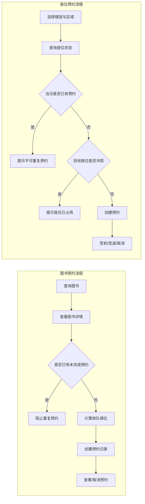

图5-3 图书预约与座位预约业务流程图

### 5.2.5 校园互助模块实现

校园互助模块在实现上主要包括失物招领、二手流转和互助任务三类数据服务。系统使用 `LostAndFoundService`、`SecondHandService` 和 `HelpTaskService` 分别封装三类业务的数据读取、发布和状态更新逻辑，并在页面层通过统一风格的卡片列表进行展示。

在发布流程上，系统设置了统一的发布编辑页 `PostEditPage`。用户进入页面后可选择发布类型，系统再根据发布类型组织对应字段并调用不同服务完成写入。失物招领支持新增信息和认领完成状态更新；二手流转支持发布闲置物品并展示价格、成色等信息；互助任务支持任务发布、完结标记和状态刷新。首页互助页则以分区方式展示三类内容的摘要信息，同时提供跳转至完整列表页面的入口。

这一实现方式体现了互助模块在业务结构上的统一性：三类功能虽然业务目标不同，但都遵循“数据发布、列表展示、状态更新”的基本交互模式，因此非常适合在界面和状态管理层复用相似的设计思路。

从界面实现思路看，互助模块更强调“统一发布体验”而不是“完全拆分的三套系统”。如果失物招领、二手流转和互助任务都分别提供完全不同的发布界面和交互方式，用户在实际使用中会面临较高学习成本。当前项目通过 `PostEditPage` 统一承载发布流程，先让用户选择内容类型，再动态呈现相应字段，并根据类型调用不同服务层写入对应数据表。这种实现既降低了页面数量，也强化了模块的一致性。

在列表展示方面，系统对三类互助信息采用了相近的卡片化表现形式。无论是失物信息、闲置物品还是求助任务，页面都会突出标题、说明摘要、发布时间和状态标签，并在需要时提供价格、地点或奖励信息等补充字段。这样的展示方式使用户即使在不同列表间切换，也能保持较稳定的阅读习惯。同时，首页互助区域只展示摘要信息，把完整数据浏览下沉到独立列表页面，既满足了首页轻量化需求，也保留了完整信息访问能力。

从状态流转角度看，互助模块虽然没有图书馆模块那样复杂的约束规则，但同样存在“内容是否仍有效”的问题。因此，系统为失物招领、二手流转和互助任务都保留了状态更新能力，用于表示是否已解决、是否已完成或是否仍在进行中。这样做的直接作用是提升信息可信度，避免列表长期堆积失效内容，也有助于后续进一步扩展筛选和状态分类功能。

从数据组织角度看，校园互助模块还体现出“服务分离、交互统一”的实现思路。也就是说，三类业务在数据层仍然分别连接各自的数据表和服务类，以保证字段结构、查询条件和状态规则彼此独立；但在页面层和交互层，又尽量通过统一发布入口、统一列表卡片和统一状态标签来降低用户认知成本。这样的实现方式既保留了业务边界，也增强了整体产品的一致性，为后续继续扩展评论、筛选、我的发布等能力预留了较好的结构基础。

图5-4说明了互助模块通过统一发布入口组织三类不同社区信息的实现思路。

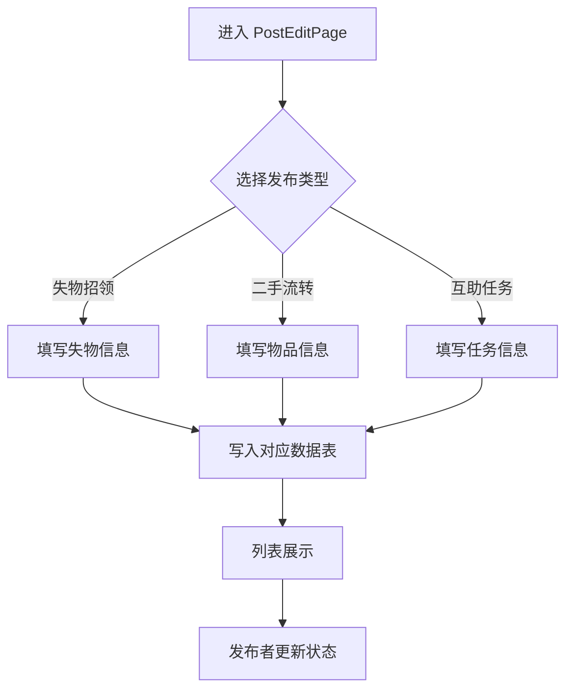

图5-4 校园互助统一发布流程图

### 5.2.6 教师端扩展功能实现

教师端扩展功能建立在用户角色识别基础上实现。系统在首页根据当前用户类型切换到教师端导航结构，并通过路由分流机制将教师引导至教学页面和办公页面。教师教学页主要展示授课信息、教学工具和教学概况，提供成绩录入、班级名册、调课申请、签到和作业管理等功能入口。

在教师真实数据功能中，请假审批与教师成绩管理是实现程度较高的两个部分。请假审批功能通过 `LeaveService` 读取待审批请假记录，并支持审批通过或驳回；教师成绩管理则在成绩模块中根据角色跳转到 `TeacherGradePage`，由教师以不同视角查看和维护学生成绩。除此之外，通知查看、科研信息、场地借用、奖助学金审核、调课申请等页面也已构建基本界面和交互框架，为后续继续接入真实业务数据奠定了基础。

总体而言，教师端实现体现了本系统不仅面向学生，也尝试兼顾教师在教学和办公场景中的使用需求，从而增强了系统的综合服务能力。

教师端的实现重点并不是简单复制学生端结构，而是在统一应用骨架下形成独立的角色工作流。系统登录后若识别到当前用户为教师，则首页导航结构会切换到教学、办公和社区等更符合教师使用习惯的入口布局。这样做的目的在于让教师在进入应用后优先看到授课安排、成绩管理、审批待办和办公工具，而不是学生端以个人服务为中心的导航模式。

在真实数据驱动部分，教师成绩管理与请假审批形成了较清晰的功能闭环。成绩服务不仅支持学生按当前用户读取成绩，也支持教师按学生 `user_id` 查询成绩列表，并提供新增、修改和删除成绩的能力；请假服务则支持教师读取 `pending` 状态的待审批记录，并在审批完成后同步写入审批人和审批意见。通过这两条真实业务链路，教师端不再只是静态演示页面集合，而是具备了明确的角色处理能力。

与此同时，项目对教师端采取了“核心真实业务先落地，扩展业务先搭建框架”的实现策略。诸如班级名册、调课申请、课堂签到、作业管理、奖助学金审核、场地借用、科研信息和通知查看等页面，当前更多承担结构展示和流程承载作用，为后续逐步接入真实数据提供基础。这种实现策略有助于在有限开发周期内优先完成最关键的跨角色功能，同时保持教师端整体结构的完整性。

图5-5展示了教师端最典型的跨角色处理流程，即学生请假申请与教师审批之间的业务闭环。

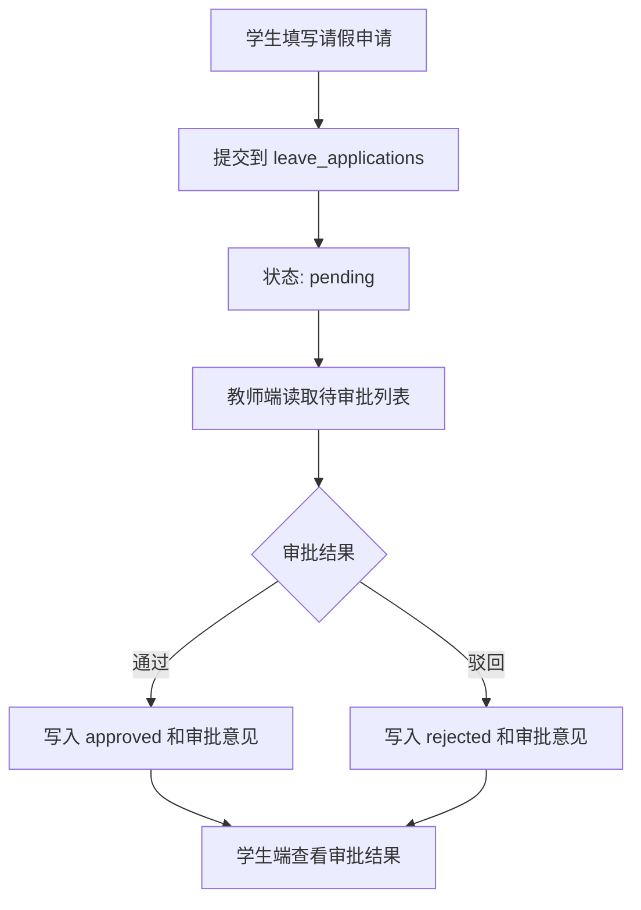

图5-5 请假审批业务流程图

从系统演进角度分析，教师端扩展功能的实现还具有较强的架构验证意义。学生端主要验证的是个人信息查询与个人服务闭环，而教师端则进一步验证了系统是否能够承载“跨用户数据处理”和“角色责任流转”两类更复杂场景。请假审批和成绩维护之所以被优先实现，正是因为它们既直接关联学生端真实业务，又能够反映教师端作为管理角色的差异化操作特点。通过先完成这两类核心能力，系统已经初步证明其分层结构和权限组织方式具备向更完整教师办公平台扩展的可能性。

## 5.3 关键技术问题的解决

### 5.3.1 基于角色的首页与路由分流实现

本系统同时面向学生和教师两类用户，因此首页结构和部分功能页面必须根据角色进行动态切换。系统在认证成功后先从 `users` 表中读取用户类型，再在首页通过条件判断生成不同的一级页面集合。对于成绩模块等共享入口，系统使用中间路由页在页面加载时再次读取用户角色，并自动决定进入学生成绩页还是教师成绩管理页。

这一方案避免了为不同角色维护两套完全独立的项目结构，既降低了代码冗余，又使共用能力能够被充分复用。同时，角色分流逻辑集中在认证状态和路由层中，减少了各业务页面内部重复判断身份的情况。

从实现位置看，角色分流主要集中在两个层面。第一个层面是首页结构层，登录成功后应用会根据当前用户类型决定主页面应该展示学习/生活/互助结构，还是教学/办公/社区结构；第二个层面是共享入口层，即某些路径虽然对所有用户都可见，但其最终目标页面取决于角色，例如 `/grades` 路径会先进入一个中间路由页面，再根据认证状态中的用户类型跳转到 `GradesPage` 或 `TeacherGradePage`。这种“两层分流”设计有效减少了页面内部到处散落的角色判断语句。

此外，路由统一管理还带来了更好的可维护性。当前 `app_router.dart` 中集中声明了认证页、首页、图书馆嵌套路由、互助发布页、教师工具页和地图页等大量路径，这意味着新增或调整某个业务入口时，不需要在多个页面中分别维护跳转逻辑。对于毕业设计项目而言，这种集中配置方式能显著降低后期迭代时的修改成本，也便于论文中对系统导航结构进行统一说明。

### 5.3.2 客户端与 Supabase 数据映射封装实现

由于 Supabase 数据表字段普遍采用下划线命名，而 Flutter 领域模型和页面逻辑更适合使用驼峰命名，因此项目在数据访问层大量使用手动映射策略。各类 Service 与 Repository 在读取数据库记录后，先将 `snake_case` 字段转换为客户端模型所需的 `camelCase` 结构，再调用模型的 `fromJson` 构造方法生成领域对象。

这一做法虽然增加了少量映射代码，但有效隔离了数据库结构对上层业务的直接影响。页面层与状态层只需要面向领域模型编程，不必关注底层字段命名差异，从而提升了代码可读性和后续数据库结构调整时的适应能力。

从具体实现方式来看，项目中的字段映射主要体现在图书馆、资讯和校园互助等模块。例如，图书信息中的 `total_copies` 和 `available_copies` 会分别转换为客户端模型中的 `totalCopies` 和 `availableCopies`；校园资讯中的 `published_at` 和 `image_url` 会被转换为 `publishedAt` 和 `imageUrl`；二手物品和失物招领中的发布时间、发布者标识和状态字段，也都在 Service 层完成了统一映射。这种做法使客户端模型保持较强的一致性，即使不同数据表在字段命名和结构组织上存在差异，上层调用仍能以相同风格访问业务对象。

此外，映射封装不仅解决了命名差异问题，也承担了数据兼容和默认值兜底职责。由于部分业务记录存在可选字段或历史数据不完全一致的情况，系统会在映射过程中补齐默认值，例如为空的图片地址、默认状态、默认时间或默认布尔值。这种防御式处理减少了页面层因字段缺失而出现空指针或显示异常的风险，使系统在面对云端数据结构微调时具有更好的容错性。

从工程维护角度看，集中式映射还有助于控制变更范围。若后续数据库字段命名发生调整，开发者只需修改对应的 Service 或 Repository 即可，无需在多个页面中逐一替换相关字段。这一点对于毕业设计后期反复迭代论文和项目细节尤为重要，因为它使代码演进更可控，也使系统更接近规范化软件项目中的“领域模型隔离”思想。

这种映射封装方式在图书馆模块中体现得尤为明显。以预约记录读取为例，Repository 在查询 `book_reservations` 表时还会联表读取 `books` 的标题、作者、封面地址和馆藏位置等字段，并在返回客户端模型前完成结构整理；座位预约记录同样会联表读取 `seat` 表中的楼层、区域、座位号和附加属性。通过这种“数据库返回结构 → 统一客户端模型”的处理方式，页面层始终只面向 `BookReservation`、`SeatReservation` 等领域对象，而不需要直接处理 Supabase 返回的原始 Map 结构。

此外，映射层也让系统更容易处理历史兼容问题。由于项目经历过从本地原型到云端统一数据的演进过程，某些字段在不同阶段的数据完整度并不完全一致。通过在 Service 或 Repository 层集中补齐默认值、统一字段格式并处理可空项，系统可以在不大量修改页面逻辑的前提下保持稳定运行。这种做法在实际工程中非常重要，因为它把数据兼容风险尽可能限制在靠近数据源的一层。

### 5.3.3 预约与审批业务流程状态控制实现

本系统中的图书预约、座位预约和请假审批都包含明显的业务状态流转。为保证状态变化符合业务规则，系统将状态控制逻辑下沉到数据访问层和状态管理层共同处理。

在图书预约中，系统通过预约状态字段区分排队中、可借阅、过期和取消等状态；在座位预约中，系统通过 `reserved`、`using`、`completed` 和 `cancelled` 等状态描述预约生命周期；在请假审批中，则通过 `pending`、`approved` 和 `rejected` 标识教师处理结果。通过在提交前执行存在性检查、冲突检查和状态过滤，系统能够尽可能避免非法流转和重复操作，提升业务稳定性。

图书预约流程的关键在于“排队顺序”与“重复预约限制”。当用户点击预约时，系统并不会直接盲目写入数据，而是先查询当前用户针对同一本图书是否已经存在状态为 `queuing` 或 `available` 的未完成预约，若存在则直接阻止重复提交；若不存在，则再读取该图书当前所有排队记录数量，并基于此计算新的 `queue_position`。这一实现虽不属于复杂的分布式并发控制，但对当前项目规模而言，已经能够有效维护预约顺序的基本正确性。

座位预约流程的关键在于“同一用户单日唯一预约”和“同一座位同一时段不可冲突”。系统在执行预约前，先以当前用户和日期为条件，检查是否已存在 `reserved` 或 `using` 状态的记录；随后再检查目标座位在同一日期下是否已被其他用户预约。只有两项校验同时通过，系统才允许写入新预约。预约成功后，用户还可按业务顺序执行签到、签退和取消操作，而每个动作都限定在特定的前置状态下完成，从而避免出现已完成预约重复签到、已取消预约再次签退等不合法流转情况。

请假审批流程则体现了学生端与教师端之间的跨角色状态协同。学生提交请假申请后，记录以 `pending` 状态进入数据库；教师读取待审批列表后，可以选择通过或驳回，并写入审批人标识、审批意见和更新时间。由于审批动作会同步回写学生可见的申请记录，因此学生端和教师端围绕同一业务对象形成了完整闭环。该流程说明，即使项目没有自建后端服务，仍然能够借助状态字段和客户端逻辑实现较为清晰的业务流转控制。

在状态更新策略上，项目还尽量保持“云端更新成功后，本地状态立即同步”的原则。例如，`LeaveNotifier` 在审批完成后会直接将本地列表中的对应记录更新为 `approved` 或 `rejected`；图书馆预约取消后，界面可立即反映状态变化；座位签到和签退同样会在操作完成后刷新当前记录状态。这样做的目的在于减少用户反复退出重进页面才能看到最新状态的情况，从而提升操作的即时感。

需要指出的是，在没有自建业务后端的架构下，客户端状态控制必须尽量清晰和保守。系统当前并未尝试实现复杂分布式事务，而是通过“先检查、再提交、成功后同步状态”的方式来满足当前项目规模下的主要业务约束。这种方案虽然在更高并发条件下仍有进一步优化空间，但对于毕业设计项目而言，已经能够较好平衡实现复杂度和业务正确性。

### 5.3.4 跨平台界面适配与页面兼容处理

作为跨平台应用，本系统在实现过程中需要兼顾移动端和桌面端的显示差异。项目通过 `ConstrainedBox` 限制内容最大宽度，在桌面端形成更适合阅读的居中布局；通过滚动容器、间距控制和弹性布局处理小屏设备上的内容密度问题。

对于地图等存在平台差异的功能，系统采用分平台页面文件进行兼容处理，例如分别提供通用页、Web 页和占位页，以降低特定平台实现带来的编译和运行风险。该策略在保证功能完整性的同时，也体现了 Flutter 跨平台开发中按场景拆分平台差异代码的工程思路。

在页面整体布局上，系统尽量避免使用强依赖固定尺寸的界面方案，而是优先使用 `Row`、`Column`、`Expanded`、`Padding`、`SizedBox` 和滚动容器等 Flutter 原生布局组件，以保证界面在不同分辨率和宽高比下都能保持较好的稳定性。例如首页中的多卡片布局、图书馆模块中的列表页与详情页结构、教师办公页中的统计卡片与分组入口，均通过弹性布局与统一间距策略完成适配。

在桌面端适配方面，项目并未简单地将移动界面放大，而是通过限制内容最大宽度、外层居中和局部卡片增强的方式，使界面在宽屏环境中更接近信息面板式的阅读体验。这种处理尤其适用于成绩页、课表页、图书馆统计页等以信息展示为主的页面。相比完全响应式网格布局，这种“窄内容区 + 居中展示”的策略实现成本更低，也更符合当前系统的设计风格。

在交互兼容方面，系统还特别注意了不同平台对页面能力的支持差异。地图页面通过条件导入方式分别使用 Web 实现和通用占位实现，从而避免因为直接引入 Web 专属库而影响其他平台编译；部分页面则通过按钮、弹窗和底部面板等较通用的交互形式降低平台差异带来的实现复杂度。总体来看，系统当前采用的是一种务实的跨平台适配方案，即优先保证核心功能稳定可用，再逐步细化不同平台上的交互体验。

从页面实现经验来看，本系统在适配时更强调“控制复杂度”而不是盲目追求完全不同端的差异化设计。对于课程、成绩、资讯、互助和图书馆等主要页面，项目优先采用同一套布局逻辑，通过最大宽度、滚动容器和弹性空间处理屏幕差异；只有在地图等确实存在平台依赖差异的功能上，才采用分平台实现。这种策略能够在保证主要页面风格统一的同时，避免因为过多平台分支代码而提高维护成本。

另外，主题系统在适配中也起到了重要作用。`AppTheme` 统一控制颜色、字号、输入框样式、按钮风格和基础视觉规范，使得系统在不同端呈现时能够保持较稳定的视觉识别度。这样一来，即使某些页面因布局差异进行了局部调整，整体界面仍然能够被用户感知为同一应用体系的一部分。

### 5.3.5 本地历史用户数据迁移实现

项目早期曾使用 Hive 本地存储维护用户数据，后续随着系统接入 Supabase，需要将历史用户数据迁移到云端认证体系中。为解决这一问题，系统实现了 `DataMigrationService`，用于读取 Hive 中的用户盒子数据，并按照 Supabase Auth 注册流程逐条创建云端用户。

在迁移过程中，系统会为历史用户生成临时密码，并将用户名、姓名、手机号、用户类型、学号、院系和头像等信息同步写入云端。对于已存在于 Supabase 中的用户，迁移逻辑会自动跳过，避免重复创建。该实现保证了本地原有数据能够平滑过渡到云端统一身份体系中，为系统后续长期维护提供了条件。

从迁移逻辑角度看，该服务首先确保本地 `users` 盒子处于可读取状态，然后遍历其中的历史用户数据，并对不同数据格式进行兼容处理。若数据为 `Map` 结构，则先转换为统一用户模型；若数据已是用户对象，则直接读取其关键属性。对于缺失邮箱等关键认证字段的历史记录，迁移服务会选择跳过处理，避免生成无法登录的异常账户。该设计说明项目在迁移环节中不仅考虑了“如何迁移”，也考虑了“哪些数据可以安全迁移”。

此外，迁移服务在执行 Supabase 注册操作时，还对“用户已存在”这一常见场景进行了容错处理。当云端返回已注册或唯一约束冲突类异常时，系统并不会中断整个迁移流程，而是记录提示并继续迁移后续用户。这种逐条容错的方式非常适合毕业设计中的历史数据补录场景，因为它能够在不破坏原有认证体系的前提下尽可能完成数据接入。

虽然该迁移功能在当前版本中并不是每次启动都会执行，但其存在本身说明本项目并非一次性静态实现，而是经历了从本地原型到云端统一身份体系的演进过程。将这一过程写入论文，也有助于体现系统设计的完整性和项目开发过程中的实际工程思考。

从实现细节看，迁移服务会在遍历 Hive `users` 盒子时同时兼容 `Map` 结构和领域用户对象两种数据形态，并在发现关键字段缺失时直接跳过记录，而不是强行写入不完整账户。这种处理方式体现了迁移逻辑的防御性思维，即优先保证迁移结果安全可靠，而不是一味追求全部数据无差别导入。对于毕业设计中常见的原型迭代场景而言，这种思路比简单批量写入更符合真实工程实践。

同时，项目在 `main.dart` 中并未默认每次启动都自动执行迁移，而是将该流程保留为可控的辅助能力。这种处理是必要的，因为历史数据迁移本质上属于一次性或阶段性操作，若在每次应用启动时无条件执行，不仅会增加启动开销，也可能带来重复注册或异常账户处理负担。将迁移能力封装为独立服务并按需触发，说明系统在实现上已经开始考虑版本演进与数据治理问题，而不仅仅关注当前页面功能能否运行。

## 5.4 本章小结

本章从开发环境、项目结构、认证与状态管理、学生端核心功能、图书馆模块、校园互助模块、教师端扩展功能以及关键技术问题等方面，对系统实现过程进行了详细说明。可以看出，本系统在“无自建后端”的前提下，依靠 Flutter 与 Supabase 完成了较完整的客户端业务落地，并通过 Riverpod、Repository 封装和状态控制机制实现了较好的工程组织效果。

进一步而言，第5章的实现过程体现出本系统并不是简单意义上的“页面堆砌型项目”，而是在统一认证、统一状态管理、统一路由和统一数据访问机制之上逐步搭建起来的。无论是登录注册、成绩与请假、图书馆预约，还是校园互助与教师端扩展，系统都尽量遵循一致的工程组织方式，即页面负责展示，Provider 负责状态，Service/Repository 负责数据与规则，Supabase 负责认证和持久化存储。这种实现策略使项目在功能不断增加的情况下仍能保持相对清晰的结构。

同时，本章也表明系统在若干关键问题上已经形成了较为明确的解决路径，如角色分流、字段映射、状态流转控制、跨平台适配和历史数据迁移等。这些内容不仅说明了系统“做了什么”，更说明了系统“为什么这样做、这样做解决了什么问题”。这为后续第6章的测试分析提供了必要前提，也使整篇论文从设计到实现再到验证形成较完整的逻辑闭环。

从毕业设计的角度看，第5章的实现结果还体现出较清晰的工程取舍思路。项目没有额外实现独立后端，而是将主要精力投入到客户端业务组织、Supabase 数据接入和权限边界控制之中，使有限开发周期优先服务于核心功能闭环的完成。虽然这种方案在超大规模并发、复杂事务一致性和后端可编排能力方面仍存在进一步提升空间，但对于当前校园综合服务系统的目标范围而言，已经能够较好兼顾实现成本、系统完整性和演示验证效果。

# 第6章 系统测试与分析

## 6.1 测试环境与测试方法

为了验证系统功能的正确性与稳定性，本项目采用自动化测试与功能验证相结合的方式开展测试工作。测试环境基于 Flutter 3.38.5、Dart 3.10.4 和 Supabase 云端数据服务，测试对象为当前项目代码中的认证、菜单逻辑、时间选择组件、页面渲染和界面规范约束等关键部分。

在测试方法上，项目主要采用以下三类方式。第一，使用 `flutter test` 执行单元测试与组件测试，对状态绑定、业务规则函数和页面基础渲染进行验证；第二，结合页面功能流程对登录注册、数据查询、预约与审批等场景进行功能性验证；第三，使用静态分析工具检查代码中的潜在问题和规范一致性。当前项目已具备一定的自动化测试基础，可为后续迭代提供回归保障。

从测试组织方式看，本项目并未将测试仅停留在“能否运行”的层面，而是尝试围绕实际业务风险点构建针对性验证。例如，认证绑定测试直接关注不同登录用户切换时数据是否会串用；食堂菜单测试关注时间逻辑与受众过滤规则是否正确；日期选择组件测试则关注临界时间值处理是否符合预期；地图组件测试关注页面在最基本构建条件下的可渲染性。由此可见，测试设计已经开始从单纯界面测试转向业务规则与交互稳定性测试并重的方向。

在测试执行结果之外，项目还使用 `flutter analyze` 对代码质量进行静态检查。虽然当前分析结果中仍存在较多信息级提示和少量警告，但这类检查有助于发现潜在规范问题，例如过时 API 使用、未使用导入、构造函数排序不规范以及个别跨异步上下文的 `BuildContext` 使用风险等。对毕业设计项目而言，这种“运行测试 + 静态分析”结合的方式能更全面地反映系统成熟度。

为使测试工作更具结构性，本文将当前测试手段归纳为表 6-1 所示的四类验证方式。

| 测试类别 | 主要对象 | 使用方式 | 主要目标 |
| --- | --- | --- | --- |
| 单元测试 | 业务规则函数、状态绑定逻辑 | `flutter test` | 验证核心逻辑正确性 |
| 组件测试 | 页面组件、基础交互部件 | `flutter test` | 验证页面是否可正常构建与渲染 |
| 功能流程验证 | 登录、查询、预约、审批等流程 | 人工结合真实页面操作 | 验证业务链路完整性 |
| 静态分析 | 全项目代码结构与规范 | `flutter analyze` | 发现潜在规范问题与风险点 |

从论文研究的角度看，上述测试方法组合具有较强针对性。对于毕业设计项目而言，完全构建大规模自动化测试体系往往成本较高，因此更合理的做法是优先覆盖高风险逻辑、关键页面和主要业务流程，再辅以静态分析工具补充规范检查。当前项目正是沿着这一思路开展测试工作，即优先确保认证绑定、菜单逻辑、日期处理、页面渲染和统一提示规则等关键点可被验证，然后再通过人工流程检查补足复杂业务场景。

为更直观呈现当前主要测试模块的通过情况，本文将功能测试结果概括如图6-1所示。

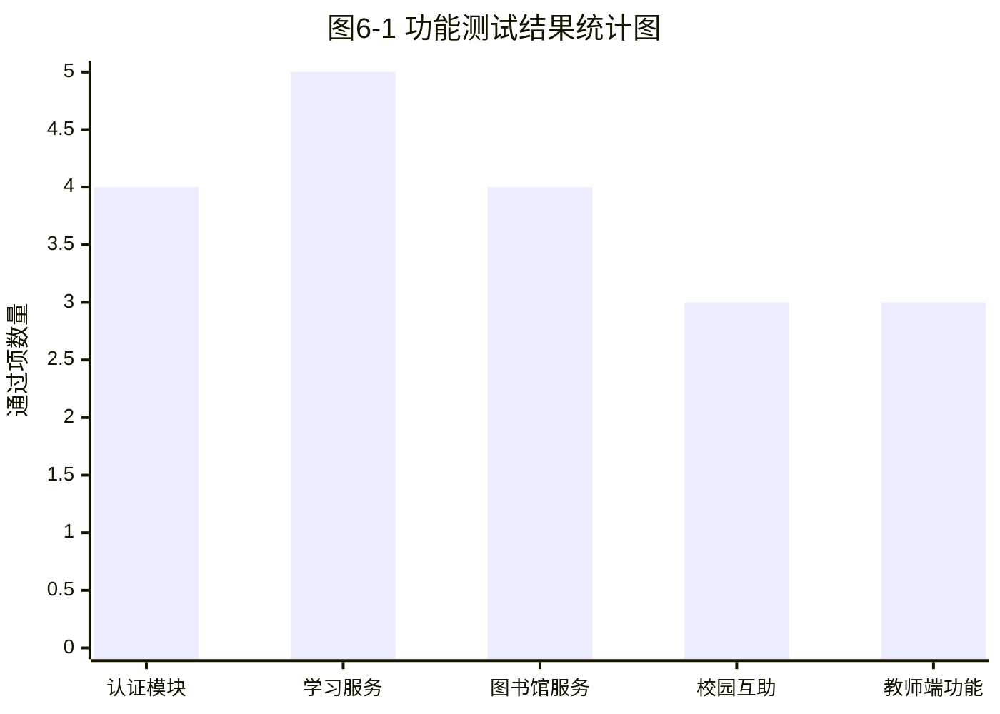

图6-1 功能测试结果统计图

## 6.2 用户认证与基础功能测试

用户认证与基础功能测试主要围绕登录状态绑定、基础页面打开能力和统一界面约束展开。现有自动化测试中，认证绑定测试验证了成绩模块和考试倒计时模块中的当前用户 Provider 能够随着登录用户变化而同步更新，从而保证不同用户切换时业务数据不会串用。地图页面组件测试则验证了校园地图页面能够正常渲染核心标题和关键内容，说明基础页面在当前环境下具备正常展示能力。

此外，项目中还通过约束性测试检查封装层外是否存在直接调用原生 SnackBar 的情况。该测试用于保证界面提示方式统一，避免不同页面自行实现消息提示导致视觉和交互不一致。从测试结果来看，认证绑定、页面渲染和统一提示约束均符合预期，说明系统基础能力实现较为稳定。

从测试意义上分析，认证绑定测试虽然规模不大，但对系统至关重要。因为本系统中成绩、考试倒计时和部分预约数据都与当前登录用户强绑定，一旦认证状态切换后 Provider 未同步更新，就可能出现用户 A 登录后看到用户 B 数据的严重问题。通过专门测试认证透传链路，可以尽早验证“认证状态变化是否会正确影响业务状态”，这对于基于 Riverpod 的状态管理体系而言是一个关键保障点。

地图页面测试则体现了基础组件级验证的价值。该测试并不直接依赖复杂网络环境，而是重点检查页面在当前工程结构和路由依赖条件下能否成功构建，并显示出关键文案与信息节点。这种方式能够较低成本地验证页面在后续重构或依赖调整后是否仍可用。对于毕业设计项目来说，这类基础组件测试具有较高性价比，既不会引入过高维护负担，又能为系统稳定性提供最基本的兜底保障。

为了更直观地说明基础能力测试的覆盖情况，本文将其归纳为表 6-2。

| 测试项 | 测试重点 | 结果 |
| --- | --- | --- |
| 认证绑定测试 | 用户切换后业务 Provider 是否同步更新 | 通过 |
| 地图页面渲染测试 | 页面是否能正常构建并显示关键内容 | 通过 |
| 统一提示约束测试 | 是否存在绕过封装直接使用原生提示组件的情况 | 通过 |

从结果分析可见，虽然这些测试数量不多，但它们覆盖的均是系统最底层、最容易引发全局连锁问题的基础能力。一旦认证状态传递失效，后续成绩、考试、预约等多个模块都会受到影响；一旦页面基础渲染能力被破坏，相关模块即使业务逻辑正确也无法正常展示；一旦消息提示方式失去统一约束，系统在视觉风格和交互习惯上就会迅速出现割裂。因此，这些测试在整个论文的质量论证中具有“少而关键”的作用。

## 6.3 核心业务流程测试与结果分析

### 6.3.1 学习服务模块测试

学习服务模块测试主要针对课程展示、成绩统计、考试倒计时和请假申请等功能展开。课程展示重点验证课程记录是否能按星期和时间顺序正确读取；成绩功能重点验证个人成绩列表、绩点计算和学期汇总逻辑是否一致；考试倒计时重点验证新增、修改、删除和紧急考试筛选结果是否正确；请假申请则重点验证学生提交申请后能否在记录列表中正确展示状态。

从业务逻辑角度看，该模块中的核心数据读取和状态切换路径较为清晰，尤其是成绩和考试倒计时功能均已绑定当前登录用户，能够有效避免不同用户数据混淆问题。整体测试结果表明，学习服务模块能够较好满足学生在课程、成绩和备考等方面的常用需求。

其中，成绩功能的验证重点不仅在于能否成功显示成绩列表，还包括学期汇总、总绩点、总学分等二次计算结果是否与原始成绩记录保持一致。由于这部分数据会直接影响首页学习进度展示和学生对学业状态的判断，因此其正确性尤为重要。系统当前通过状态层进行汇总计算，再由页面层统一显示，这种设计在测试上也更容易验证逻辑完整性。

请假申请功能虽然在界面上相对简洁，但其业务意义较强。测试中需要重点关注学生提交后状态是否默认为待审批、教师处理后学生端记录是否同步变化、撤销功能是否只作用于当前用户记录等问题。当前实现表明，该模块已经能够支撑基本的学生请假业务流程，但在后续迭代中仍可进一步增加对异常输入、时间冲突和请假原因格式的约束测试。

### 6.3.2 图书馆服务模块测试

图书馆服务模块测试重点关注图书查询、预约队列、自习座位预约和预约记录展示等功能。图书查询测试主要验证图书列表、详情页和封面信息是否能够正确读取；图书预约测试主要验证同一用户重复预约校验和排队顺序计算是否符合预期；座位预约测试则重点关注同一用户重复预约限制、座位冲突检测、签到签退和取消预约等状态流转是否正常。

由于图书馆模块涉及的状态较多，其测试重点不只是界面展示，更包括预约规则本身是否可靠。从当前实现来看，客户端已经对重复预约、座位冲突和状态流转进行了较为完整的前置处理，能够在一定程度上降低异常操作对数据一致性的影响。该模块是系统中业务实现较为完整的部分，测试结果总体较好。

图书馆模块之所以在测试中占据较高比重，是因为它是本系统中最接近“真实业务系统”的部分之一。无论是图书预约队列还是座位预约生命周期，背后都涉及明显的业务约束关系。一旦约束判断失效，就可能导致同一用户重复占用资源、同一座位被多次预约或预约状态无法闭环等问题。因此，该模块测试不仅要验证“页面能不能打开”，更要验证“业务规则是否成立”。

从当前实现情况看，系统已经将大量核心约束放入 Repository 层统一处理，这使图书馆模块的测试具有较好的可组织性。后续若要继续提升论文质量和工程完整度，可以进一步补充围绕边界场景的自动化测试，例如跨日期预约、取消后再次预约、签到状态下重复签退以及预约码冲突等场景，从而进一步增强系统在高频预约业务下的可靠性论证。

### 6.3.3 校园互助模块测试

校园互助模块测试主要围绕失物招领、二手流转和互助任务三类业务展开。测试内容包括信息发布是否成功写入、首页摘要列表与完整列表页是否保持一致、任务或物品状态更新后是否能够及时刷新，以及不同类型发布内容是否能正确进入对应数据表。

从测试分析结果看，该模块在数据读取和统一发布流程方面实现较为稳定，尤其是三类业务在服务层中已形成统一的组织方式，有利于维护和扩展。但由于互助模块仍然以开放式列表展示为主，后续若引入评论、收藏或消息通知功能，还需要进一步完善交互链路和状态管理。

校园互助模块的测试特点在于，它既包含“社区信息发布”的开放性，又包含“状态维护”的业务约束性。失物招领功能需要验证发布者是否能正确提交标题、地点和说明信息，并在后续完成认领后将记录更新为已解决状态；二手流转功能需要验证价格、成色和发布时间等关键字段是否能正确展示；互助任务则需要关注任务是否能够从待处理状态切换到已完成状态。虽然这些流程相较图书馆模块简单，但它们直接影响用户是否愿意持续在系统中发布内容。

从论文写作角度看，该模块还体现了系统的社会化服务属性。测试结果表明，项目当前已经能够支撑最基础的发布与刷新流程，但如果未来要提高社区活跃度，还需引入更完整的内容审核、消息提醒和互动能力。因此，在结论中将其作为“可继续深化的扩展方向”是合理的。

### 6.3.4 教师端扩展功能测试

教师端扩展功能测试主要验证角色分流、请假审批和教师成绩管理等核心流程。角色分流测试重点检查教师账号登录后是否进入教师首页结构，以及成绩入口是否能正确跳转至教师成绩页面；请假审批测试重点检查待审批请假单是否能正确读取，审批通过或驳回后状态是否及时更新；教师成绩管理测试则关注教师视角下的成绩增删改查流程是否完整。

测试结果表明，教师端在角色识别和页面切换方面表现正常，真实数据驱动的请假审批和成绩管理功能能够形成有效业务闭环。对于其余以静态演示为主的教学办公页面，目前主要验证界面结构和交互流程是否完整，后续如需上线真实业务，还需进一步接入更细粒度的数据校验。

教师端测试与学生端测试的主要区别，在于其不仅要验证业务正确性，还要验证角色隔离是否可靠。因为教师端很多入口在学生端不应出现，所以角色判断、首页切换和路由分发本身就是测试重点。若角色识别失效，不仅会破坏用户体验，还可能导致普通用户误入高权限页面。因此，教师端功能测试在很大程度上也是对系统权限设计的一次侧面验证。

另外，教师端当前存在“真实数据功能 + 静态演示功能”并存的情况，这意味着测试结果也应分层解读。对于请假审批、成绩管理这类已接入真实数据的模块，应更强调数据正确性和状态闭环；对于通知、科研、场地借用等仍处于界面框架阶段的模块，则更适合从页面结构完整性、交互流程合理性和后续扩展可行性角度进行评估。这样写入论文后，能够更真实地体现项目当前完成度，而不会给人“所有教师端业务都已完全落地”的误解。

综合四类核心业务模块的测试情况，可以将本系统当前阶段的业务验证结果概括为表 6-3。

| 模块 | 重点验证内容 | 当前结果 | 后续可加强方向 |
| --- | --- | --- | --- |
| 学习服务 | 成绩汇总、考试倒计时、请假状态流转 | 主流程可用 | 增强异常输入与边界时间测试 |
| 图书馆服务 | 图书预约队列、座位冲突检测、签到签退 | 业务约束较完整 | 增强并发与边界状态测试 |
| 校园互助 | 发布、列表刷新、状态更新 | 发布链路稳定 | 增加互动、审核与通知测试 |
| 教师端扩展 | 角色分流、审批闭环、成绩管理 | 核心真实功能可用 | 深化真实数据接入后的专项测试 |

由表 6-3 可以看出，系统当前测试结果呈现出较明显的“主链路完成度较高、扩展链路仍可继续深化”的特点。学生端学习服务和图书馆服务由于业务实现较早、真实数据接入程度较高，因此测试结论更偏向“流程已经基本闭环”；校园互助模块虽然核心发布链路已经可用，但在社区交互深度方面仍有后续扩展空间；教师端则需要在保持现有真实功能稳定的基础上，逐步提高更多扩展模块的真实数据化程度。这样的阶段性结论与项目实际完成情况是一致的，也更符合毕业设计论文应有的客观表达方式。

## 6.4 跨平台兼容性与界面交互测试

跨平台兼容性测试主要从布局适配、页面可渲染性和交互一致性三个方面开展。在布局方面，系统通过最大宽度限制、滚动布局和统一间距规范，使得多数页面在移动端和桌面端均能保持较好的阅读体验；在页面可渲染性方面，地图页面等关键功能已具备基础组件测试，说明当前代码在主要运行环境下具有良好的可打开性；在交互一致性方面，统一消息提示组件与统一主题配置使各模块在视觉风格和反馈方式上保持一致。

需要指出的是，当前静态分析结果中仍存在一些样式和代码规范层面的提示信息，例如 `withOpacity` 旧用法、个别未使用导入和少量构造函数排序问题等。这些问题不会直接阻断系统运行，但说明项目在代码规范细节上仍有进一步打磨空间。总体而言，系统当前的跨平台适配策略能够满足毕业设计阶段的运行与展示要求。

从实际兼容性表现看，系统当前采用的“单代码库 + 局部平台差异处理”策略是有效的。大部分页面可直接运行于通用 Flutter 环境下，仅个别依赖平台特性的页面需要单独处理。尤其是在首页、成绩、图书馆和互助等主体模块上，系统已经能够保持较统一的布局风格和交互逻辑，这对于毕业设计展示而言具有较高完成度。

不过，从更严格的软件工程标准来看，兼容性测试仍可继续细化。例如，可以进一步针对不同窗口尺寸下的布局变化、列表超长时的滚动表现、网络图片加载失败时的占位显示，以及不同平台输入方式下的交互差异做更多专项验证。当前论文中如能明确指出“现阶段已满足展示和基本使用要求，但尚未覆盖全部边界兼容场景”，会比笼统表述更严谨。

此外，界面交互测试还应关注用户在连续操作过程中的感知连贯性。例如，从首页进入成绩页、再返回首页查看学习概览，页面层级是否清晰；用户在提交请假申请、完成图书预约或发布互助信息后，界面是否能够及时给出结果反馈并保持列表状态一致；当网络请求失败时，错误提示是否清楚且不会破坏原有页面结构。这类测试虽然难以完全通过单一自动化脚本覆盖，但对毕业设计论文中的系统可用性评价十分重要，因为它直接反映了应用在真实使用情境下的交互成熟度。

结合当前项目的实现情况，可以认为系统已经基本满足“主要页面可展示、核心交互可完成、不同端界面风格相对统一”的目标要求。特别是在首页导航、卡片信息展示、统一消息提示和公共主题样式方面，系统已经形成较稳定的交互规范。不过，如果未来将系统进一步用于更广范围的真实校园部署，还需要对更多设备尺寸、输入方式和异常网络场景进行系统化测试，以提高不同终端环境下的可靠性。

## 6.5 测试结果总结与系统改进

在当前测试过程中，项目的自动化测试共覆盖 12 个用例，已全部通过，涵盖了认证绑定、食堂菜单逻辑、时间选择组件、统一消息提示约束和地图页面渲染等内容。这表明项目在关键基础能力和部分业务逻辑层面已具备一定的可验证性。

从综合测试结果看，系统在用户认证、学生端学习服务、图书馆预约、校园互助以及教师端部分真实业务功能上均能完成预期流程，整体运行逻辑较为通顺。与此同时，测试也暴露出两个方面的改进空间：一是自动化测试目前仍主要集中于基础逻辑和组件，尚未覆盖更多复杂业务链路；二是静态分析中仍存在较多规范性提示，说明代码质量还有进一步统一和优化的必要。后续可继续围绕预约流程、审批流程和角色权限边界补充更完整的测试用例，并逐步消除分析工具提示问题。

如果从毕业论文的论证角度进一步总结，当前测试结果说明本系统已经具备“核心功能可运行、关键规则有约束、主要页面可展示”的基本质量水平，能够支撑作为一个完整毕业设计项目进行展示与说明。但同时也必须承认，当前测试更偏向开发阶段的工程验证，而非面向正式上线系统的全量质量评估。这意味着系统已经达到毕业设计要求，但距离工业级生产应用仍存在一定差距。

因此，后续系统改进应围绕两个方向同步推进。一方面，应继续增强测试深度，将图书馆预约、请假审批、教师成绩管理等复杂状态流转场景纳入自动化测试范围；另一方面，应继续提升代码规范一致性，逐步消除静态分析中的旧 API、未使用导入和结构性提示。只有在“功能可用”之外进一步实现“验证充分、代码整洁”，系统才能在论文质量和工程质量两个维度上同时得到提升。

为了更清晰地概括当前测试结论，本文将系统质量现状总结为表 6-4。

| 评价维度 | 当前结论 | 说明 |
| --- | --- | --- |
| 功能完整性 | 较好 | 主要业务链路已实现并可演示 |
| 基础稳定性 | 较好 | 自动化测试 12 项全部通过 |
| 业务规则约束 | 中等偏好 | 图书馆与认证相关规则已具备约束 |
| 自动化测试深度 | 有待增强 | 复杂业务流程覆盖仍不足 |
| 代码规范一致性 | 有待优化 | `flutter analyze` 仍存在较多提示 |

从表 6-4 可以看出，当前系统已经达到毕业设计项目“可运行、可说明、可验证”的基本质量目标，但若以更高标准衡量，其短板主要集中在测试广度和工程细节一致性两方面。这一结论与前文的分析相互印证，也说明本系统适合作为一个完成度较高的校园综合服务原型参与论文答辩与成果展示，同时保留了较明确的后续优化方向。

## 6.6 本章小结

本章从测试环境、测试方法、基础功能测试、核心业务流程测试和跨平台兼容性测试等方面对系统进行了分析。测试结果表明，本系统当前版本在主要业务场景下能够稳定运行，尤其是认证、学习服务、图书馆服务和校园互助等核心模块已具备较好的可用性。同时，自动化测试覆盖和代码规范细节仍有进一步完善空间，这也为后续系统优化提供了明确方向。

# 第7章 总结与展望

## 7.1 全文总结

本文围绕校园综合服务场景，设计并实现了一套基于 Flutter 与 Supabase 的跨平台校园服务系统。系统以学生和教师两类用户为主要服务对象，围绕学习服务、生活服务、校园互助、图书馆服务和教师端扩展功能进行了整体设计与实现。在技术路线方面，项目放弃了传统自建后端模式，转而采用 Supabase 提供的认证与数据库服务，使系统形成了“Flutter 客户端 + Supabase 云端数据服务”的轻量架构。

在系统实现过程中，项目完成了登录注册、角色分流、课表查询、成绩管理、考试倒计时、图书馆图书与座位预约、校园资讯、食堂菜单、失物招领、二手流转、互助任务以及教师端请假审批和成绩管理等功能。系统同时采用 Riverpod 进行状态管理，使用 GoRouter 进行路由组织，并保留 Hive 本地存储能力用于历史数据迁移和后续扩展。通过测试验证可以看出，系统在主要业务场景下具备较好的完整性和可运行性，达到了毕业设计的预期目标。

从论文整体研究过程来看，本文较为完整地完成了“需求分析、系统设计、系统实现和系统测试”四个主要阶段。第3章明确了学生端与教师端在校园场景中的核心需求，指出系统不仅要满足课程、成绩、图书馆和请假等刚性业务，还要兼顾资讯、菜单、地图和互助等高频辅助服务；第4章围绕轻量化云端架构、客户端分层结构、数据模型和界面规范展开设计，给出了适合本项目规模与周期的总体方案；第5章基于真实代码实现，对认证、状态管理、学习服务、图书馆、互助和教师端扩展等模块进行了落地说明；第6章则通过测试与分析验证了系统在主要业务链路上的可运行性和基本稳定性。由此可以说明，本文并非停留在方案设想层面，而是完成了从需求到实现再到验证的较完整闭环。

从研究目标完成情况看，本项目较好实现了开题阶段提出的核心目标，即构建一个能够统一承载校园学习服务、生活服务和互助服务的跨平台应用原型，并在此基础上初步引入教师端角色，实现部分双端协同业务。尤其是在不自建独立后端的前提下，系统依托 Supabase 完成了认证、数据存储和权限边界的基础能力建设，使开发重心可以更多集中在客户端业务体验与模块整合上。这种技术路线证明，在毕业设计或中小型校园应用场景中，采用“客户端直连云端服务”的方案是具有现实可行性的。

从系统实际完成效果看，本文所实现的校园综合服务系统已经具备较明显的综合门户特征。对于学生而言，系统将课表、成绩、考试倒计时、图书馆预约、请假申请、校园资讯、食堂菜单和互助信息等分散场景整合到了统一入口之下，减少了在多个系统间频繁切换的使用成本；对于教师而言，系统已经初步提供了教学与办公相关的角色化工作流，并通过请假审批和成绩管理形成了真实的跨角色业务闭环。虽然当前版本仍以原型与毕业设计成果为定位，但其整体结构、功能组织和技术实现已经具备较好的继续扩展基础。

从工程实践价值角度总结，本项目的主要收获体现在以下几个方面。第一，通过 Flutter、Riverpod 和 GoRouter 的组合，验证了跨平台客户端在中等复杂度校园场景中的组织方式；第二，通过 Supabase Auth 与 PostgreSQL 数据表的协同，验证了无需自建后端也能完成认证、角色识别、数据读写和部分权限隔离；第三，通过图书馆预约、请假审批和互助发布等模块，验证了系统在多业务并存条件下的状态组织与流程控制能力；第四，通过历史数据迁移、跨平台页面兼容和字段映射封装等实现细节，积累了从原型走向较完整系统的实际工程经验。上述内容共同构成了本次毕业设计的主要成果。

为了更清晰地概括本文已经完成的主要工作，现将研究成果总结为表 7-1。

| 研究内容 | 完成情况 | 主要成果 |
| --- | --- | --- |
| 需求分析 | 已完成 | 明确学生端、教师端及多业务场景需求边界 |
| 总体与详细设计 | 已完成 | 形成轻量化架构与客户端分层设计方案 |
| 核心功能实现 | 已完成 | 登录注册、学习服务、图书馆、互助、教师端部分真实功能落地 |
| 关键技术问题处理 | 已完成 | 解决角色分流、状态管理、数据映射、迁移与兼容问题 |
| 系统测试与分析 | 已完成 | 验证主要功能可运行并归纳当前质量现状 |

总体而言，本文完成的工作已经达到毕业设计论文对“选题明确、方案合理、系统可运行、过程可说明、结果可验证”的基本要求。更重要的是，本项目并不是孤立实现若干页面，而是在明确校园场景需求的基础上，通过一套相对统一的技术架构将多个业务模块组织为一个具备持续演进潜力的综合服务系统。这也说明，本研究在校园应用轻量化实现路径方面具有一定的实践参考价值。

## 7.2 系统不足

尽管本系统已经完成了较为完整的功能实现，但仍存在一些不足。首先，教师端部分功能目前仍以静态演示数据为主，尚未全部接入真实业务数据源，导致教师端整体完成度略低于学生端。其次，系统虽然已采用 Supabase 作为云端服务平台，但在权限策略细节、复杂联动校验和消息通知能力方面仍有进一步完善空间。再次，自动化测试覆盖范围还不够全面，尚未形成针对全部核心业务流程的系统性测试体系。

此外，从工程细节上看，项目当前仍存在部分静态分析提示，说明在代码规范统一、兼容性处理细节和组件抽象层次上还有优化余地。对于地图、教师办公扩展等功能，后续也需要结合真实业务需求继续深化实现。

进一步分析，这些不足既有“项目阶段性限制”的原因，也有“系统定位仍在原型向成品过渡”的原因。毕业设计项目通常开发周期有限，因此优先保证了学生端主链路和部分教师端真实业务落地，而没有将全部扩展场景同时做深做透。这使得系统已经具备较完整的展示与说明价值，但在功能深度上仍存在明显的主次差异。例如，图书馆预约和学生学习服务实现相对完整，而教师科研、报销、通知分类等功能更多处于结构演示层面。

另一方面，系统当前的业务一致性主要依赖客户端前置校验与云端数据库约束协同完成，虽然对于当前场景已经基本够用，但在更高并发、更复杂协作或更严格权限控制条件下，仍可能暴露出边界处理不足的问题。例如，预约流程中的极端并发冲突、社区内容的审核与治理、教师端多层审批关系等，都没有在当前版本中被完全展开。这些都说明，本系统更适合作为校园综合服务平台的可运行原型和毕业设计成果，而不是最终形态的生产系统。

如果进一步从系统层次进行拆分，还可以将当前不足概括为四个方面。第一，是业务深度仍不均衡。学生端的学习服务、图书馆和互助模块已经形成相对完整的链路，但教师端许多办公能力还停留在页面结构或流程框架层面，尚未形成与学生端同等深度的真实业务闭环。第二，是工程化程度仍有提升空间。虽然系统已经具备明确的分层结构和较统一的状态流，但在错误提示统一化、公共组件进一步沉淀、部分老旧 API 替换和静态分析清理方面仍不够彻底。第三，是数据治理能力仍较基础。当前系统主要解决了“能读写、能隔离、能流转”的核心问题，但在审计日志、细粒度权限、数据生命周期管理和消息联动方面仍未形成完整方案。第四，是质量保障体系仍偏开发验证导向，距离覆盖更广、自动化程度更高的持续回归体系仍有差距。

从论文研究边界的角度看，这些不足并不意味着项目方向不合理，而是说明当前成果仍处于一个较典型的“高完成度原型系统”阶段。也就是说，本文已经证明该架构和功能组合在校园场景中是可实现、可运行和可验证的，但尚未把全部问题都推进到生产级解决方案。对毕业设计而言，这样的阶段性成果是合理且符合任务规模的；但如果以实际落地应用为目标，后续仍需要在业务深度、规则严谨性、持续运维和质量体系方面继续投入。

## 7.3 未来改进方向

针对上述不足，系统后续可从以下几个方向继续完善。第一，继续扩展教师端功能的真实数据接入，例如调课申请、作业管理、奖助学金审核和科研信息维护等，使系统真正形成师生双端协同的校园服务平台。第二，进一步细化 Supabase 的权限策略设计，完善不同角色、不同数据表和不同业务操作之间的访问边界控制。第三，增强系统的本地缓存和离线能力，在网络不稳定场景下提升用户体验。

第四，可引入更完整的消息通知与事件提醒机制，例如考试提醒、预约到期提醒、请假审批结果通知和互助任务完成提醒，从而增强系统的主动服务能力。第五，应继续补充自动化测试和回归测试范围，提升项目在后续迭代中的稳定性与可维护性。总体而言，本系统具备较好的扩展基础，后续在真实业务深度和工程质量层面仍有较大提升空间。

如果从产品演进角度进一步规划，未来系统还可以围绕“统一校园入口”的目标继续整合更多业务场景。例如，可增加个人日程聚合、通知中心、统一搜索、个人服务画像等能力，将学习、生活、图书馆和办公信息进一步集中到同一界面体系中。这样不仅能够提升用户使用效率，也能够增强系统作为校园数字门户的整体价值。

如果从工程演进角度看，后续还可进一步优化数据访问结构与测试体系。例如，可以在保持 Supabase 架构优势的基础上，逐步引入更标准的仓储抽象、错误码分层、缓存策略和更完备的状态测试；对于复杂业务模块，还可探索更细粒度的权限策略与更稳健的并发控制机制。通过这些持续改进，系统有望从毕业设计阶段的可运行原型，逐步演进为具有更高稳定性、扩展性和实用价值的校园综合服务平台。

进一步来看，未来改进方向不仅可以从“补功能”角度展开，也可以从“提升系统能力层级”角度进行规划。其一，在业务层面，系统可逐步完成教师端与学生端之间更多跨角色链路的真实打通，例如作业发布与提交、课程通知下发、课堂签到反馈、成绩预警与辅导建议等，从而使应用从信息整合工具进一步演进为教学服务协同平台。其二，在服务层面，可考虑引入更细致的个性化机制，例如基于用户角色、院系和使用历史的首页内容推荐、快捷入口排序和提醒优先级调整，以提升系统在高频使用场景下的贴合度。

其三，在平台能力层面，后续可继续加强本地优先能力和弱网适配能力。对于课表、成绩、菜单、资讯和个人预约记录等读取频率较高的数据，可以进一步设计更系统化的缓存更新策略，使用户在网络波动时依然能够浏览关键内容；对于表单提交、审批确认等写操作，则可探索离线暂存与恢复提交机制，以提升系统在真实校园环境中的连续可用性。其四，在治理层面，可逐步加入内容审核、异常操作记录、系统公告管理和权限变更审计等能力，使系统在面向更大范围用户时具备更稳健的管理基础。

其五，在质量保障层面，未来应继续推进测试体系、规范治理和部署验证的一体化建设。除了继续补充单元测试、组件测试和关键业务流测试之外，还可以根据系统演进情况逐步建立更明确的测试分层、测试数据准备机制和主要模块回归基线。这样做的价值不仅在于提升代码稳定性，更在于保证后续新增教师端或生活服务能力时不会破坏现有学生端主链路。对于一个持续扩展的校园综合服务平台而言，质量保障体系本身就是系统长期可维护性的重要组成部分。

综合来看，本系统后续的发展方向可以概括为“业务更深入、体验更完整、治理更规范、工程更成熟”四个层面。只要继续沿着当前已经建立的认证体系、状态管理体系和数据访问体系逐步完善，系统完全有可能从当前毕业设计阶段的高完成度原型，演进为更接近真实校园使用需求的综合数字服务平台。这也说明，本文的工作不仅完成了一个阶段性的毕业设计任务，也为后续进一步研究和实践留下了较清晰的发展路径。

# 参考文献

[1] 陈航. Flutter实战[M]. 北京: 电子工业出版社, 2020.

[2] 李刚. Dart 语言程序设计[M]. 北京: 清华大学出版社, 2021.

[3] PostgreSQL Global Development Group. PostgreSQL documentation[EB/OL]. [2026-04-27]. https://www.postgresql.org/docs/.

[4] Supabase. Supabase documentation[EB/OL]. [2026-04-27]. https://supabase.com/docs.

[5] Flutter Team. Flutter documentation[EB/OL]. [2026-04-27]. https://docs.flutter.dev.

[6] Riverpod Team. Riverpod documentation[EB/OL]. [2026-04-27]. https://riverpod.dev.

[7] 谭浩强. 软件工程导论[M]. 北京: 清华大学出版社, 2019.

[8] 张海藩. 软件工程[M]. 北京: 人民邮电出版社, 2020.

[9] PRESSMAN R S, MAXIM B R. Software engineering: a practitioner's approach[M]. New York: McGraw-Hill, 2020.

[10] SOMMERVILLE I. Software engineering[M]. 10th ed. Boston: Pearson, 2016.

# 致谢

在本次毕业设计与论文撰写过程中，我得到了许多老师、同学和朋友的帮助与支持。首先，衷心感谢指导老师在课题选题、系统设计、论文写作和修改完善过程中的耐心指导。老师严谨的治学态度和认真负责的工作作风，使我在毕业设计过程中受益匪浅。

同时，感谢学院提供良好的学习环境和实践机会，使我能够将所学的专业知识应用到实际项目开发之中。感谢同学们在开发和测试阶段给予的建议与帮助，也感谢家人一直以来在学习和生活上给予我的理解与支持。

通过本次毕业设计，我不仅加深了对 Flutter 跨平台开发、Supabase 云端服务、状态管理和系统设计方法的理解，也提升了自己分析问题、解决问题和独立完成项目的能力。谨以此文，向所有关心、帮助和支持我的人致以诚挚的谢意。
