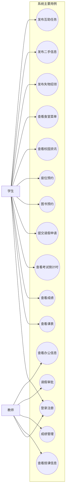
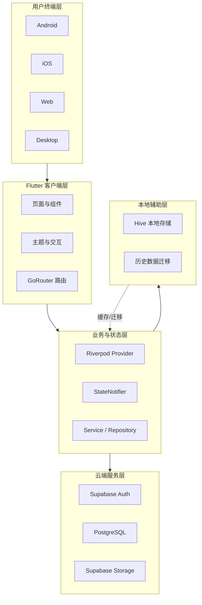
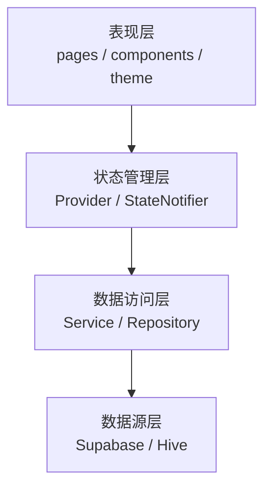
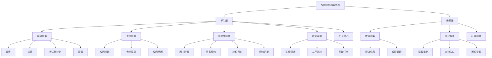
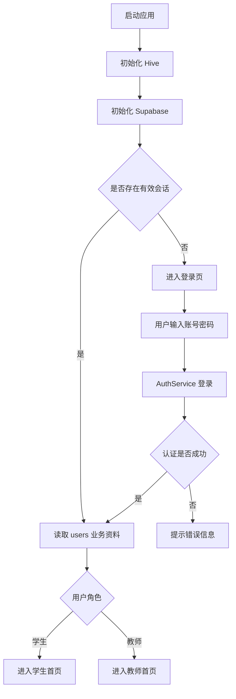
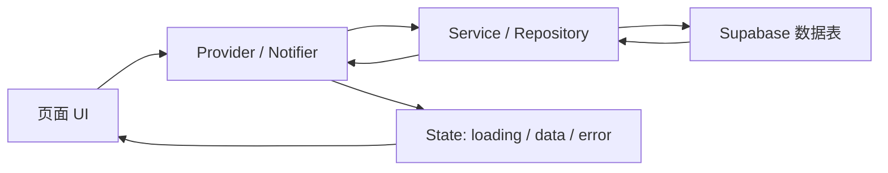
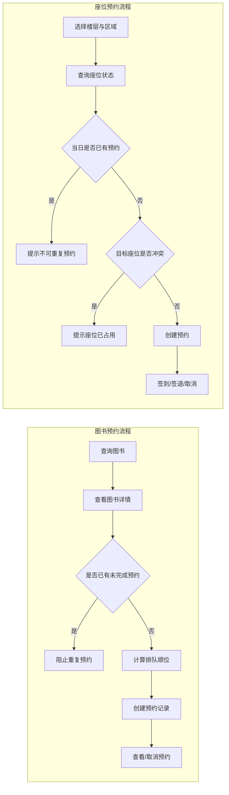
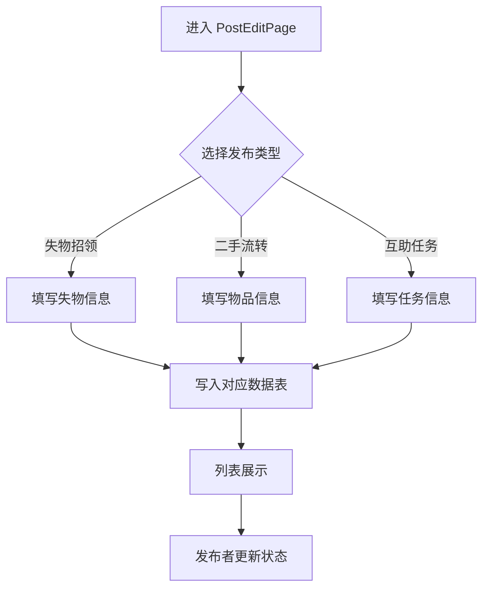
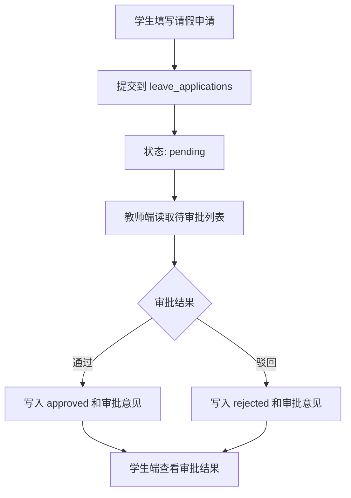
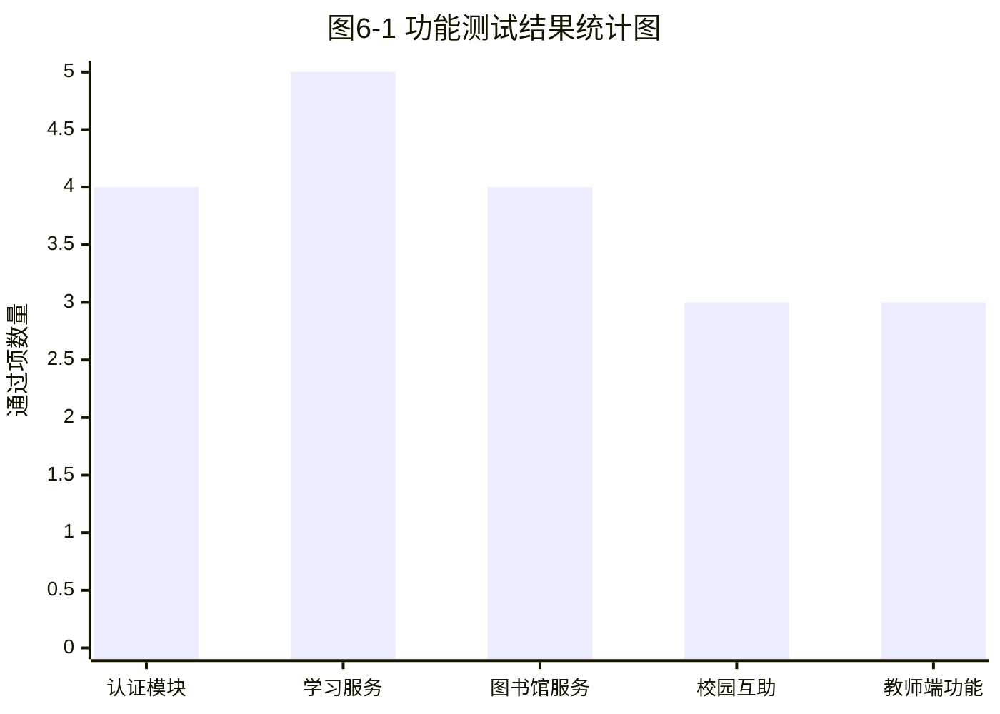

# 摘要

针对当前高校数字服务入口分散、使用链路割裂以及多端体验不一致等问题，本文设计并实现了一套基于 Flutter 与 Supabase 的校园综合服务系统。系统面向学生与教师两类核心用户，围绕学习服务、生活服务、图书馆服务、校园互助以及教师教学办公扩展等场景展开。研究过程中，采用需求分析、分层设计、模块化实现与测试验证相结合的方法，在不单独建设业务后端的前提下，利用 Supabase 提供的身份认证与 PostgreSQL 数据存储能力，构建了“Flutter 客户端 + 云端数据服务”的轻量化实现方案。系统实现了登录注册、角色分流、课表与成绩查询、考试倒计时、图书与座位预约、校园资讯浏览、食堂菜单查询、失物招领、二手流转、互助任务发布以及教师端请假审批和成绩管理等功能。测试结果表明，在本文研究范围内，系统主要业务链路运行稳定，能够较好满足校园综合服务场景下的信息整合与功能协同需求。尽管教师端部分扩展功能、自动化测试深度与细粒度权限治理仍有提升空间，但本文的实现结果已经验证了该技术路线在毕业设计与中小规模校园应用中的现实可行性。

**关键词：** Flutter；Supabase；校园综合服务系统；跨平台开发；移动应用

# Abstract

To address the problems of fragmented service entrances, disconnected usage flows, and inconsistent multi-platform experience in current campus applications, this thesis designs and implements a campus integrated service system based on Flutter and Supabase. The system is oriented toward two major user groups, namely students and teachers, and covers learning services, daily life services, library services, campus mutual-aid functions, as well as extended teaching and office scenarios for teachers. In this study, requirement analysis, layered design, modular implementation, and testing were combined to build a lightweight architecture of "Flutter client plus cloud data services" without developing an independent business backend. With the support of Supabase Auth and PostgreSQL, the system implements user registration and login, role-based navigation, course schedule and grade inquiry, exam countdown management, book and seat reservation, campus news browsing, canteen menu inquiry, lost-and-found, second-hand exchange, help task publishing, leave approval, and teacher-side grade management. The test results indicate that, within the scope of this research, the major business flows operate stably and can basically satisfy the demand for service integration and functional coordination in campus scenarios. Although there is still room for improvement in teacher-side business depth, automated test coverage, and fine-grained permission governance, the study demonstrates the practical feasibility of this technical route for graduation projects and small-to-medium campus applications.

**Key Words:** Flutter; Supabase; campus integrated service system; cross-platform development; mobile application

# 目录

# 第1章 绪论

## 1.1 研究背景与现状

随着高校信息化建设不断深入，校园服务正在由传统线下办理逐步转向线上集成化处理。课程查询、成绩查看、校园资讯获取、图书馆预约、请假审批以及校园互助等需求，已经成为师生日常学习与生活中的高频场景。然而在许多实际校园环境中，这些功能往往分散在多个系统或多个小程序之中，存在入口分散、交互不统一、数据更新不及时和跨平台体验不一致等问题，给师生使用带来了较高成本。

移动互联网和跨平台开发技术的发展，也为校园综合服务系统的建设提供了新的实现路径。Flutter 能够以单一代码库同时适配移动端、Web 端和桌面端，在开发效率、界面一致性和维护成本方面具有优势。Supabase 等后端即服务平台则降低了中小型信息系统的开发门槛，使开发者可以在不自建完整后端服务的前提下完成用户认证、数据存储和权限控制等能力集成。

从现有研究和应用现状来看，校园类应用大多集中在某一个子场景，例如仅提供教务查询、仅提供图书馆服务或仅提供生活资讯，真正面向学生与教师双角色、覆盖学习、生活、互助和办公多个业务场景的综合型系统相对较少。尤其是在毕业设计或中小型项目实践中，如何在有限开发周期内利用现代跨平台技术快速构建具备较完整业务闭环的校园服务系统，仍具有较强的研究和实践价值。

## 1.2 研究目的与意义

本课题旨在设计并实现一套基于 Flutter 与 Supabase 的校园综合服务系统，以解决校园服务功能入口分散、使用体验割裂以及开发维护成本较高等问题。系统围绕学生和教师在校园中的真实使用场景，集成学习服务、生活服务、校园互助、图书馆服务和教师办公扩展等功能，尝试构建一个具有统一界面风格、统一认证方式和统一数据访问机制的跨平台应用。

从实践意义上看，本系统能够为师生提供更集中、更便捷的校园服务入口，提升课程、成绩、资讯、预约和审批等高频业务的使用效率，并通过校园互助等功能增强校内社区协作能力。对于学校信息化建设而言，这种“轻量客户端 + 云端服务平台”的实现模式也具有一定参考价值，能够为中小规模校园应用的开发提供较低成本的实现思路。

从技术研究意义上看，本课题验证了 Flutter 在校园综合服务场景中的跨平台适用性，探索了 Riverpod 状态管理、GoRouter 路由组织、Supabase 身份认证与数据访问、Hive 本地存储与数据迁移等技术的协同应用方式。通过本系统的设计与实现，可以进一步总结在“无自建后端”条件下构建完整业务应用的工程方法，对后续类似项目开发具有借鉴意义。

## 1.3 研究内容与技术路线

本文的研究内容主要包括以下几个方面。首先，对校园综合服务系统的目标用户、业务场景和功能需求进行分析，明确系统需要覆盖的核心服务范围；其次，根据项目实际情况设计系统总体架构、分层结构、数据库模型、权限策略和界面交互方案；再次，基于 Flutter 与 Supabase 完成系统的功能实现，包括登录注册、课表、成绩、考试倒计时、图书馆预约、校园资讯、互助社区以及教师端部分教学办公功能；最后，通过测试与分析对系统可用性、稳定性和后续改进方向进行总结。

在技术路线方面，系统以前端统一开发为核心，采用 Flutter 作为客户端开发框架，以 Riverpod 实现状态管理，以 GoRouter 统一管理页面导航，以 Supabase 提供身份认证和 PostgreSQL 数据存储能力，以 Hive 承担本地轻量存储与历史数据迁移任务。整体技术路线可以概括为：需求分析 → 架构设计 → 数据模型设计 → 核心模块实现 → 系统测试与总结。该路线既符合毕业设计项目的实施节奏，也较好契合本系统“快速集成、轻量实现、持续扩展”的建设目标。

## 1.4 论文组织结构

本文共分为七章。

第1章为绪论，主要介绍课题研究背景、研究目的与意义、研究内容以及论文整体结构。

第2章为相关技术综述，主要分析系统开发中涉及的 Flutter、Dart、Supabase、Riverpod、GoRouter 和 Hive 等关键技术。

第3章为系统需求分析，围绕校园综合服务场景，从业务需求、功能需求、非功能需求和可行性等方面展开论述。

第4章为系统设计，主要对系统总体架构、客户端分层结构、功能模块划分、数据模型与权限控制以及界面视觉交互方案进行设计说明。

第5章为系统实现，重点介绍开发环境、项目结构、核心功能模块实现过程以及关键技术问题的解决方式。

第6章为系统测试与分析，对系统的测试环境、测试方法、核心功能验证情况以及系统存在的问题进行总结。

第7章为总结与展望，对全文工作进行归纳，并提出系统当前不足及后续改进方向。

# 第2章 相关技术综述

## 2.1 Flutter 跨平台开发框架

Flutter 是 Google 推出的跨平台 UI 框架，支持以单一代码库构建 Android、iOS、Web 和桌面端应用。对于校园综合服务系统而言，Flutter 的主要价值在于界面一致性较好、组件化能力较强，能够在有限周期内完成多模块页面开发并兼顾后续维护。

本系统选择 Flutter，主要基于三点考虑：一是学生端与教师端存在较多页面结构复用，组件化开发需求明显；二是系统需要兼顾移动端与桌面端展示；三是 Flutter 生态能够较方便地接入状态管理、路由和本地存储等能力，适合毕业设计项目的实现节奏。

### 2.1.1 Dart 语言特性分析

Dart 是 Flutter 的开发语言，具有语法清晰、面向对象能力完整和异步编程支持良好等特点。其空安全机制能够在编译阶段减少空引用问题，适合本系统这类以云端数据驱动为主的应用场景。

在本系统中，`Future`、`async` 和 `await` 被广泛用于登录认证、列表读取、预约提交和状态刷新等异步操作；集合处理和 JSON 映射能力则用于成绩汇总、考试排序、菜单组织以及数据库字段到客户端模型的转换。

### 2.1.2 Flutter 的 Widget 机制与渲染原理

Flutter 采用声明式 UI 思想，界面中的文本、容器、列表和页面都以 Widget 形式组织。开发者通过组合 Widget 构建层次化界面，再借助状态变化驱动局部更新，从而降低复杂页面的维护成本。

Flutter 不依赖平台原生控件，而是通过自身渲染引擎完成绘制，因此在不同平台上能够保持较稳定的视觉表现。本系统中的首页卡片、底部导航、状态标签和自定义进度展示，均建立在这种统一渲染机制之上。

## 2.2 Supabase 后端即服务平台

Supabase 提供身份认证、PostgreSQL 数据库、对象存储和权限控制等能力。本系统未单独实现业务后端，而是直接使用 Supabase 承担认证与数据支撑任务，从而将开发重点集中在客户端功能组织和业务流程实现上。

### 2.2.1 Supabase Auth 身份认证机制

Supabase Auth 提供注册、登录、会话维护和退出登录等基础能力。本系统在此基础上结合 `users` 业务表扩展手机号、学号、角色和院系等校园业务字段，形成“认证信息 + 业务资料”相结合的用户体系。

这种设计将登录凭据管理与校园角色管理分离开来：Auth 负责身份合法性，业务表负责角色识别和资料补充。对于本系统这种学生、教师双角色共用同一入口的应用，该方案能够兼顾实现效率与业务适配性。

### 2.2.2 Supabase PostgreSQL 数据存储机制

Supabase 以 PostgreSQL 作为底层数据库，适合保存课程、成绩、请假、资讯、图书预约、座位预约和互助信息等结构化数据。本系统依托主键、外键、状态字段和时间字段组织业务关系，使预约队列、审批流转和个人数据隔离具备较清晰的数据基础。

由于系统多数功能都具有明确的用户归属和状态变化特征，关系型数据库在约束控制、条件查询和排序统计方面的优势能够得到较好发挥。

### 2.2.3 Row Level Security 权限控制机制

Row Level Security（RLS）是 PostgreSQL 的行级权限控制机制。对于本系统这种客户端直连云端数据库的架构，RLS 是保证数据安全的关键手段。成绩、考试倒计时、请假记录、图书预约和座位预约等私有数据，需要限制为“仅本人可读写”；教师审批类数据则需结合角色开放特定权限。

RLS 与 Supabase Auth、角色字段和客户端分流逻辑共同构成系统的权限边界。即使前端页面存在疏漏，只要数据库策略定义正确，用户也无法直接越权访问不属于自己的记录。

## 2.3 Riverpod 状态管理与 GoRouter 路由管理

Riverpod 用于统一管理认证状态、成绩状态、课程状态、考试倒计时状态、资讯状态和请假状态等业务数据，使页面能够围绕状态变化自动更新，减少页面层与数据层的直接耦合。

GoRouter 用于统一组织登录页、首页、图书馆、成绩、请假和教师端页面之间的导航关系，并配合角色识别完成学生端与教师端入口分流。两者结合后，系统能够较稳定地协调“当前用户状态”和“当前页面位置”这两个核心问题。

## 2.4 Hive 本地存储与历史数据迁移

Hive 是 Flutter 常用的轻量级本地键值数据库。虽然本系统当前核心业务数据主要存储于 Supabase 中，但 Hive 仍承担两项辅助职责：一是在应用启动阶段提供本地初始化支持，二是在项目从本地原型演进到云端数据体系时承担历史用户数据迁移任务。

保留 Hive 的意义不在于继续作为主数据源，而在于为迁移、缓存和弱网优化预留能力。这种“主数据上云，本地能力辅助”的做法更符合本系统的实际演进路径。

## 2.5 本章小结

本章概述了系统实现所依赖的关键技术，包括 Flutter、Dart、Supabase、Riverpod、GoRouter 和 Hive。上述技术共同支撑了本系统的跨平台界面、云端数据访问、权限控制和状态管理，也为后续需求分析、系统设计与功能实现奠定了技术基础。

# 第3章 系统需求分析

## 3.1 系统业务场景概述

本系统面向学生与教师两类用户。学生更关注课表、成绩、考试提醒、图书馆服务、校园资讯和校园互助；教师除生活类信息外，还更关注授课安排、成绩管理、请假审批和办公入口。系统既要覆盖学习与生活场景，也要兼顾一定程度的教学管理需求。

从使用方式看，校园服务具有高频、碎片化和角色差异明显等特点。用户希望在统一入口中快速完成查询、预约、发布和审批，而不必在多个系统之间频繁切换。

为便于说明主要用户及其高频场景，本文将其归纳为表 3-1。

| 用户角色 | 典型使用时段 | 高频业务场景 | 主要目标 |
| --- | --- | --- | --- |
| 学生 | 课前、考试周、午餐时段、图书馆使用前后 | 课表查询、成绩查看、考试倒计时、图书与座位预约、请假申请、资讯浏览、互助发布 | 快速获取学习与生活信息，完成个人服务操作 |
| 教师 | 上课前后、办公时段、审批处理时段 | 授课安排查看、成绩管理、请假审批、通知浏览、办公入口访问 | 快速处理教学与办公事务，完成角色化管理操作 |

## 3.2 系统功能需求分析

结合业务场景，本系统的功能需求可以分为三类：一是登录、注册、角色识别和状态恢复等基础支撑需求；二是学习服务、图书馆服务和请假流程等核心业务需求；三是资讯、菜单、地图、互助和教师办公扩展等综合服务需求。

为直观展示学生与教师的主要功能边界，本文绘制系统用例如图 3-1 所示。

图3-1 系统用例图

### 3.2.1 用户认证与角色分流需求

系统需要提供注册、登录、退出登录、会话恢复和用户资料读取等基础认证能力。考虑到校园场景的使用习惯，登录入口除邮箱密码外，还应支持学号或手机号作为辅助标识。

系统还必须在登录成功后完成角色分流。学生与教师在首页结构、可见模块和可执行操作上存在明显差异，因此角色判断应同时作用于界面入口、路由跳转和数据访问范围。

### 3.2.2 学生端学习服务需求

学生端学习服务是系统主链路，至少应覆盖课表查询、成绩查询与统计、考试倒计时、图书馆服务以及请假申请等功能。上述功能均与当前登录用户强绑定，需要保证数据归属明确、结果展示清晰。

在组织方式上，学习服务应兼顾首页摘要展示与二级页面详细查看。首页应优先呈现高频信息，详细页则负责承载完整数据和具体操作。

### 3.2.3 校园生活服务需求

校园生活服务主要包括资讯、菜单、地图和基础出行信息。此类功能以查询为主，业务规则相对简单，但使用频率较高，因此需要突出信息层级和访问效率。

生活服务的核心要求不是复杂交互，而是“打开即可读、内容更新及时、展示结构清楚”。这类需求决定了该模块应采用轻量化页面组织方式。

### 3.2.4 校园互助服务需求

校园互助服务主要覆盖失物招领、二手流转和互助任务三类场景。系统需要支持内容发布、列表展示和状态更新，并允许发布者维护本人信息。

由于三类业务在交互结构上相近，需求分析阶段即可将其归纳为统一发布、统一展示和统一状态管理的问题，以便后续在系统设计中复用相似的页面与数据结构。

### 3.2.5 教师端教学与办公扩展需求

教师端需求主要包括授课安排查看、成绩管理、请假审批以及若干办公扩展入口。与学生端相比，教师端更强调待办聚合、状态处理和角色责任边界。

在优先级上，请假审批和成绩管理属于教师端的核心真实业务；通知、调课、奖助学金审核等则属于可逐步接入的扩展功能。

为便于归纳功能优先级，本文将主要需求总结为表 3-2。

| 功能类别 | 主要使用角色 | 业务性质 | 优先级 |
| --- | --- | --- | --- |
| 用户认证与角色分流 | 学生、教师 | 基础支撑 | 高 |
| 学习服务 | 学生 | 核心业务 | 高 |
| 图书馆服务 | 学生 | 核心业务 | 高 |
| 校园生活服务 | 学生、教师 | 高频辅助 | 中高 |
| 校园互助服务 | 学生、教师 | 社区扩展 | 中 |
| 教师端教学与办公 | 教师 | 角色扩展 | 中高 |

## 3.3 系统非功能需求分析

### 3.3.1 性能与响应性需求

系统需要在登录、页面切换、列表加载和预约提交等高频操作中保持较好的响应速度，避免长时间空白、明显卡顿或重复提交。

对于只读型页面，应保证首屏信息尽快呈现；对于写入型操作，应尽快反馈成功或失败结果，减少用户不确定感。

### 3.3.2 跨平台兼容性需求

由于系统采用 Flutter 开发，因此需要保证主要功能在移动端和桌面端环境下均可稳定运行。布局应具备弹性，避免小屏拥挤或大屏过度拉伸。

对于地图等存在平台依赖差异的功能，应提供分平台处理或降级方案，以保证主流程不受影响。

### 3.3.3 数据安全与权限控制需求

系统涉及成绩、请假、预约和个人资料等敏感信息，因此必须保证私有数据不越权访问，且客户端不得暴露高权限密钥。

数据安全需要由认证机制、角色识别、数据库权限策略和客户端分流逻辑共同完成，而不能仅依赖页面层隐藏入口。

### 3.3.4 可维护性与可扩展性需求

系统应具备明确的模块边界，使页面层、状态层和数据层相对分离，降低后续功能扩展和问题修复的成本。

此外，新增业务应尽量复用既有认证、路由和数据访问机制，避免因局部扩展破坏整体结构。

为便于概括，本文将主要非功能需求整理为表 3-3。

| 非功能类别 | 重点关注内容 | 需求目标 |
| --- | --- | --- |
| 性能与响应性 | 页面加载、数据刷新、操作反馈 | 高频场景下保持流畅与及时反馈 |
| 跨平台兼容性 | 多端布局、交互一致性、平台差异处理 | 保证主要功能在移动端和桌面端稳定可用 |
| 数据安全与权限控制 | 身份认证、角色隔离、私有数据访问边界 | 防止越权读取与误操作 |
| 可维护性与可扩展性 | 分层结构、模块化组织、后续功能接入能力 | 支持系统持续迭代和功能扩展 |

## 3.4 系统可行性分析

从技术可行性看，Flutter、Supabase、Riverpod、GoRouter 和 Hive 均为成熟技术，能够支撑毕业设计周期内的实现工作。尤其是 Supabase 的引入，显著降低了认证、数据库和权限控制的自建成本。

从经济可行性看，本系统主要依托开源框架和云服务基础能力完成开发，不需要额外建设复杂后端基础设施，适合毕业设计项目的资源条件。

从应用可行性看，课程、成绩、图书馆、请假、资讯和互助等功能均对应真实校园场景，具有明确的用户需求。当前项目又已经具备较清晰的数据表结构和业务边界，因此方案具有较好的可验证性。

从实施角度看，系统可以按“认证与主链路优先、扩展功能逐步补充”的方式推进，这一节奏与项目当前实现路径一致，也降低了整体开发风险。

为便于概括，本文将可行性分析结果总结为表 3-4。

| 可行性维度 | 主要依据 | 结论 |
| --- | --- | --- |
| 技术可行性 | Flutter、Supabase、Riverpod 等技术成熟 | 可行 |
| 经济可行性 | 主要依托开源框架和云服务基础能力 | 可行 |
| 应用可行性 | 校园场景真实、师生需求明确 | 可行 |
| 开发组织可行性 | 模块边界清晰，可按优先级分阶段推进 | 可行 |
| 运行维护可行性 | 架构较轻量，后续维护重点明确 | 可行 |

## 3.5 本章小结

本章从业务场景、功能需求、非功能需求和可行性四个方面分析了系统建设的现实条件。分析结果表明，本系统需要在统一入口下同时处理学习、生活、互助和教学办公等场景，并在性能、兼容性和权限控制方面满足基本工程要求。这些内容为第 4 章系统设计提供了直接依据。

# 第4章 系统设计

## 4.1 系统总体架构设计

本系统采用“Flutter 客户端 + Supabase 云端服务 + Hive 本地辅助存储”的总体架构。系统未单独实现业务后端，而是利用 Supabase 提供的认证、数据库和对象存储能力完成用户管理与数据持久化，从而将开发重点集中在客户端业务组织和交互实现上。

从职责划分看，系统可概括为表现层、状态与业务协调层、数据访问层和云端数据层。表现层负责页面展示与交互，状态层基于 Riverpod 维护认证状态和各业务模块状态，数据访问层通过 Service 与 Repository 封装数据操作，云端数据层则由 Supabase Auth、PostgreSQL 和 Storage 组成。

如图 4-1 所示，Hive 在当前版本中主要承担本地初始化、历史数据迁移和后续缓存扩展的辅助职责；登录注册、成绩、课表、请假、资讯、图书馆预约和互助等核心功能则已由 Supabase 提供真实数据支撑。

图4-1 系统总体架构图

## 4.2 客户端分层结构设计

为明确客户端内部职责边界，本文将其分为表现层、状态管理层、数据访问层和数据源层，如图 4-2 所示。

图4-2 客户端分层结构图

### 4.2.1 表现层设计

表现层主要负责界面展示、输入响应、页面跳转和多端适配。系统将页面、通用组件、主题样式和路由配置进行集中组织，以保证不同模块在视觉风格和交互方式上的一致性。

学生端首页以学习、生活和互助为一级入口，教师端首页则以教学、办公和社区为一级入口。认证页、图书馆、成绩、请假和互助发布等二级页面通过统一路由体系组织，从而形成较清晰的页面层次。

在适配策略上，系统主要通过 `SafeArea`、滚动容器和最大宽度限制控制不同设备上的布局表现；对于地图等存在平台差异的页面，则采用分平台页面实现。

### 4.2.2 业务逻辑层设计

业务逻辑层位于表现层与数据访问层之间，负责状态管理、异步流程协调和业务规则组织。本系统采用 Riverpod 管理认证、成绩、课程、考试倒计时、资讯、请假审批和校园互助等状态。

各模块通常以“状态对象 + Notifier + Provider”的方式组织。状态对象保存业务数据、加载状态和错误信息，Notifier 负责调用数据服务并在操作完成后更新状态。

认证状态是该层的核心。系统需要在启动时恢复会话，在登录或退出后同步刷新首页结构和依赖当前用户的数据模块，并据此完成学生端与教师端的角色分流。

### 4.2.3 数据访问层设计

数据访问层负责客户端与 Supabase 之间的交互。为降低页面层与数据库结构的直接耦合，系统对查询、写入、状态校验和异常处理进行了统一封装。

从组织形式看，通用业务主要由 Service 承担，如认证、课表、成绩、考试倒计时、资讯、请假和互助功能；图书馆模块则因预约、借阅和统计逻辑更复杂，采用 Repository 形式独立封装。

由于 Supabase 数据表字段多使用下划线命名，系统在该层统一完成字段映射和模型转换，并在预约、审批等流程中执行必要的前置校验。

## 4.3 系统功能模块设计

结合需求分析，系统功能可划分为学习服务、生活服务、校园互助和教师端扩展四个模块。各模块通过统一认证、统一状态管理和统一数据访问方式协同运行。

图 4-3 展示了系统的整体模块结构。

图4-3 系统功能模块结构图

### 4.3.1 学习服务模块设计

学习服务模块是学生端主链路，主要包括课表查询、成绩查询与统计、考试倒计时、图书馆服务、请假申请和教室查找等功能。该模块以“首页摘要 + 二级页面详细查看”的方式组织，使高频信息可以快速触达。

其中，课程和成绩依赖当前用户身份进行个性化读取；考试倒计时支持个人计划维护；图书馆服务承担学习资源获取与座位预约；请假申请则与教师端审批形成跨角色数据链路。

### 4.3.2 生活服务模块设计

生活服务模块主要包括校园资讯、食堂菜单、校园地图和通勤信息。该模块以轻量查询为主，强调信息更新及时、层级清晰和进入成本低。

资讯按发布时间组织，菜单按周次和餐次组织，地图则用于空间认知和地点辅助查找。相关设计重点不是复杂业务处理，而是保证高频生活信息可以快速获取。

### 4.3.3 校园互助模块设计

校园互助模块包括失物招领、二手流转和互助任务三类功能。三类业务均支持内容发布、列表展示和状态更新，因此系统在交互层采用统一发布入口，在展示层采用相近的卡片化组织方式。

这种设计既保留了三类业务各自独立的数据结构，也降低了用户在不同互助场景间切换时的学习成本。

### 4.3.4 教师端扩展模块设计

教师端扩展模块主要包括教学服务、办公审批和信息展示三部分。当前实现中，请假审批和教师成绩管理已接入真实数据；授课安排、通知查看和部分办公入口则用于支撑教师端整体工作流。

教师端与学生端共享统一认证、状态管理和数据访问机制，但在首页结构和功能入口上依据角色进行差异化组织，从而体现双角色应用的设计要求。

## 4.4 Supabase 数据模型与权限设计

### 4.4.1 主要数据表结构设计

为支撑学习服务、生活服务、图书馆服务、校园互助和教师端扩展功能，项目在 Supabase PostgreSQL 中建立了多组数据表。整体设计遵循“按业务域划分、按用户归属组织、按状态流转建模”的原则。

图 4-4 给出了系统核心实体之间的主要关联关系。

图4-4 系统数据库 E-R 图

在身份数据方面，系统以 `auth.users` 作为认证主体，并在公共 `users` 表中保存姓名、手机号、角色、学号和院系等业务信息。学习服务主要依赖 `courses`、`grades`、`exam_countdowns` 和 `leave_applications` 等表；生活服务主要使用 `campus_news`、`canteens` 和 `canteen_weekly_menus`；校园互助主要对应 `lost_and_found`、`second_hand_items` 和 `help_tasks`；图书馆服务则依赖 `books`、`book_reservations`、`seat`、`seat_reservation` 和 `library_announcements` 等表。教师端还预留了 `teacher_schedules`、`reschedule_applications`、`assignment_submissions` 和 `scholarship_reviews` 等结构。

### 4.4.2 客户端数据交互流程设计

系统未采用独立业务后端，因此客户端与云端数据之间的交互直接建立在 Supabase SDK 之上。整体流程可概括为：页面触发请求，状态层协调调用，数据访问层完成查询或写入，随后将结果映射为客户端模型并回写页面状态。

在查询流程中，页面通过 Riverpod 订阅业务 Provider，Notifier 调用 Service 或 Repository 读取 Supabase 数据表，并将结果封装为包含 `isLoading`、`error` 和业务数据的状态对象。页面再依据状态完成渲染。

在写入流程中，系统遵循“前置校验 - 提交请求 - 刷新状态”的模式。图书预约、座位预约和请假审批等功能均在写入前完成必要约束检查，以降低异常状态和重复提交的发生概率。

### 4.4.3 用户权限与数据访问控制设计

由于客户端可直接访问 Supabase 数据库，因此权限设计需要同时依赖 Supabase Auth、角色字段、业务查询过滤和 Row Level Security。系统的基本原则是：私有数据按用户隔离，公共数据按业务开放，审批和管理类操作按角色控制。

成绩、考试倒计时、座位预约、图书预约和个人请假记录等数据必须绑定当前用户；资讯、菜单和图书基础信息可在业务范围内开放读取；教师审批和教师成绩管理则要求当前用户具备教师角色。

客户端侧还通过角色识别进一步限制入口显示和路由跳转，从而形成“数据库权限约束 + 客户端角色分流”的双重控制方式。

## 4.5 界面视觉与交互设计

系统的界面设计遵循“简洁统一、信息清晰、操作低负担”的原则。颜色、字体、间距和全局主题统一定义在 `AppColors`、`AppSpacing`、`AppTextStyles` 和 `AppTheme` 等文件中，通用按钮、卡片、输入框、加载状态和提示消息也采用组件化封装。

在交互组织上，学生端采用底部导航承载学习、生活和互助三个高频模块，教师端则切换为教学、办公和社区三类入口。首页优先呈现课程、成绩摘要、考试提醒、资讯和互助等高频内容，预约详情、审批处理和成绩管理等流程性功能则放在二级页面展开。

在适配与反馈方面，系统通过卡片布局、统一状态标签、加载提示、空状态和错误提示增强可用性，并通过最大宽度限制和分平台页面处理兼顾移动端与桌面端体验。

## 4.6 本章小结

本章从总体架构、客户端分层、功能模块、数据模型与权限控制以及界面交互五个方面给出了系统设计方案。该设计能够适配本项目“无自建后端、以客户端实现为主”的实际条件，并为第 5 章的功能实现提供基础。

# 第5章 系统实现

## 5.1 开发环境与项目结构

本系统基于 Flutter 3.38.5 和 Dart 3.10.4 开发，云端能力由 Supabase 提供。状态管理采用 Riverpod，路由管理采用 GoRouter，本地存储采用 Hive。`cached_network_image`、`flutter_svg` 和 `shimmer` 等库用于图像加载和界面反馈。

为便于说明系统实现所依赖的基础环境，本文将当前主要开发环境归纳为表 5-1。

| 项目要素 | 采用方案 |
| --- | --- |
| 客户端框架 | Flutter 3.38.5 |
| 开发语言 | Dart 3.10.4 |
| 状态管理 | Riverpod / flutter_riverpod |
| 路由管理 | GoRouter |
| 云端服务 | Supabase |
| 数据库 | PostgreSQL（由 Supabase 托管） |
| 本地存储 | Hive / hive_flutter |
| 图像与界面增强 | cached_network_image、flutter_svg、shimmer |

项目目录采用“通用能力集中、复杂业务独立”的组织方式。`core/services` 负责认证、课程、成绩、考试、资讯和请假等通用数据访问；`domain/models` 定义领域模型；`features/library`、`features/study`、`features/life`、`features/office` 组织相对独立的业务模块；`presentation` 负责页面、路由、组件和主题。应用启动时先初始化 Hive 与 Supabase，再注入 `ProviderScope`，最后通过 `MaterialApp.router` 挂载路由与主题。该结构符合当前“客户端直连 Supabase”的实现方式，也便于后续继续扩展教师端与图书馆模块。

## 5.2 核心功能模块实现

### 5.2.1 基于 Supabase Auth 的登录注册功能实现

系统启动后先执行 `Supabase.initialize()`，再由 `AuthService` 统一封装登录、注册、退出登录、会话恢复和资料读取等操作。认证主链路仍以 Supabase Auth 的邮箱密码机制为核心，不额外实现独立认证后端。

为适配校园场景中的学号或手机号登录习惯，系统在客户端增加了一层账号转换逻辑。用户输入学号或手机号后，`AuthService` 先在 `users` 业务表中反查对应邮箱，再调用 `signInWithPassword` 完成认证。注册时，系统通过 `signUp` 写入认证信息，并将姓名、角色、学号、院系和头像等业务字段保存到公共 `users` 表。

用户资料读取通过认证信息与 `users` 表扩展信息合并完成，最终生成统一的 `User` 模型。`AuthNotifier` 和 `authStateProvider` 负责维护当前用户、加载状态和错误信息。登录成功后，依赖用户身份的成绩、考试、预约和审批模块可以自动收到状态变更。

图5-1展示了系统登录完成后从身份认证到角色分流的主链路。

图5-1 登录与角色分流流程图

### 5.2.2 基于 Riverpod 的全局状态管理实现

系统使用 Riverpod 组织全局状态。成绩、考试倒计时、课程表、请假、资讯、失物招领、二手流转和互助任务等模块均采用“State + Notifier + Provider”的统一结构，集中管理业务数据、加载状态和错误信息。

该结构将页面、数据访问和状态更新分离开来。页面只负责订阅 Provider 并渲染状态，Notifier 负责调用 Service 或 Repository 执行异步请求。以成绩模块为例，`GradesState` 除保存成绩列表外，还负责计算总绩点、总学分和学期汇总；请假模块中的 `LeaveNotifier` 则同时处理学生提交、教师审批和记录刷新。

Riverpod 还承担了认证状态向下游业务状态的传递。当前用户发生变化后，依赖用户标识的 Provider 会重新加载对应数据，避免不同用户之间的数据串用。对审批、撤销和预约取消等操作，系统采用“云端成功后立即同步本地状态”的更新方式，以减少页面重复进入的成本。

如图5-2所示，系统通过 Riverpod 将页面、业务服务和数据源之间的异步交互组织为统一状态流。

图5-2 Riverpod 状态流转图

### 5.2.3 学习服务模块实现

学习服务模块围绕课表、成绩、考试倒计时和请假申请展开。课表数据由 `CourseService` 从 `courses` 表读取，在首页显示当天课程摘要，在完整课表页展示详细安排；成绩数据由 `GradeService` 从 `grades` 表读取，再由状态层计算 GPA、总学分和学期汇总；考试倒计时由 `ExamCountdownService` 负责新增、修改、删除和排序。

首页学习区域采用“摘要卡片 + 功能入口”的组织方式，集中呈现当天课程、成绩概览、考试提醒和请假入口。完整课表、成绩列表、考试列表和请假记录则放在二级页面，避免首页信息堆叠过多。该结构兼顾了高频信息可达性和完整数据浏览需求。

请假功能建立在 `leave_applications` 表之上。学生可以提交申请、查看个人记录，并在允许的状态下执行撤销；教师端审批复用同一张表，形成跨角色业务链路。学习服务模块因此不仅覆盖了学生常用查询功能，也为教师端审批提供了真实数据来源。

### 5.2.4 图书馆服务模块实现

图书馆服务模块是本系统实现程度较高的业务模块，采用 `Repository + Provider + Page` 的组织方式。`BookRepository` 负责图书基础信息读取，`ReservationRepository` 负责图书预约与排队顺位计算，`SeatRepository` 负责座位查询、预约、签到、签退和取消等操作。

图书预约逻辑建立在 `book_reservations` 表之上。用户提交预约前，系统先检查是否已存在 `queuing` 或 `available` 状态的未完成预约；若不存在，再根据当前排队记录生成新的 `queue_position`。该流程满足了重复预约限制和基本排队顺序控制。

座位预约逻辑建立在 `seat` 与 `seat_reservation` 两张表之上。系统先按楼层和区域读取启用座位，再结合当日预约记录计算座位状态；创建预约前，需要同时通过“同一用户单日唯一预约”和“目标座位不可冲突”两项校验。签到、签退和取消操作也仅在合法前置状态下执行。

页面层围绕图书与座位两条主线展开，包含 `LibraryHomePage`、`BookSearchPage`、`BookDetailPage`、`MyLoansPage`、`MyReservationsPage`、`SeatReservationPage` 和 `LibraryStatsPage` 等页面。图书馆首页负责入口聚合，详细操作下沉到二级页面处理。

图5-3 图书预约与座位预约业务流程图

### 5.2.5 校园互助模块实现

校园互助模块包含失物招领、二手流转和互助任务三类业务，分别由 `LostAndFoundService`、`SecondHandService` 和 `HelpTaskService` 完成数据读取、发布和状态更新。三类数据在表结构上相互独立，但页面层采用统一的卡片列表与状态标签进行展示。

为降低发布流程的学习成本，系统使用统一的 `PostEditPage` 作为发布入口。用户先选择发布类型，再填写对应字段，页面随后调用相应服务写入数据表。首页互助区域只展示摘要内容，完整列表和状态维护操作在二级页面完成。

互助模块的状态控制相对简单，但仍保留“已认领”“已售出”“已完成”等标记，用于区分信息是否有效。这一设计避免了失效内容长期停留在列表中，也为后续增加筛选和我的发布等功能保留了空间。

图5-4 校园互助统一发布流程图

### 5.2.6 教师端扩展功能实现

教师端功能建立在角色识别基础上。系统登录后读取 `users` 表中的角色字段，若当前用户为教师，则首页导航切换为教学、办公和社区等入口。该分流方式使教师进入应用后优先看到授课安排、成绩管理和审批待办。

当前教师端已接入真实数据的功能主要包括请假审批和成绩管理。请假审批通过 `LeaveService` 读取 `pending` 状态记录，并支持审批通过、驳回和意见写入；成绩管理通过 `TeacherGradePage` 按学生维度查看、维护成绩数据。两条链路均与学生端业务直接关联，能够体现教师端的角色差异。

班级名册、调课申请、作业管理、奖助学金审核、科研信息和场地借用等页面目前已完成界面结构与交互框架，用于承载后续业务扩展。

图5-5 请假审批业务流程图

## 5.3 关键技术问题的解决

### 5.3.1 基于角色的首页与路由分流实现

本系统同时面向学生和教师两类用户，因此首页结构与共享入口需要按角色分流。认证成功后，系统先从 `users` 表读取用户类型，再在首页生成不同的一级页面集合。对于成绩等共享路径，系统通过中间路由页再次判断角色，并跳转到学生成绩页或教师成绩管理页。

角色判断集中在认证状态和路由层处理，减少了业务页面内部重复判断身份的情况。`app_router.dart` 统一维护认证页、首页、图书馆嵌套路由、互助发布页、教师工具页和地图页，也降低了后续调整导航结构的成本。

### 5.3.2 客户端与 Supabase 数据映射封装实现

由于 Supabase 数据表字段普遍使用下划线命名，而 Flutter 页面和模型更适合使用驼峰命名，系统在 Service 与 Repository 层统一完成字段映射，再调用模型的 `fromJson` 构造方法生成领域对象。

该策略主要应用于图书馆、成绩和用户资料读取等模块，例如 `queue_position`、`reserve_date`、`student_id` 和 `department` 等字段均在数据访问层转换。页面层和状态层只面向统一领域模型编程，降低了数据库字段变更对上层代码的影响。

### 5.3.3 业务状态流转与前置校验实现

在未自建独立业务后端的条件下，预约、审批和状态更新类逻辑主要由客户端完成。系统采用“先检查、再提交、成功后同步状态”的处理方式，将关键约束前移到数据访问层和状态层。

图书预约通过状态字段区分排队中、可借阅、过期和取消等状态，并在提交前校验重复预约；座位预约通过 `reserved`、`using`、`completed` 和 `cancelled` 描述生命周期，并在提交前执行单日唯一预约与座位冲突检测；请假审批则通过 `pending`、`approved` 和 `rejected` 描述跨角色处理结果。

由于状态更新会直接影响当前界面显示，系统在审批、撤销、取消预约和签到签退完成后同步刷新本地状态集合。该方案无法替代复杂并发控制，但能够满足毕业设计场景下的主要业务约束。

### 5.3.4 跨平台界面适配与页面兼容处理

作为跨平台应用，系统需要同时兼顾移动端和桌面端显示。页面布局优先采用 `Row`、`Column`、`Expanded`、`Padding` 和滚动容器等 Flutter 原生组件，并通过 `ConstrainedBox` 限制桌面端内容宽度，以获得较稳定的阅读布局。

对地图等存在平台依赖差异的功能，系统采用分平台页面文件和条件导入处理，分别提供 Web 实现与通用占位实现。统一主题系统 `AppTheme` 负责颜色、字号、输入框和按钮风格控制，从而保持不同平台下的界面一致性。

### 5.3.5 本地历史用户数据迁移实现

项目早期使用 Hive 保存本地用户数据，后续接入 Supabase 后实现了 `DataMigrationService` 进行历史数据迁移。该服务读取 Hive 中的 `users` 盒子，兼容 `Map` 结构和领域对象两种数据形态，再按 Supabase Auth 注册流程逐条补录用户。

迁移过程中，系统会跳过缺失关键认证字段的记录，并对“用户已存在”类异常执行容错处理，避免单条失败中断整个流程。该服务不在每次应用启动时自动执行，而是保留为按需触发的辅助能力，用于支持从本地原型向云端认证体系过渡。

## 5.4 本章小结

本章说明了系统在客户端架构、认证机制、状态管理、学习服务、图书馆、校园互助、教师端扩展以及关键工程问题上的实现方式。结果表明，在不自建独立业务后端的前提下，Flutter 结合 Supabase 仍可完成校园综合服务系统的主要功能闭环，并保持较清晰的工程组织。

# 第6章 系统测试与分析

## 6.1 测试环境与测试方法

为验证系统功能的正确性与稳定性，项目采用自动化测试、人工功能验证和静态分析相结合的方式开展测试。测试环境基于 Flutter 3.38.5、Dart 3.10.4 和 Supabase 云端数据服务。

自动化测试主要通过 `flutter test` 完成，重点覆盖认证绑定、菜单逻辑、时间选择组件、页面渲染和统一提示约束等关键点；人工验证主要用于登录、查询、预约和审批等完整业务链路；`flutter analyze` 则用于发现潜在规范问题和风险点。

本文将当前测试手段归纳为表 6-1。

| 测试类别 | 主要对象 | 使用方式 | 主要目标 |
| --- | --- | --- | --- |
| 单元测试 | 业务规则函数、状态绑定逻辑 | `flutter test` | 验证核心逻辑正确性 |
| 组件测试 | 页面组件、基础交互部件 | `flutter test` | 验证页面是否可正常构建与渲染 |
| 功能流程验证 | 登录、查询、预约、审批等流程 | 人工结合真实页面操作 | 验证业务链路完整性 |
| 静态分析 | 全项目代码结构与规范 | `flutter analyze` | 发现潜在规范问题与风险点 |

为直观呈现主要测试模块的通过情况，本文将结果概括如图 6-1 所示。

图6-1 功能测试结果统计图

## 6.2 用户认证与基础功能测试

基础功能测试主要围绕认证绑定、页面渲染和统一提示约束展开。测试结果表明，成绩模块和考试倒计时模块中的当前用户 Provider 能够随着登录用户变化而同步更新，从而避免不同用户数据串用。

此外，地图页面能够正常渲染关键内容，系统也不存在绕过封装直接调用原生 SnackBar 的情况，说明基础页面能力和界面提示约束较为稳定。

表 6-2 对基础能力测试结果进行了归纳。

| 测试项 | 测试重点 | 结果 |
| --- | --- | --- |
| 认证绑定测试 | 用户切换后业务 Provider 是否同步更新 | 通过 |
| 地图页面渲染测试 | 页面是否能正常构建并显示关键内容 | 通过 |
| 统一提示约束测试 | 是否存在绕过封装直接使用原生提示组件的情况 | 通过 |

## 6.3 核心业务流程测试与结果分析

### 6.3.1 学习服务模块测试

学习服务模块主要测试课程展示、成绩统计、考试倒计时和请假申请等功能。结果表明，成绩与考试功能均已绑定当前登录用户，成绩汇总与请假状态流转也能够保持基本正确。

该模块当前已能够满足学生在课程、成绩和备考方面的主要需求，但对异常输入、边界时间和更复杂请假规则的测试仍可继续补充。

### 6.3.2 图书馆服务模块测试

图书馆服务模块重点测试图书查询、图书预约、自习座位预约和预约记录展示等能力。测试结果表明，重复预约校验、排队顺序计算、座位冲突检测以及签到签退等关键规则能够正常生效。

由于该模块的状态较多、约束较强，其测试价值主要体现在业务规则验证而非单纯页面展示。后续仍可增加并发和边界场景测试。

### 6.3.3 校园互助模块测试

校园互助模块测试主要覆盖失物招领、二手流转和互助任务的发布、列表刷新和状态更新。结果表明，统一发布流程能够稳定写入对应数据表，列表页与首页摘要也能保持基本一致。

不过，该模块仍以开放式信息展示为主，若后续引入评论、收藏或消息通知，还需要补充更完整的状态管理与交互验证。

### 6.3.4 教师端扩展功能测试

教师端测试主要验证角色分流、请假审批和教师成绩管理等流程。当前结果表明，教师账号能够正确进入教师首页，请假审批与成绩管理可以形成基本业务闭环。

需要说明的是，教师端当前仍存在“真实数据功能 + 静态演示功能”并存的情况，因此测试结论主要针对已接入真实数据的部分模块。

综合四类核心业务模块的测试情况，结果可归纳为表 6-3。

| 模块 | 重点验证内容 | 当前结果 | 后续可加强方向 |
| --- | --- | --- | --- |
| 学习服务 | 成绩汇总、考试倒计时、请假状态流转 | 主流程可用 | 增强异常输入与边界时间测试 |
| 图书馆服务 | 图书预约队列、座位冲突检测、签到签退 | 业务约束较完整 | 增强并发与边界状态测试 |
| 校园互助 | 发布、列表刷新、状态更新 | 发布链路稳定 | 增加互动、审核与通知测试 |
| 教师端扩展 | 角色分流、审批闭环、成绩管理 | 核心真实功能可用 | 深化真实数据接入后的专项测试 |

## 6.4 跨平台兼容性与界面交互测试

跨平台兼容性测试主要从布局适配、页面可渲染性和交互一致性三个方面开展。当前系统通过最大宽度限制、滚动布局和统一间距规范，使多数页面在移动端和桌面端都能够保持基本稳定的显示效果。

对于地图等存在平台依赖差异的功能，系统采用了分平台处理策略，因此主流程未受到明显影响。统一主题和统一消息提示组件也保证了各模块在视觉风格和反馈方式上的一致性。

`flutter analyze` 结果中仍存在旧 API、未使用导入和个别结构性提示，说明项目在工程细节上仍有继续打磨空间。

## 6.5 测试结果总结与系统改进

当前项目的自动化测试共覆盖 12 个用例，已全部通过，说明系统在认证绑定、基础页面渲染和部分业务规则层面具备较好的可验证性。综合人工验证结果看，用户认证、学生端学习服务、图书馆预约、校园互助以及教师端部分真实业务功能均能完成预期流程。

系统当前的主要不足有两点：一是自动化测试尚未覆盖更多复杂业务链路；二是静态分析中仍有较多规范性提示。后续应继续围绕预约流程、审批流程和角色权限边界补充测试，并逐步清理代码规范问题。

表 6-4 对当前系统质量现状进行了概括。

| 评价维度 | 当前结论 | 说明 |
| --- | --- | --- |
| 功能完整性 | 较好 | 主要业务链路已实现并可演示 |
| 基础稳定性 | 较好 | 自动化测试 12 项全部通过 |
| 业务规则约束 | 中等偏好 | 图书馆与认证相关规则已具备约束 |
| 自动化测试深度 | 有待增强 | 复杂业务流程覆盖仍不足 |
| 代码规范一致性 | 有待优化 | `flutter analyze` 仍存在较多提示 |

## 6.6 本章小结

本章对系统的测试环境、测试方法、基础能力和核心业务流程进行了分析。结果表明，系统在主要业务场景下已具备较好的可运行性，但在测试深度和代码规范一致性方面仍有继续完善的空间。

# 第7章 总结与展望

## 7.1 全文总结

本文围绕校园综合服务场景，设计并实现了一套基于 Flutter 与 Supabase 的跨平台校园服务系统。系统面向学生与教师两类用户，在不自建独立业务后端的前提下，采用“Flutter 客户端 + Supabase 云端数据服务”的轻量架构完成主要功能建设。

系统实现了登录注册、角色分流、课表查询、成绩管理、考试倒计时、图书与座位预约、校园资讯、食堂菜单、失物招领、二手流转、互助任务以及教师端请假审批和成绩管理等功能，并结合 Riverpod、GoRouter 和 Hive 完成状态管理、路由组织和历史数据迁移。

从论文工作过程看，本文较完整地完成了需求分析、系统设计、系统实现和系统测试四个阶段。测试结果表明，系统在主要业务场景下具备较好的可运行性，能够满足毕业设计的基本目标。

从项目价值看，本研究验证了在中小规模校园应用场景中，使用 Flutter 结合 Supabase 完成统一入口、角色分流和多业务整合是可行的，也积累了在无自建后端条件下组织客户端架构、数据访问和权限边界的实践经验。

为更清晰地概括本文的主要成果，现将其总结为表 7-1。

| 研究内容 | 完成情况 | 主要成果 |
| --- | --- | --- |
| 需求分析 | 已完成 | 明确学生端、教师端及多业务场景需求边界 |
| 总体与详细设计 | 已完成 | 形成轻量化架构与客户端分层设计方案 |
| 核心功能实现 | 已完成 | 登录注册、学习服务、图书馆、互助、教师端部分真实功能落地 |
| 关键技术问题处理 | 已完成 | 解决角色分流、状态管理、数据映射、迁移与兼容问题 |
| 系统测试与分析 | 已完成 | 验证主要功能可运行并归纳当前质量现状 |

本文完成的工作已达到毕业设计论文对“方案合理、系统可运行、过程可说明、结果可验证”的基本要求。

## 7.2 系统不足

当前系统仍存在以下不足。首先，教师端部分功能仍以静态演示为主，真实业务深度整体弱于学生端。其次，系统虽然已具备基本权限控制与状态约束，但在细粒度权限、消息通知和复杂并发场景处理方面仍不够完善。

此外，自动化测试尚未覆盖全部核心业务流程，`flutter analyze` 结果中仍保留部分规范性提示，说明项目在工程化细节上仍有继续优化空间。

因此，现阶段系统更适合作为完成度较高的毕业设计原型，而非直接面向大规模真实部署的生产系统。

## 7.3 未来改进方向

后续改进可重点从五个方面展开：一是继续接入教师端真实业务数据，如调课申请、作业管理和奖助学金审核；二是细化 Supabase 权限策略，完善不同角色和不同操作之间的访问边界；三是增强本地缓存和弱网处理能力；四是补充考试提醒、预约到期提醒和审批结果通知等消息机制；五是继续扩大自动化测试和回归测试覆盖范围。

若系统进一步面向真实校园场景扩展，还可以引入统一搜索、通知中心、个人日程聚合以及更细致的内容审核与日志审计能力，从而提升系统的完整性与治理能力。

本系统已经建立了较清晰的认证、状态管理和数据访问基础，具备继续扩展的条件。后续若沿着既有架构继续深化业务和质量保障体系，系统仍有较大的完善空间。

# 参考文献

[1] 陈航. Flutter实战[M]. 北京: 电子工业出版社, 2020.

[2] 李刚. Dart 语言程序设计[M]. 北京: 清华大学出版社, 2021.

[3] PostgreSQL Global Development Group. PostgreSQL documentation[EB/OL]. [2026-04-27]. https://www.postgresql.org/docs/.

[4] Supabase. Supabase documentation[EB/OL]. [2026-04-27]. https://supabase.com/docs.

[5] Flutter Team. Flutter documentation[EB/OL]. [2026-04-27]. https://docs.flutter.dev.

[6] Riverpod Team. Riverpod documentation[EB/OL]. [2026-04-27]. https://riverpod.dev.

[7] 谭浩强. 软件工程导论[M]. 北京: 清华大学出版社, 2019.

[8] 张海藩. 软件工程[M]. 北京: 人民邮电出版社, 2020.

[9] PRESSMAN R S, MAXIM B R. Software engineering: a practitioner's approach[M]. New York: McGraw-Hill, 2020.

[10] SOMMERVILLE I. Software engineering[M]. 10th ed. Boston: Pearson, 2016.

# 致谢

在本次毕业设计与论文撰写过程中，我得到了许多老师、同学和朋友的帮助与支持。首先，衷心感谢指导老师在课题选题、系统设计、论文写作和修改完善过程中的耐心指导。老师严谨的治学态度和认真负责的工作作风，使我在毕业设计过程中受益匪浅。

同时，感谢学院提供良好的学习环境和实践机会，使我能够将所学的专业知识应用到实际项目开发之中。感谢同学们在开发和测试阶段给予的建议与帮助，也感谢家人一直以来在学习和生活上给予我的理解与支持。

通过本次毕业设计，我不仅加深了对 Flutter 跨平台开发、Supabase 云端服务、状态管理和系统设计方法的理解，也提升了自己分析问题、解决问题和独立完成项目的能力。谨以此文，向所有关心、帮助和支持我的人致以诚挚的谢意。
