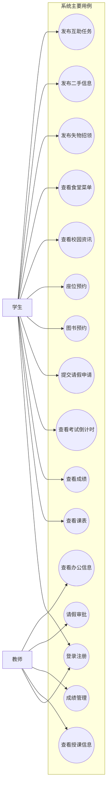
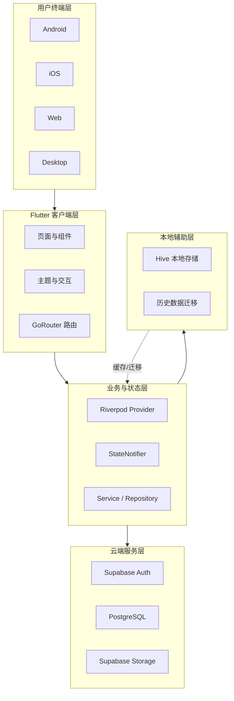
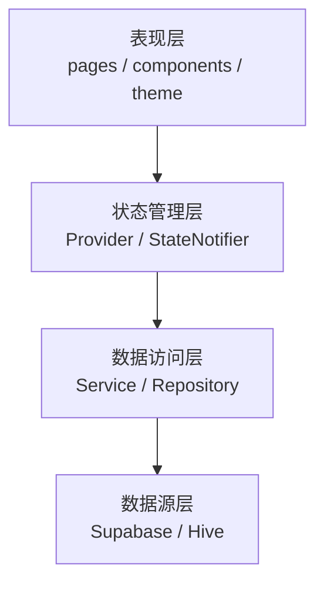
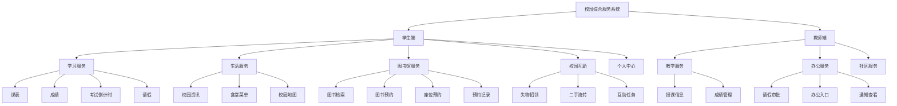
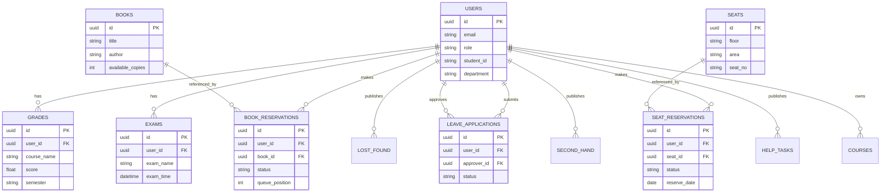
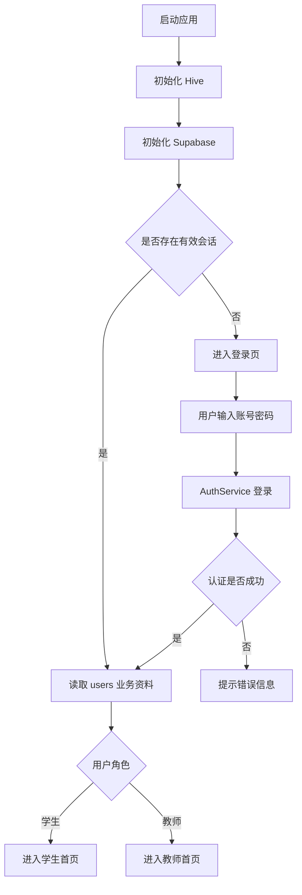
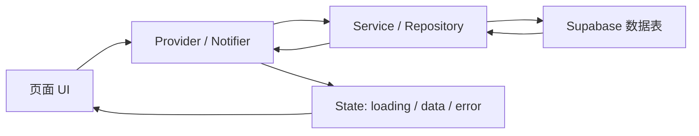
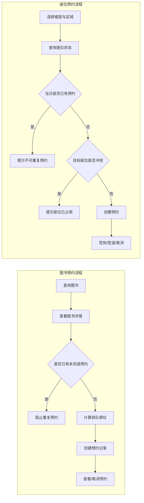
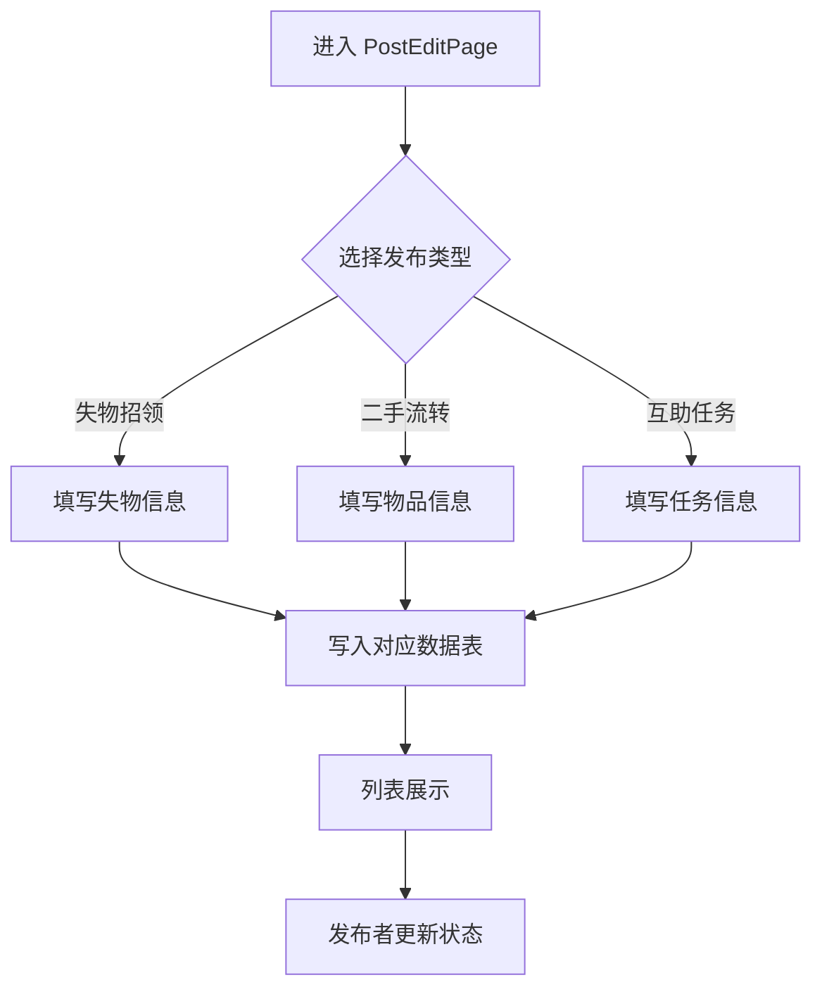
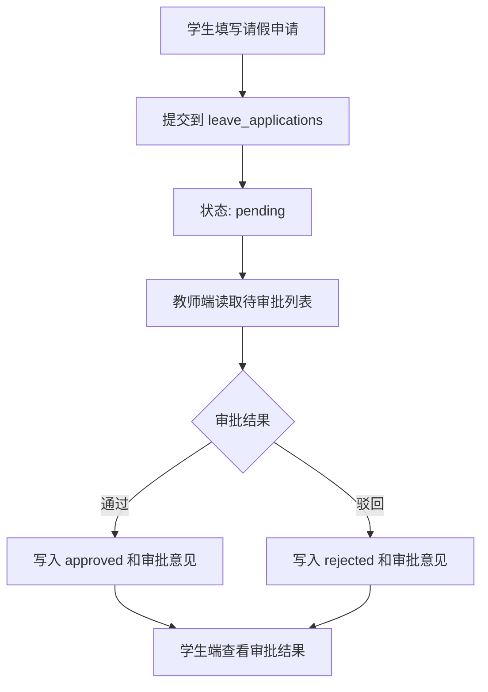

# 毕业设计论文插图规划

本文档用于配合 [毕业设计论文.md](D:\work\FlutterCampus\docs\毕业设计论文.md) 继续完善论文内容，重点整理论文中建议插入的图，包括图号、插入位置、图题、具体内容、绘制要点、正文引用示例以及 Mermaid 草稿。  
其中，流程图、架构图、分层图和 E-R 图可以先用 Mermaid 起草，最终建议使用 `draw.io`、`ProcessOn` 或 `Visio` 重绘后导出为 PNG，再插入正式论文。

## 1. 使用说明

1. 建议在 `docs` 目录下新建图片文件夹，例如：`docs/论文插图/`
2. 图文件建议命名为：`图4-1-系统总体架构图.png`
3. 正式论文中图题建议统一使用：

```md


图4-1 系统总体架构图
```

4. 每张图前后正文都应有解释，不要只插图不分析
5. 本文中的 Mermaid 草稿主要用于确定结构与内容，最终论文提交版建议重绘

## 2. 插图总表

| 图号 | 插入章节 | 图名 | 图类型 | 优先级 |
| --- | --- | --- | --- | --- |
| 图3-1 | 3.2 系统功能需求分析 | 系统用例图 | 用例图 | 高 |
| 图4-1 | 4.1 系统总体架构设计 | 系统总体架构图 | 架构图 | 高 |
| 图4-2 | 4.2 客户端分层结构设计 | 客户端分层结构图 | 分层结构图 | 高 |
| 图4-3 | 4.3 系统功能模块设计 | 系统功能模块结构图 | 模块结构图 | 高 |
| 图4-4 | 4.4 Supabase 数据模型与权限设计 | 系统数据库 E-R 图 | E-R 图 | 高 |
| 图5-1 | 5.2.1 登录注册功能实现 | 登录与角色分流流程图 | 流程图 | 高 |
| 图5-2 | 5.2.2 全局状态管理实现 | Riverpod 状态流转图 | 状态流图 | 中高 |
| 图5-3 | 5.2.4 图书馆服务模块实现 | 图书预约与座位预约业务流程图 | 业务流程图 | 高 |
| 图5-4 | 5.2.5 校园互助模块实现 | 校园互助统一发布流程图 | 业务流程图 | 中高 |
| 图5-5 | 5.2.6 教师端扩展功能实现 | 请假审批业务流程图 | 跨角色流程图 | 高 |
| 图6-1 | 6.2 或 6.5 | 功能测试结果统计图 | 统计图 | 中高 |

## 3. 逐图详细说明

### 图3-1 系统用例图

- 插入位置：`3.2 系统功能需求分析` 开头或学生端、教师端功能分析之后
- 图名：`图3-1 系统用例图`
- 图的作用：概括学生与教师两个角色在系统中的核心功能边界
- 图中应包含的角色：
  - 学生
  - 教师
- 学生端核心用例：
  - 登录注册
  - 查看课表
  - 查看成绩
  - 查看考试倒计时
  - 提交请假申请
  - 图书预约
  - 座位预约
  - 查看校园资讯
  - 查看食堂菜单
  - 发布失物招领
  - 发布二手信息
  - 发布互助任务
- 教师端核心用例：
  - 登录注册
  - 查看授课信息
  - 成绩管理
  - 请假审批
  - 查看办公信息

- 正文引用示例：
  - `如图3-1所示，本系统主要面向学生与教师两类用户，不同角色在功能权限和业务操作上存在明显差异。`

- Mermaid 草稿：



---

### 图4-1 系统总体架构图

- 插入位置：`4.1 系统总体架构设计` 第一段之后
- 图名：`图4-1 系统总体架构图`
- 图的作用：展示系统从用户终端到客户端、业务层、云端服务层的整体结构
- 图中应包含的层次：
  - 用户终端层：Android、iOS、Web、Desktop
  - 客户端展示层：Flutter UI、组件、页面、主题
  - 业务与状态层：GoRouter、Riverpod、Notifier、Service/Repository
  - 云端服务层：Supabase Auth、PostgreSQL、Storage
  - 本地辅助层：Hive
- 关键箭头说明：
  - 用户操作
  - 路由跳转
  - 状态更新
  - 认证请求
  - 数据读取/写入
  - 本地缓存/迁移

- 正文引用示例：
  - `如图4-1所示，本系统采用“Flutter 客户端 + Supabase 云端服务 + Hive 本地辅助存储”的轻量化总体架构。`

- Mermaid 草稿：



---

### 图4-2 客户端分层结构图

- 插入位置：`4.2 客户端分层结构设计` 第一段之后
- 图名：`图4-2 客户端分层结构图`
- 图的作用：说明表现层、状态管理层、数据访问层和数据源层之间的关系
- 图中建议展示的代表元素：
  - 表现层：`presentation/pages`、`components`、`theme`
  - 状态管理层：`Provider`、`StateNotifier`
  - 数据访问层：`AuthService`、`GradeService`、`LeaveService`、`Repository`
  - 数据源层：`Supabase`、`Hive`

- 正文引用示例：
  - `如图4-2所示，系统在客户端内部采用较清晰的分层结构，页面展示、状态组织与数据访问彼此解耦。`

- Mermaid 草稿：



---

### 图4-3 系统功能模块结构图

- 插入位置：`4.3 系统功能模块设计` 第一段之后
- 图名：`图4-3 系统功能模块结构图`
- 图的作用：从整体上展示学生端与教师端的功能划分
- 一级模块：
  - 学生端
  - 教师端
- 学生端二级模块：
  - 学习服务
  - 生活服务
  - 图书馆服务
  - 校园互助
  - 个人中心
- 教师端二级模块：
  - 教学服务
  - 办公服务
  - 社区服务
- 三级模块示例：
  - 学习服务：课表、成绩、考试倒计时、请假
  - 生活服务：资讯、菜单、地图
  - 图书馆服务：图书检索、图书预约、座位预约、预约记录
  - 校园互助：失物招领、二手流转、互助任务
  - 教学服务：授课信息、成绩管理
  - 办公服务：请假审批、办公入口、通知查看

- 正文引用示例：
  - `图4-3反映了系统整体的功能组织方式，其中学生端以个人服务为中心，教师端以教学与审批处理为中心。`

- Mermaid 草稿：



---

### 图4-4 系统数据库 E-R 图

- 插入位置：`4.4 Supabase 数据模型与权限设计` 中数据库结构分析部分
- 图名：`图4-4 系统数据库 E-R 图`
- 图的作用：说明系统核心实体及其关系
- 核心实体建议保留：
  - 用户
  - 课程
  - 成绩
  - 考试计划
  - 请假申请
  - 图书
  - 图书预约
  - 座位
  - 座位预约
  - 校园资讯
  - 菜单
  - 失物招领
  - 二手物品
  - 互助任务
- 关系重点：
  - 用户 与 成绩：一对多
  - 用户 与 考试计划：一对多
  - 用户 与 请假申请：一对多
  - 教师用户 与 请假申请审批：一对多
  - 图书 与 图书预约：一对多
  - 用户 与 图书预约：一对多
  - 座位 与 座位预约：一对多
  - 用户 与 座位预约：一对多
  - 用户 与 失物招领/二手物品/互助任务：一对多

- 正文引用示例：
  - `如图4-4所示，系统数据模型围绕用户实体展开，并通过预约、审批和发布记录连接多个业务域。`

- Mermaid 草稿：



---

### 图5-1 登录与角色分流流程图

- 插入位置：`5.2.1 基于 Supabase Auth 的登录注册功能实现` 末尾
- 图名：`图5-1 登录与角色分流流程图`
- 图的作用：展示系统启动、认证、读取用户资料以及角色跳转的主链路
- 关键步骤：
  - 启动应用
  - 初始化 Hive
  - 初始化 Supabase
  - 检查当前会话
  - 未登录进入登录页
  - 已登录读取 `users` 资料
  - 判断 `role/type`
  - 跳转学生首页或教师首页
  - 失败则提示错误

- 正文引用示例：
  - `图5-1说明了系统登录完成后并不会直接进入固定首页，而是先读取业务资料并根据角色字段进行页面分流。`

- Mermaid 草稿：



---

### 图5-2 Riverpod 状态流转图

- 插入位置：`5.2.2 基于 Riverpod 的全局状态管理实现`
- 图名：`图5-2 Riverpod 状态流转图`
- 图的作用：展示页面、Provider、Service 和 Supabase 之间的状态流关系
- 建议突出：
  - 用户操作触发
  - Notifier 调用数据服务
  - 异步结果返回
  - `loading / data / error` 三类状态更新
  - UI 自动刷新

- 正文引用示例：
  - `如图5-2所示，系统将业务请求与界面更新之间的联系统一收敛到 Riverpod 状态流中。`

- Mermaid 草稿：



---

### 图5-3 图书预约与座位预约业务流程图

- 插入位置：`5.2.4 图书馆服务模块实现`
- 图名：`图5-3 图书预约与座位预约业务流程图`
- 图的作用：体现图书馆模块的复杂业务流程
- 左侧图书预约分支：
  - 查询图书
  - 查看详情
  - 检查是否重复预约
  - 计算排队顺位
  - 创建预约
  - 查看或取消预约
- 右侧座位预约分支：
  - 选择楼层与区域
  - 查询座位状态
  - 校验当日是否已有预约
  - 校验是否冲突
  - 创建预约
  - 签到/签退/取消

- 正文引用示例：
  - `从图5-3可以看出，图书馆模块已经不再是简单的数据展示，而是包含明显业务约束的预约子系统。`

- Mermaid 草稿：



---

### 图5-4 校园互助统一发布流程图

- 插入位置：`5.2.5 校园互助模块实现`
- 图名：`图5-4 校园互助统一发布流程图`
- 图的作用：说明失物招领、二手流转和互助任务在交互层上的统一性
- 关键内容：
  - 进入 `PostEditPage`
  - 选择发布类型
  - 展示对应动态表单
  - 写入对应数据表
  - 列表展示
  - 状态更新

- 正文引用示例：
  - `图5-4表明，互助模块虽然涉及三类业务，但在交互结构上采用了统一发布入口和统一状态维护思路。`

- Mermaid 草稿：



---

### 图5-5 请假审批业务流程图

- 插入位置：`5.2.6 教师端扩展功能实现` 或 `5.3.3 预约与审批业务流程状态控制实现`
- 图名：`图5-5 请假审批业务流程图`
- 图的作用：体现学生端与教师端之间的跨角色业务闭环
- 关键内容：
  - 学生填写申请
  - 提交到 `leave_applications`
  - 状态为 `pending`
  - 教师读取待审批列表
  - 教师通过或驳回
  - 写入审批意见
  - 学生查看结果

- 正文引用示例：
  - `图5-5直观展示了请假模块从学生提交到教师处理再到结果反馈的完整跨角色流转过程。`

- Mermaid 草稿：



---

### 图6-1 功能测试结果统计图

- 插入位置：`6.2 用户认证与基础功能测试` 末尾或 `6.5 测试结果总结与系统改进`
- 图名：`图6-1 功能测试结果统计图`
- 图的作用：用可视化方式概括各模块测试通过情况
- 建议横轴模块：
  - 认证模块
  - 学习服务
  - 图书馆服务
  - 校园互助
  - 教师端功能
- 建议纵轴：
  - 测试通过项数量
  - 或 通过率

- 可直接用于作图的数据模板：

| 模块 | 用例数 | 通过数 | 通过率 |
| --- | --- | --- | --- |
| 认证模块 | 4 | 4 | 100% |
| 学习服务 | 5 | 5 | 100% |
| 图书馆服务 | 4 | 4 | 100% |
| 校园互助 | 3 | 3 | 100% |
| 教师端功能 | 3 | 3 | 100% |

- 正文引用示例：
  - `图6-1对各模块测试结果进行了汇总，能够更直观地反映系统当前版本的功能完成度。`

---

## 4. 推荐的插图插入顺序

如果时间有限，建议优先完成以下 9 张图：

1. 图3-1 系统用例图
2. 图4-1 系统总体架构图
3. 图4-2 客户端分层结构图
4. 图4-3 系统功能模块结构图
5. 图4-4 系统数据库 E-R 图
6. 图5-1 登录与角色分流流程图
7. 图5-3 图书预约与座位预约业务流程图
8. 图5-5 请假审批业务流程图
9. 图6-1 功能测试结果统计图

## 5. 后续补图建议

1. 架构图、分层图和流程图优先用 `draw.io` 重绘
2. E-R 图建议只保留关键实体和主外键，不要把所有字段都塞进去
3. 所有图都要在正文中出现“如图X-X所示”的分析语句
4. 如果后续教师端功能继续扩展，可新增：
   - 教师成绩管理流程图
   - 多角色权限控制图
   - 通知与消息提醒流程图
